# HuntAI SRE 业务问题模型

- **Status**: Draft（Stage 3 问题建模产出；非 PRD、非已冻结）
- **日期**: 2026-09-13；二期增补 2026-09-14
- **输入**: [`docs/01_market_research/market_research_report.md`](../01_market_research/market_research_report.md)；[`docs/02_competitor_analysis/competitor_analysis_report.md`](../02_competitor_analysis/competitor_analysis_report.md)；仓库维护人需求收口 Q1–Q28（2026-09-13）；二期收口 Q1–Q15（2026-09-14）
- **纪律**: 本文只记录已拍板规则。未拍板的数字与供应商标 **[TBD-BIZ]**。禁止把研究包或竞品能力写成已建设功能。一期 §8 共 20 项验收范围不因二期改动。

**一句话**: HuntAI SRE 是企业内部、接在现网 Kubernetes / Prometheus / Alertmanager / xMatters 之上的**可信 AI 运维层**：Alertmanager 告警入库后由人点「调查」（二期在 `severity=critical` 时可自动开查），用只读工具产出**服务端 citation** 的 RCA；xMatters 继续负责呼叫；无模型时仍能把 firing 告警和规则扫描结果当作 finding。二期另增：Loki LogQL 只读、人批 `restart`/`scale`、60 分钟零 token 定时扫描。

---

## 1. 业务目标

| # | 目标 | 判定（可观察） | 来源 |
|---|---|---|---|
| G1 | 被 xMatters 叫起的人，能在 HuntAI 里打开**同一条** Alertmanager firing 告警并完成一次只读 cited 调查 | 深链或列表能定位到 `cluster_id` + fingerprint；调查结束态为「有 citation 的完成」或「`inconclusive`」，二者界面可区分 | Q3、Q6、Q18、Q24 |
| G2 | 开发 on-call 只能调查自己团队标签下的告警；SRE 能看全部（含 `unscoped`） | 权限矩阵 §4；无标签告警对开发不可见 | Q1、Q8、Q14、Q17 |
| G3 | 无 LLM Key / 禁止出域时，产品仍能展示 firing 告警，且 SRE 能跑按需规则扫描 | 关闭模型后列表与扫描仍可用；扫描路径零 LLM 调用 | Q5、Q10 |
| G4 | HuntAI 不成为监控权威、不成为呼叫权威、不在一期执行任何外部写 | 无 Prom/AM/xMatters 替换；一期无 silence / ack / page / IM / 邮件出站 / kubectl 写 | Q2、Q6、Q11 |
| G5 | 一期 20 人可用，结构能撑到 1000 注册账号（仍是公司内单组织，不是对外 SaaS） | NFR-010、NFR-011 | Q4 |
| G6 | 二期在不推翻 G1–G5 的前提下：critical 可自动开查、LogQL 可 citation、人批 restart/scale、定时规则扫描 | §11；BR-070 起 | 2026-09-14 Q1–Q15 |

非目标（与 G4 同条，此处只强调）：不承诺公开 MTTR / RCA 准确率数字。四家竞品均无可靠公开准确率；HuntAI 不得用未评测数字当目标。评测集 **[TBD-BIZ]**，不进本期目标表。独立对话产品 / 无 `alert_id` 的 Ask / SuperBizAgent 双页：**永不做**（Q4=A）。

---

## 2. 核心业务流程

图例：`人工` = 必须由人触发或确认；`系统` = HuntAI 自动执行。每个流程给出输入 / 处理 / 输出 / 异常。

### 2.1 告警入库（北极星前置）

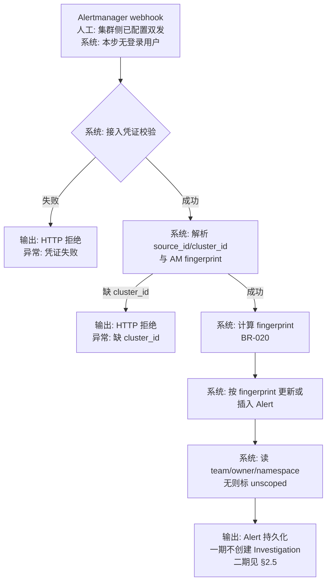

| 项 | 内容 |
|---|---|
| 输入 | 该集群 Alertmanager 发往 HuntAI 的 webhook 体；接入凭证（身份 ≠ 调查人 OIDC，BR-016） |
| 处理 | 校验接入身份；绑定 `cluster_id`；计算 fingerprint；upsert Alert；打 `unscoped` 或团队标签 |
| 输出 | 一条 Alert 记录。resolved 通知更新同一 fingerprint 的 Alert。**一期**不自动开调查；**二期**仅当 BR-070 满足时由 §2.5 创建 |
| 异常 | 凭证失败 → 拒绝入库；缺 `cluster_id` → 拒绝入库；缺 team/owner/namespace → 仍入库，标 `unscoped`（BR-022） |
| 并行事实 | 同一 Alertmanager **继续**向 xMatters 发原 webhook。HuntAI 不读取个人邮箱，不解析 xMatters 转发信 |

### 2.2 告警驱动只读调查（北极星）

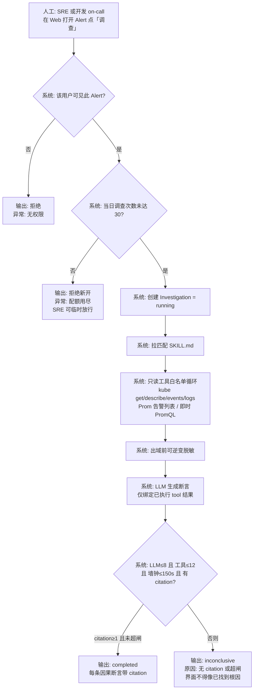

| 项 | 内容 |
|---|---|
| 输入 | 已入库 Alert 的 id；当前 OIDC 用户；该用户团队绑定 |
| 处理 | 鉴权 → 日额度 → 建调查 → 拉 Skill → 只读工具 →（有 LLM 时）脱敏 → LLM → 服务端铸造 citation。无 LLM / 禁出域时跳过 LLM，只跑工具（BR-053） |
| 输出 | `completed`（断言全部带 citation）或 `inconclusive`（零 citation、无 LLM 因而无 Claim、或成本闸，BR-031、BR-040、BR-053） |
| 异常 | 不可见告警 → 拒绝；日额度满 → 拒绝新开且**不占次数**（SRE 可临时放行，BR-041）；人点并发超过 NFR-011 规划值 **不拒绝**（BR-054）；工具失败 → 该次 tool 无 citation，不得用失败结果冒充证据；墙钟 150s 到 → 停，标 `inconclusive`（成本；墙钟定义见 BR-040） |
| 不做 | **一期**入库不自动开调查；HuntAI 不 page；不写 AM / xMatters。**二期**自动开查见 §2.5；写修复见 §2.6 |

### 2.3 SRE 按需规则扫描（AI-Free）

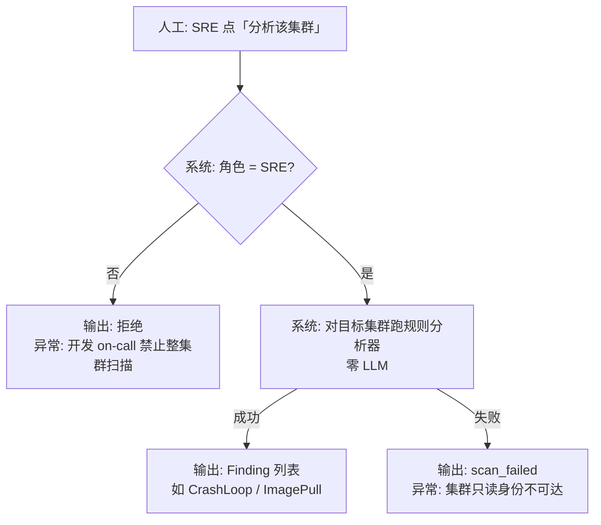

| 项 | 内容 |
|---|---|
| 输入 | 目标 `cluster_id`；SRE 用户 |
| 处理 | 校验角色；用该集群只读 ServiceAccount 做规则扫描；不调用 LLM |
| 输出 | 本轮 Finding 快照（不另做「关闭 finding」工作流，见 BR-027） |
| 异常 | 非 SRE → 拒绝；集群不可达 → `scan_failed` |

### 2.4 从呼叫到调查（运营桥，产品只保证 URL）

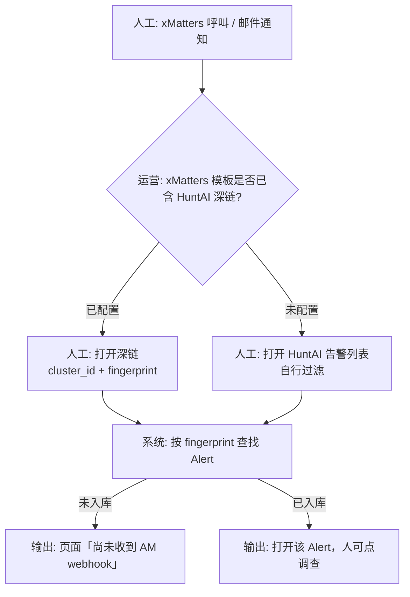

HuntAI 不调用 xMatters API。模板是否已改属于运营变更，不是本系统写路径。

### 2.5 二期：`severity=critical` 自动开查

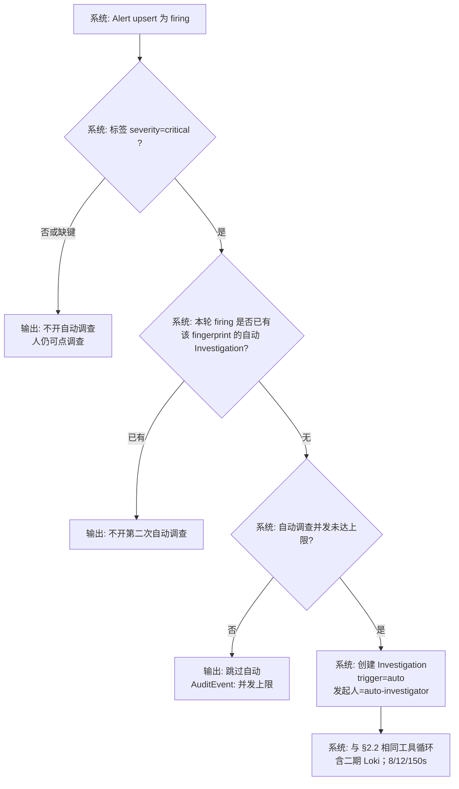

| 项 | 内容 |
|---|---|
| 输入 | 已 upsert 的 firing Alert；标签集合 |
| 处理 | 仅当 `severity` 精确等于 `critical`；每 fingerprint 每次 firing 期间最多 1 次自动调查；并发自动 `running` ≤ 5 |
| 输出 | Investigation（`trigger=auto`）或跳过 |
| 异常 | 缺键 / 值不是 `critical` → 不开自动（fail-close，不得改成全开）；并发满 → 跳过并审计，Alert 仍在 |
| 额度 | 不计入任何 User 的每日 30 次 |

图中「并发未达上限」= 全组织 `trigger=auto` 且 `running` 的 Investigation 个数 **≤ 5**（NFR-017）。

### 2.6 二期：人批写修复

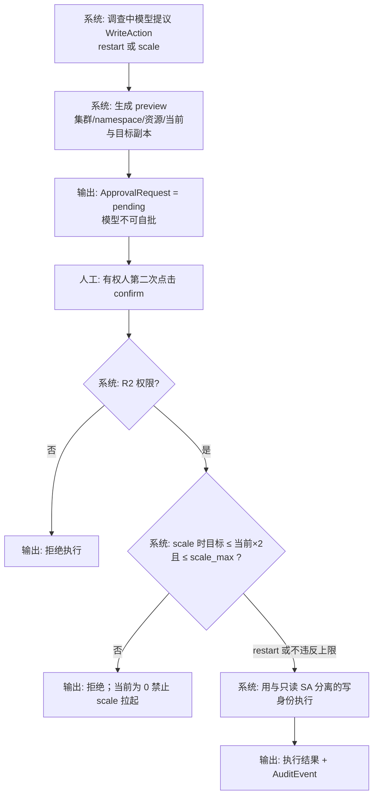

| 项 | 内容 |
|---|---|
| 输入 | 某次 Investigation 内的 WriteAction 提议；confirm 的 User |
| 处理 | preview → 人 confirm；校验 env / namespace / scale 上限；分离写身份执行 |
| 输出 | 执行成功或拒绝；不得由 LLM 直接调用写接口 |
| 异常 | 集群 `write_remediation` 未打开 → 写工具不出现；无 `scale_max` → 该集群禁止 scale；Investigation 已结束 → pending 作废 |

### 2.7 二期：60 分钟定时规则扫描

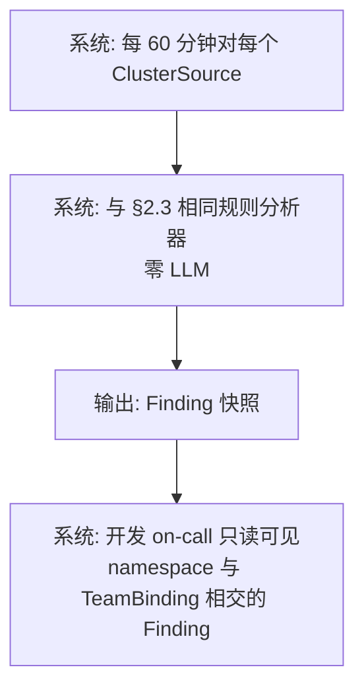

SRE 仍可按 §2.3 手动触发。开发禁止触发扫描。

---

## 3. 核心业务实体及关系

一期必须建下列对象。二期增补见同表「二期」列。不建 Incident（完整 IRM）、Mailbox、PlaywrightJob、无 `alert_id` 的 ChatSession。

| 实体 | 职责 | 关键身份 | 阶段 |
|---|---|---|---|
| Organization | 公司级单租户；本产品恰好一个 | 固定内部组织，非 SaaS 多组织 | 一期 |
| User | OIDC 登录的人 | IdP 主体；可有一个 break-glass 本地管理员账号（BR-011） | 一期 |
| TeamBinding | 人可查看的标签值 | `team` / `owner` / `namespace` 的值集合；来自 IdP 组映射，管理员可改 | 一期 |
| ClusterSource | 一个 Kubernetes 集群及其 Prom / AM | `cluster_id`；Prom 只读账号；部署态只读 ServiceAccount。二期必填 `env`：`production` \| `non_production`（未填视为 `production`）；`write_remediation` 默认关；`scale_max` **[TBD-BIZ]** 未填则禁止 scale | 一期；字段二期 |
| IngestCredential | AM webhook 接入身份 | 与 User OIDC 分离 | 一期 |
| Alert | 一条去重后的告警 | `cluster_id` + fingerprint | 一期 |
| Investigation | 一次调查 | 一期发起人必为 User；二期可为 `auto-investigator`。`trigger`=`human` \| `auto` | 一期；trigger 二期 |
| ToolCall | 一次已执行的工具调用 | 输入、输出副本、截断标记 | 一期；二期可含 Loki 与写操作预览（写执行见 WriteAction） |
| Citation | 服务端铸造的证据绑定 | 只能指向本次 Investigation 内已成功的**只读** ToolCall | 一期 |
| Claim | RCA 中的一条因果断言 | 必须挂 ≥1 条 Citation | 一期 |
| ScanRun | 一次规则扫描 | `trigger`=`manual` \| `scheduled`；属于一个 ClusterSource | 一期；scheduled 二期 |
| Finding | 扫描器规则命中 | 属于一次 ScanRun | 一期 |
| Skill | Git 中的 `SKILL.md` | 按全局 / 集群 / team 匹配 | 一期 |
| RelatedLink | Grafana / Loki / Kibana / Elastic **URL** | 不算 Citation | 一期 |
| AuditEvent | append-only | 含跳过自动开查、写确认、定时扫描 | 一期；事件类型二期增补 |
| WriteIdentity | 与只读 SA 分离的写凭证 | 仅 restart/scale；默认不绑定 | 二期 |
| LokiCredential | 该集群 Loki 只读查询凭证 | LogQL | 二期 |
| WriteAction | 一次写修复提议 | verb=`restart` \| `scale`；绑定 Investigation、目标资源 | 二期 |
| ApprovalRequest | 人批卡片 | 绑定一条 WriteAction；状态 pending/confirmed/rejected/void | 二期 |
| SystemPrincipal | `auto-investigator` | 不可登录 UI；不可 confirm 写操作 | 二期 |

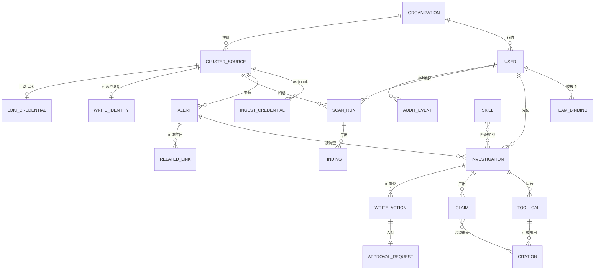

约束（已拍板，不是新规则）：

1. 一期 Organization 基数 = 1。
2. Alert 不跨 `cluster_id` 合并。
3. Citation 不得指向未执行、失败、或其它 Investigation 的 ToolCall。
4. RelatedLink 与 user 粘贴文本不得成为 Citation。
5. Citation 不得指向 WriteAction 的执行结果（写修复不是 RCA 证据源）。
6. `auto-investigator` 不得作为 ApprovalRequest 的确认人。

---

## 4. 角色与权限矩阵

角色只有三种人 + 一种系统身份。不设 NOC、经理操作者。

| 能力 | SRE / 平台 | 开发 on-call | break-glass 本地管理员 | IngestCredential（系统） |
|---|---|---|---|---|
| OIDC 登录 | 允许 | 允许 | 不走 OIDC；仅紧急 | 否 |
| 看 / 调查匹配自己 TeamBinding 的 Alert | 允许（且可看全部 Alert） | 仅匹配 | 与 SRE 相同（紧急排障） | 否 |
| 看 `unscoped` Alert | 允许 | 禁止 | 允许 | 否 |
| 点「调查」 | 允许 | 仅自己可见的 Alert | 允许 | 否 |
| 按需扫描整个集群 | 允许 | 禁止 | 允许 | 否 |
| 按需只扫自己 namespace | 禁止（扫描器只提供整集群） | 禁止 | 禁止 | 否 |
| 配置 AM webhook / Prom 数据源 / 分析器 | 允许 | 禁止 | 允许 | 否 |
| 管理 Skill 仓库映射、TeamBinding | 允许 | 禁止 | 允许 | 否 |
| 临时放行用户日调查额度 | 允许 | 禁止 | 允许 | 否 |
| 写入 Alert（webhook upsert） | 否 | 否 | 否 | 允许 |
| 发起 LLM / 只读工具 | 仅经「调查」 | 仅经「调查」 | 仅经「调查」 | 否 |
| 二期：跑 Loki LogQL | 调查内不限 namespace | 调查内仅 TeamBinding 的 `namespace`；无 namespace 绑定则拒绝 | 同 SRE | 否 |
| 二期：只读查看 Finding | 全部 | 仅 Finding.namespace 与 TeamBinding 相交 | 全部 | 否 |
| 二期：触发扫描 | 系统每 60 分钟；SRE 仍可手动 | 禁止 | 可手动 | 否 |
| 二期：confirm restart/scale | 任意 `env` | 仅 `non_production` 且目标 namespace ∈ TeamBinding | 同 SRE | 否 |
| Alertmanager silence | 禁止 | 禁止 | 禁止 | 禁止 |
| xMatters ack / 关单 / 评论 | 禁止 | 禁止 | 禁止 | 禁止 |
| HuntAI 呼叫 / 升级 / IM / 邮件出站 | 禁止 | 禁止 | 禁止 | 禁止 |
| kubectl 写：delete / apply / exec | 禁止 | 禁止 | 禁止 | 禁止 |
| kubectl 写：restart / scale | 一期禁止；二期仅经 ApprovalRequest | 一期禁止；二期仅 R2 且经 ApprovalRequest | 同 SRE | 禁止 |
| 读 secrets | 禁止 | 禁止 | 禁止 | 禁止 |
| 服务端执行 Playwright | 禁止 | 禁止 | 禁止 | 禁止 |
| 部署态配置个人 kubeconfig | 禁止 | 禁止 | 禁止 | 禁止 |
| 二期：配置 `env` / `write_remediation` / `scale_max` | 允许 | 禁止 | 允许 | 否 |

本机跑 HuntAI 时，工程师可用本机 kubeconfig **只对准非生产集群**（BR-046）。该行为不是上表角色权限，是开发机约定；任何已部署实例（开发套 / 预发 / 生产）仍必须用各集群专用只读 ServiceAccount。二期写操作另用 WriteIdentity，不得把写权限加进只读 SA（BR-086）。

`auto-investigator` 不是表中四列之一：不可登录、不可 confirm、不消耗 User 日额度。

---

## 5. 状态模型

### 5.1 Alert

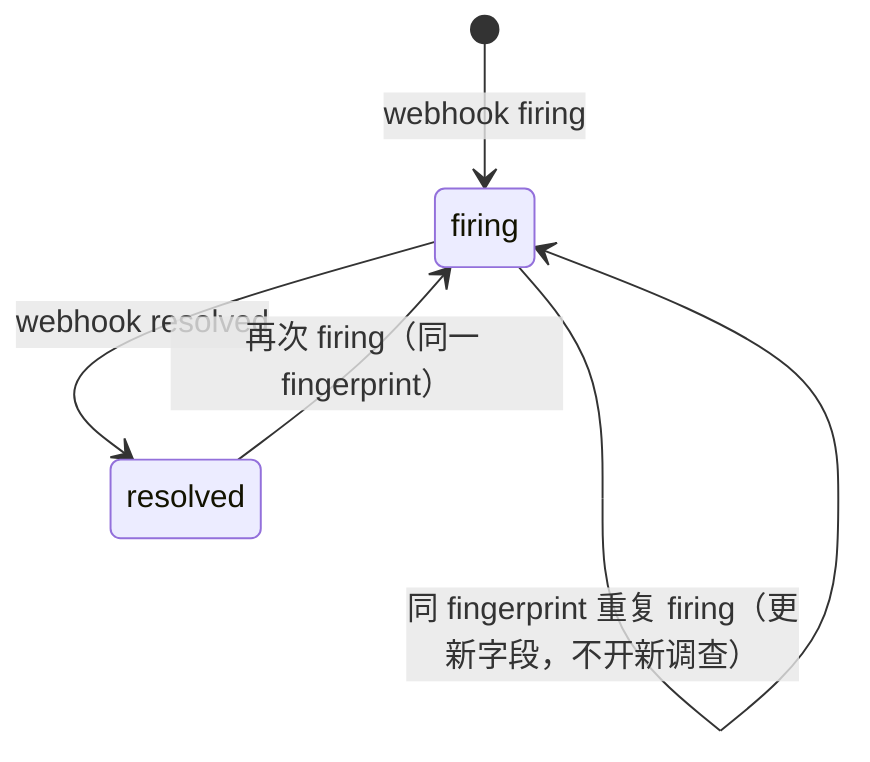

`unscoped` 是标签，不是状态：无 `team` / `owner` / `namespace` 时为真。开发 on-call 读模型里不可见 `unscoped=true` 的 Alert。

### 5.2 Investigation

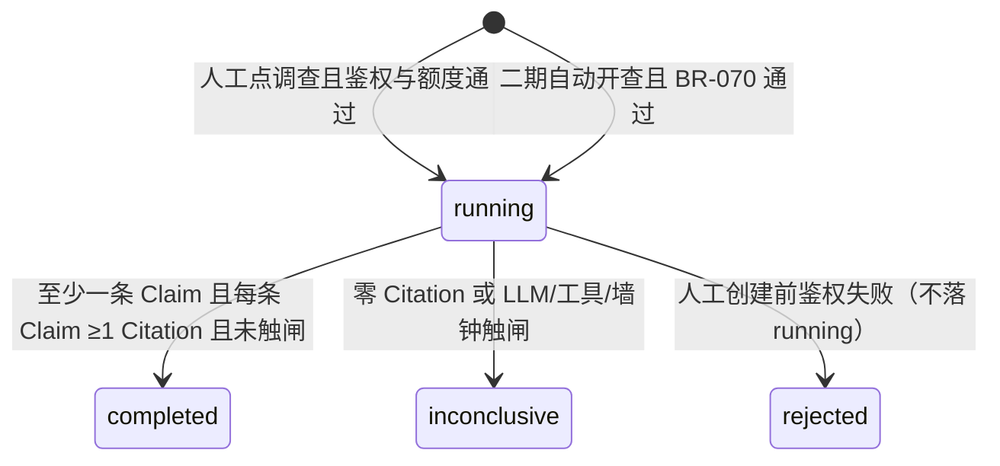

`completed` 与 `inconclusive` 在界面上必须可区分。`inconclusive` 不得使用「根因是…」作为主标题。模型不得把 Investigation 标为 `completed` 当 Citation 数为 0。`trigger=auto` 的 Investigation 不因「无登录用户」而跳过 citation 规则。

能列出或打开某 Alert 的用户，可只读该 Alert 下全部 Investigation（含他人发起与 `trigger=auto`）（BR-055）。

〔二期〕LLM+工具循环已停、但仍有 `pending` ApprovalRequest 时，主状态保持 `running`（BR-090）。界面不得表现为「仍在分析」，见交互 PG-006。

### 5.3 ScanRun

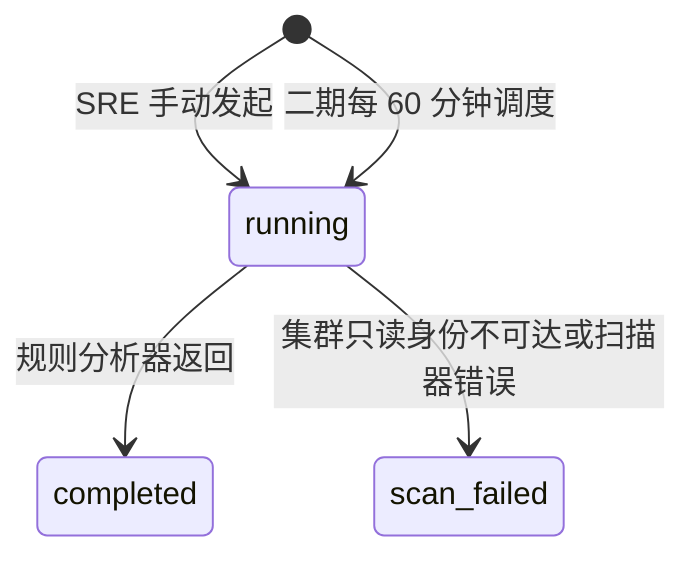

Finding 随 `completed` 的 ScanRun 冻结；没有 Finding 的 ack / close 状态。

### 5.4 二期 ApprovalRequest

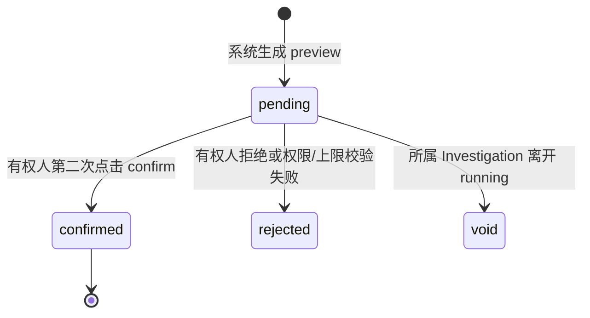

---

## 6. 业务规则清单

规则均来自 Q1–Q28 收口。一条规则一件事。

### 6.1 产品边界

| 编号 | 规则 |
|---|---|
| BR-001 | HuntAI SRE 是接在现网上的可信 AI 运维层，不是全栈可观测平台，不是 xMatters 替代物，不是 Prometheus / Alertmanager 替代物。 |
| BR-002 | 一期与目标形态都是公司内单一 Organization，不是对外多租户 SaaS。 |
| BR-003 | 生产负载按几乎全部运行在 Kubernetes 处理；一期不接 VM、SSH、云主机 API。 |
| BR-004 | 一期对接 2 至 5 个 Kubernetes 集群；每个集群一套 Prometheus、一套 Alertmanager。 |
| BR-005 | 调查权威在 HuntAI；呼叫 / 升级权威在 xMatters。两边不互相当主库。 |

### 6.2 身份与范围

| 编号 | 规则 |
|---|---|
| BR-010 | 禁止匿名使用。人必须经公司 IdP OIDC 登录。IdP 产品名 **[TBD-BIZ]**。 |
| BR-011 | 允许保留恰好一个 break-glass 本地管理员账号，不用于日常调查。 |
| BR-012 | 主操作角色是 SRE / 平台工程；开发 on-call 为辅。不设 NOC、经理为操作角色。 |
| BR-013 | 人到可见范围的主键是告警标签 `team`、`owner`、`namespace`。无 `team` 时用 `namespace` 作为缺省匹配键。 |
| BR-014 | TeamBinding 来自 IdP 组名到上述标签值的映射表；SRE 或 break-glass 可改映射。禁止用户自助勾选团队且不经审批。 |
| BR-015 | 映射变更必须写 AuditEvent（谁、何时、授予哪些标签值）。 |
| BR-016 | Alertmanager webhook 使用 IngestCredential，不得复用调查人的 OIDC 会话。 |
| BR-017 | 开发 on-call 只能列出并打开 TeamBinding 匹配的 Alert；SRE 与 break-glass 可列出全部 Alert。 |

### 6.3 告警入库与身份

| 编号 | 规则 |
|---|---|
| BR-020 | Alert 身份 = `cluster_id` + Alertmanager 自带 `fingerprint`。payload 无 `fingerprint` 时，用 `alertname` 加稳定标签集合的哈希；稳定标签集合必须排除 `startsAt` 与 `value`。 |
| BR-021 | 同一 fingerprint 的后续 webhook 更新该 Alert，不新建 Alert。**一期**不因此新建 Investigation。**二期**自动开查仅 BR-070 允许的那一次，不得因重复 firing webhook 再开。 |
| BR-022 | 缺少 `team`、`owner`、`namespace` 三者时，Alert 仍入库，`unscoped=true`。开发 on-call 不可见。不得拒绝入库，不得把无标签 Alert 视为全员可见，不得自动派给某个默认团队。 |
| BR-023 | webhook 必须带 `cluster_id`（或与 ClusterSource 一一对应的 `source_id`）。缺失则拒绝入库。 |
| BR-024 | 每个集群 Alertmanager 在保留打向 xMatters 的 receiver 之外，增加打向 HuntAI 的 receiver。HuntAI 不删除、不改写 xMatters 那条 receiver。 |
| BR-025 | 禁止以个人邮箱、IMAP、解析 xMatters 转发信作为告警源。 |

### 6.4 Finding 与扫描

| 编号 | 规则 |
|---|---|
| BR-026 | 关闭 LLM 时，已入库的 firing Alert 仍必须可作为 finding 展示。 |
| BR-027 | SRE 可对某一 `cluster_id` 发起按需规则扫描（CrashLoop、ImagePull 这类分析器）。该路径禁止调用 LLM。开发 on-call 禁止发起整集群扫描。一期不提供「只扫一个 namespace」的扫描 API。 |
| BR-028 | 禁止 24/7 以 LLM 做 Operator 巡检。定时零 token 扫描不在一期；二期见 BR-078。 |

### 6.5 调查、工具、citation

| 编号 | 规则 |
|---|---|
| BR-030 | **一期**：只有人在 Web 对一条可见 Alert 点「调查」才创建 Investigation。入库、扫描、定时任务都不得创建 Investigation。**二期**例外仅 BR-070。 |
| BR-031 | 每条 Claim 必须绑定至少一条 Citation；每条 Citation 必须指向本 Investigation 中**已成功执行**的只读 ToolCall，由服务端铸造 id。模型不得生成 Citation id。 |
| BR-032 | Citation 数为 0 时，Investigation 状态必须是 `inconclusive`，主界面不得呈现为已找到根因。 |
| BR-033 | **一期**只读工具仅限：Kubernetes `get` / `describe` / events / pod logs；Prometheus 当前 firing 与 pending 告警列表；即时 PromQL 查询。禁止写 Prometheus recording rule。**二期**增加 Loki LogQL（BR-075）。 |
| BR-034 | Grafana、Loki、Kibana、Elastic 的界面地址只许存为 RelatedLink，不得当作 Citation。 |
| BR-035 | **一期**禁止经官方 API 或 UI 自动化查询 Loki / Elastic 作为调查工具。**二期**仅开放 Loki LogQL（BR-075）；Elastic 查询 API 仍禁止。 |
| BR-036 | 禁止在任何已部署 HuntAI 进程内执行 Playwright 或其它浏览器扒页脚本。 |
| BR-037 | 若存储用户粘贴文本，必须标为 `user-supplied`：不得成为 Citation，默认不得送入 LLM。一期不把「Playwright 附件工作流」列为功能。 |
| BR-038 | 调查开始时必须尝试拉取匹配的 Skill（Git 中 `SKILL.md`，可按全局 / 集群 / team）。无 Skill 时调查仍可进行，界面必须显示「未加载组织约束」。 |
| BR-039 | Skill 的 Git 仓库地址 **[TBD-BIZ]**。空仓库允许上线。 |

### 6.6 外部副作用

| 编号 | 规则 |
|---|---|
| BR-040 | 单次 Investigation：LLM 调用 ≤ 8，只读工具调用 ≤ 12，墙钟 ≤ 150 秒。墙钟**只计** LLM 与只读工具执行；`pending` ApprovalRequest 等待期间不计入墙钟、调查保持 `running`（BR-090）。任一超限必须停止工具/LLM 循环，状态在无 pending 审批时为 `inconclusive`（成本），不得标 `completed`。pending 等待超时秒数 **[TBD-BIZ]**。 |
| BR-041 | 同一 User 每个自然日最多**成功新建** 30 个 `trigger=human` 的 Investigation。超过后拒绝新开。因额度满、组织闸、权限失败或创建接口失败而拒绝的，**不增加**当日计数。SRE 与 break-glass 可对指定用户做临时放行，并写 AuditEvent。放行额度与时限 **[TBD-BIZ]**，禁止填造「+10 次 / 24h」。自然日界 **[ASSUMPTION]** `Asia/Shanghai`。 |
| BR-042 | 组织日 token 硬闸必须可配置、可关闭新调查。默认数字 **[TBD-BIZ]**，未配置时不得假装「无限」。实现必须有「闸存在」的开关位。关闭新调查或闸未配置时：**同时阻断** `trigger=auto`（跳过自动开查并写 AuditEvent，Alert 仍入库）。 |
| BR-043 | 单次工具返回超出上下文预算时必须截断或落盘；Citation 指向截断后的存储副本，禁止把未截断超大原文整包送入 LLM。截断阈值字节数 **[TBD-BIZ]**。 |
| BR-044 | HuntAI **始终**禁止：对 Alertmanager 创建 silence；对 xMatters 事件 ack / 关单 / 评论；发起呼叫或升级；发送 IM；发送出站邮件；kubectl delete / apply / exec。**一期**另禁止 restart / scale。**二期** restart / scale 仅经 BR-080。 |
| BR-045 | 允许 HuntAI 仅在本库记录「该用户看过该 Alert」作为 AuditEvent。该记录不得同步到 Alertmanager 或 xMatters。 |

### 6.7 凭证、脱敏、深链

| 编号 | 规则 |
|---|---|
| BR-046 | 工程师仅可在本机进程使用个人 kubeconfig，且只对准非生产集群。kubeconfig 禁止入库、禁止上传到服务器。 |
| BR-047 | 任何已部署的 HuntAI 连接集群时，只读 ServiceAccount：允许 get / list / watch 工作负载与 events，允许读 pod logs；禁止 secrets、exec、一切写。Prometheus 使用只读账号。**二期**写操作必须使用分离的 WriteIdentity（BR-086），不得给本条 SA 加写动词。 |
| BR-048 | 生产只读 ServiceAccount 失败时禁止 fallback 到个人 kubeconfig。 |
| BR-049 | 送入 LLM 的内容必须先做可逆变脱敏。未覆盖字段必须有公开清单。清单字段集合 **[TBD-BIZ]**。pod logs 可在有权限用户的 HuntAI 界面展示；出域前仍走本条。Skill 可规定某 namespace 的 log 禁止外发。 |
| BR-050 | 无 LLM 时 BR-026 与 BR-027 必须仍可执行（规则 finding 与告警列表不依赖模型）。 |
| BR-051 | HuntAI 必须提供稳定深链：用 `cluster_id` 与 fingerprint 打开 Alert。未入库时页面文案为「尚未收到 AM webhook」，不得伪造 Alert。 |
| BR-052 | 密钥、token、未脱敏原文禁止写入调查保留库、Citation 副本、应用日志。 |
| BR-053 | 无可用 LLM（无 Key、禁止出域、或清单未定不得出域）时，对可见 Alert 点「调查」仍须创建 Investigation 并只跑只读工具；LLM 调用次数为 0。不得标 `completed`，不得在界面声称已找到根因。无 Claim 时终态为 `inconclusive`。 |
| BR-054 | NFR-011 的「一期同时 5 个人点 running」是容量规划目标，**不是**创建准入硬闸。超过 5 仍允许新开人工调查。自动开查并发仍受 NFR-017 / BR-072 硬闸。 |
| BR-055 | 能列出或打开某 Alert 的用户，可只读该 Alert 下全部 Investigation（含他人发起与 `trigger=auto`）。对不可见 Alert 不得通过调查 URL 读取其内容。 |

### 6.8 保留

| 编号 | 规则 |
|---|---|
| BR-060 | Investigation、ToolCall 输出副本、Citation 保留 90 天，到期删除。 |
| BR-061 | AuditEvent（含配置变更、开调查、扫描、看过、额度放行）保留 365 天，到期删除。 |
| BR-062 | Alert 实例保留 90 天，到期删除。 |

### 6.9 二期规则（2026-09-14）

不改变 §8 一期验收。未列出的能力仍按 §9 永不做。

| 编号 | 规则 |
|---|---|
| BR-070 | 仅当 Alert 处于 firing 且标签键 `severity` 的值**精确等于** `critical` 时，系统可以创建 `trigger=auto` 的 Investigation。缺键、空值、其它值（含 `Critical`、`CRITICAL`、`warning`）一律不自动开查。生产与非生产集群同一规则。不得把缺键解释成全开。组织已关闭新调查或日 token 闸未配置时不得自动开查（BR-042）。 |
| BR-071 | 同一 fingerprint 在同一次 firing 期间（直至 resolved）最多 1 个 `trigger=auto` 的 Investigation。resolved 之后再次 firing 才允许再自动开一次。重复 firing webhook 不得再开。 |
| BR-072 | 全组织同时 `running` 且 `trigger=auto` 的 Investigation 个数 ≤ 5。达到上限则跳过本次自动开查，Alert 仍入库，必须写 AuditEvent（原因：自动开查并发上限）。不排队补开。 |
| BR-073 | 自动开查的发起人是 SystemPrincipal `auto-investigator`，不计入任何 User 的每日 30 次（BR-041）。人随后打开该 Investigation 继续查，不改发起人。`auto-investigator` 不可登录、不可 confirm WriteAction。 |
| BR-074 | 自动开查的单次 Investigation 仍受 BR-040（8 LLM / 12 工具 / 150 秒，工具次数含 Loki）。超限必须 `inconclusive`（成本），不得标 `completed`。 |
| BR-075 | 二期调查只读白名单增加 Grafana Loki 的 LogQL 查询。结果可做 Citation。禁止 Elasticsearch 查询 API。禁止 Playwright / 浏览器扒页。 |
| BR-076 | 开发 on-call 的 LogQL 必须由系统注入其 TeamBinding 中的 `namespace` 值；查询去掉该约束则拒绝执行。TeamBinding 没有 namespace 时禁止该用户跑 Loki。SRE 与 break-glass 不限 namespace。 |
| BR-077 | Loki 查询凭证是 LokiCredential，只读，按 ClusterSource 配置。无凭证则该集群调查不得调用 Loki，不得 fallback 到 UI 扒页。 |
| BR-078 | 每个 ClusterSource 每 60 分钟由系统发起一次零 LLM 规则扫描（与 BR-027 同一分析器）。SRE 仍可手动触发。开发 on-call 禁止触发扫描。 |
| BR-079 | 开发 on-call 只读可见 Finding 中 namespace 与其 TeamBinding.`namespace` 相交的记录。禁止用「先扫全集群再在 UI 隐藏」之外的方式让开发触发扫描。 |
| BR-080 | 二期允许的写动词只有：对指定 Deployment 或 StatefulSet 的 `rollout restart`；对指定 Deployment 的 `scale`（必须带目标副本数）。禁止 delete Pod、禁止任意 `kubectl apply` YAML。 |
| BR-081 | 写工具默认不出现。仅当该 ClusterSource.`write_remediation` 为开，且已配置 WriteIdentity 时，调查才可提议 WriteAction。 |
| BR-082 | 模型只能生成 pending 的 WriteAction + preview，不能执行、不能 confirm。执行必须由有权人第二次点击 confirm。 |
| BR-083 | confirm 角色：SRE 与 break-glass 可确认任意 `env` 的集群。开发 on-call 仅当 ClusterSource.`env=non_production` 且目标资源 namespace ∈ 其 TeamBinding 时可确认。`env` 未填视为 `production`，开发不能确认。restart 与 scale 同一套角色（R2）。 |
| BR-084 | `scale` 的目标副本数必须 ≤ 该工作负载当前 replicas 的 2 倍，且 ≤ 该 ClusterSource.`scale_max`。当前 replicas 为 0 时禁止用 scale 拉起副本。`scale_max` 未配置则该集群禁止 scale（不得填假默认值）。 |
| BR-085 | Investigation 离开 `running` 后，所有 pending ApprovalRequest 变为 `void`，不得再执行。 |
| BR-086 | WriteIdentity 与只读 ServiceAccount 分离。只读 SA 仍遵守 BR-047。WriteIdentity 失败时禁止 fallback 到个人 kubeconfig 或只读 SA。 |
| BR-087 | 每个 ClusterSource 必填 `env`：`production` 或 `non_production`。未填视为 `production`。禁止用集群名称字符串推断环境。 |
| BR-088 | 写操作执行结果不得作为 Claim 的 Citation。 |
| BR-089 | 禁止独立对话首页、无 `alert_id` 的 Ask、无入参 `diagnose()`、上传 txt/md 向量库。调查页内对同一 Investigation 的「继续查」仍绑定原 Alert，不算独立对话产品。 |
| BR-090 | 调查图的 LLM 与只读工具循环结束后，若仍存在 `pending` ApprovalRequest，Investigation 主状态保持 `running`，直到全部 pending 变为 confirmed / rejected / void，或等待超时（秒数 **[TBD-BIZ]**，到点 void）。界面必须表明只读调查已停、正在等人确认写操作，禁止继续用「正在分析 / 正在调查」作 L1。 |

---

## 7. 非功能需求

未在收口中出现的 SLA 数字不得编造，标 **[TBD-BIZ]**。已拍板的数字直接写入。

### 7.1 性能

| 编号 | 指标 | 量化 |
|---|---|---|
| NFR-001 | 单次 Investigation 墙钟上限 | ≤ 150 秒（到点强制停止，见 BR-040） |
| NFR-002 | 单次 Investigation LLM 次数上限 | ≤ 8 |
| NFR-003 | 单次 Investigation 工具次数上限 | ≤ 12（二期含 Loki LogQL 次数） |
| NFR-004 | webhook 从接收到 Alert upsert 成功的 P95 延迟 | **[TBD-BIZ]** 毫秒；未填写前不得对外宣称入库 SLA |
| NFR-005 | 点「调查」到 Investigation 进入 `running` 的 P95 延迟 | **[TBD-BIZ]** 毫秒 |
| NFR-006 | 二期：满足 BR-070 的 firing 到自动 Investigation `running` 的 P95 | **[TBD-BIZ]** 毫秒 |

### 7.2 容量

| 编号 | 指标 | 量化 |
|---|---|---|
| NFR-010 | 注册账号 | 一期 20；结构按 1000 设计 |
| NFR-011 | 同时进行的人点 Investigation（状态 `running`） | 一期按 5、结构按 50 **规划容量**；**不作为**创建硬闸（BR-054）。自动开查另计 NFR-017（硬闸） |
| NFR-012 | 每用户每自然日新建 Investigation | ≤ 30（BR-041） |
| NFR-013 | Kubernetes 集群数 | 一期 2 至 5；每集群 1 套 Prometheus + 1 套 Alertmanager |
| NFR-014 | 告警 webhook 峰值（条 / 分钟，全组织合计） | **[TBD-BIZ]**；未填写前不得用「能抗风暴」代替数字 |
| NFR-015 | Organization 日 token 上限 | **[TBD-BIZ]**；闸的行为见 BR-042 |
| NFR-016 | 组织数量 | 1 |
| NFR-017 | 同时 `running` 的 `trigger=auto` Investigation | ≤ 5 |
| NFR-018 | 每 ClusterSource 定时规则扫描间隔 | 60 分钟 |
| NFR-019 | `scale` 目标相对当前副本倍率上限 | 2 倍（另受 `scale_max` 约束，BR-084） |

### 7.3 安全合规

| 编号 | 指标 | 量化 |
|---|---|---|
| NFR-020 | 匿名会话数 | 0 |
| NFR-021 | 已部署实例上配置的个人 kubeconfig 份数 | 0 |
| NFR-022 | 一期开放的外部写 API 数（silence / xMatters ack / page / IM / 邮件出站 / kubectl 写） | 0 |
| NFR-023 | 服务端 Playwright 执行次数 | 0（一期与二期） |
| NFR-024 | 只读 ServiceAccount 允许的 secrets 读次数 | 0 |
| NFR-025 | 出域 LLM 请求中未脱敏禁止字段的条数 | 0（禁止字段 = BR-049 清单；清单未定时，不得出域） |
| NFR-026 | 调查保留库中明文 token / 密钥条数 | 0 |
| NFR-027 | WriteIdentity 失败后 fallback 个人 kubeconfig 或只读 SA 的次数 | 0 |
| NFR-028 | 二期开放的写动词种类 | 2：`restart`、`scale` |

出域是否被合规允许：运行时默认可逆变脱敏后 BYOK 出域；架构预留禁止出域。禁出域开关的默认值与模型网关地址 **[TBD-BIZ]**。

### 7.4 数据保留

| 编号 | 指标 | 量化 |
|---|---|---|
| NFR-030 | Investigation + ToolCall 副本 + Citation | 90 天 |
| NFR-031 | AuditEvent | 365 天 |
| NFR-032 | Alert 实例 | 90 天 |
| NFR-033 | 保留期满后完成删除的时限 | **[TBD-BIZ]** 小时；未填写前不得当 SLA |

可用性（例如月度正常运行时间百分比）收口未涉及：**[TBD-BIZ]**，禁止写「高可用」。

---

## 8. MVP 范围

下列为**一期必须交付**的能力，共 20 项。不在此表的能力一期不做。二期能力见 §11，**不进入一期验收**。

1. 公司 IdP OIDC 登录；禁止匿名；恰好一个 break-glass 本地管理员。
2. IdP 组到 `team` / `owner` / `namespace` 的 TeamBinding；管理员可改；禁止自助勾选。
3. 注册 2 至 5 个 ClusterSource；每集群 Alertmanager 双发（xMatters 原 receiver 保留 + HuntAI）。
4. IngestCredential 校验；按 BR-020 计算 fingerprint；upsert Alert。
5. 告警列表：firing / resolved；SRE 看全部；开发 on-call 仅 TeamBinding；`unscoped` 仅 SRE。
6. 人工点「调查」创建 Investigation；入库不自动开调查。
7. 只读工具：kube get / describe / events / logs；Prometheus 告警列表；即时 PromQL。
8. 服务端 Citation 与 Claim 绑定；零 Citation 必须 `inconclusive` 且界面可区分。
9. 成本闸：8 LLM / 12 工具 / 150 秒 / 每用户每天 30 次调查；超限停并标 `inconclusive`。
10. Git `SKILL.md` 在调查开始时拉取；无 Skill 时提示「未加载组织约束」。
11. 关闭 LLM 时 firing Alert 仍可展示。
12. SRE 按需、零 LLM 的整集群规则扫描。
13. 出域前可逆变脱敏；未覆盖字段清单（清单内容 **[TBD-BIZ]**，无清单则不得出域）。
14. 已部署实例使用每集群只读 ServiceAccount + Prometheus 只读账号。
15. 稳定深链：`cluster_id` + fingerprint；未入库展示「尚未收到 AM webhook」。
16. 本地「看过」仅写 HuntAI AuditEvent。
17. RelatedLink 可保存 Grafana / Loki / Kibana / Elastic 的 URL。
18. AuditEvent 覆盖登录、绑定变更、开调查、扫描、数据源配置、额度放行、看过。
19. 按 BR-060–BR-062 做保留与到期删除。
20. Web 为 HuntAI 唯一产品入口（浏览器）。

运营依赖（不是 HuntAI 功能项，但 G1 完整体验需要）：在 xMatters 通知模板中加入第 15 项深链。模板未改时，人打开第 5 项列表。

---

## 9. Out of Scope（永不做）

共 40 项（≥ MVP 20 项的一半）。下列**一期与二期都不做**。曾标 1.1/二期且已迁入 §11 的不再出现于此表。

1. 替换 Prometheus 或自建指标存储。
2. 替换 Alertmanager 或在 HuntAI 内编辑告警规则。
3. 替换 xMatters 排班、升级、电话、短信。
4. HuntAI 发起 page / 升级 / 语音 / 短信。
5. 对 Alertmanager 写 silence。
6. 对 xMatters 写 ack、关单、评论、附件。
7. 出站 IM：钉钉、飞书、Slack、企业微信。
8. 出站邮件通知。
9. IMAP / 收取个人邮箱 / 解析 xMatters 转发信。
10. kubectl 写：delete Pod、apply YAML、exec。
11. 读 Kubernetes secrets。
12. 对任意 firing 入库即自动开调查（无 `severity=critical` 门槛）。
13. 把缺 `severity` 键当成自动开查放行。
14. 24/7 LLM Operator 巡检。
15. Elasticsearch 官方查询 API 作为调查工具。
16. 服务端 Playwright / 浏览器登录 Elastic 或 Grafana Loki 扒日志。
17. 把用户粘贴日志当 Citation。
18. 已部署 HuntAI 使用个人 kubeconfig（含共享「开发套」上传 kubeconfig）。
19. 本机 HuntAI 使用个人 kubeconfig 对准生产集群。
20. ServiceAccount 或 WriteIdentity 失败时 fallback 个人 kubeconfig。
21. VM、SSH、云主机、非 Kubernetes 中间件工具。
22. 自建服务目录 / CMDB。
23. 与 xMatters 组绑定作为权限主键。
24. SuperBizAgent 式 RAG 对话（无 `alert_id` 的 `diagnose()` / 快速聊天首页）。
25. 知识库文件上传 UI。
26. 无 Alert、仅选集群的 Ask（Q4 未纳入）。
27. Keep 企业版闭源 AI Correlation 的复刻。
28. 完整 IRM：事故对象、on-call 日历、状态页。
29. OneUptime 式探针、APM、日志/Trace 存储。
30. GitHub / GitLab 自动开 PR、auto-merge。
31. Jira / 工单系统开单。
32. 移动端 App。
33. 对外 SaaS 多 Organization。
34. 部门级多租户。
35. NOC 角色、经理操作角色。
36. 开发 on-call 触发整集群扫描或 namespace 扫描。
37. 用户自助勾选 TeamBinding。
38. 以未评测的 MTTR / 准确率数字作为产品承诺。
39. Slack / 其它 IM 作为第一入口。
40. Prometheus 写 recording rule / 写告警规则。

---

## 10. 完成前自检

- [x] 每条 BR 有唯一编号且无歧义（一期 BR-001–BR-062 空隙保留，2026-09-14 补 BR-053–055；二期 BR-070–BR-090）
- [x] 每条 NFR 有量化指标（含明确 **[TBD-BIZ]** 的待填数字，无「高性能 / 高可用」表述）
- [x] Out of Scope 40 项 ≥ MVP 20 项的一半
- [x] 一期 §8 仍为 20 项，未被二期改写

**实现禁令**: 不得在未改本文并走 `docs/13_changes/change_log.md` 的情况下，把 §9 任一项做成功能，或把 **[TBD-BIZ]** 填成假默认值，或把 §11 做成一期验收项。

---

## 11. 二期范围

验收独立于 §8。一期未交付不得开始用二期项充数。共 8 项。

1. 标签 `severity=critical` 时自动开查（BR-070–BR-074）；缺键 fail-close。
2. Grafana Loki LogQL 只读进调查白名单，可 Citation（BR-075–BR-077）。
3. 开发 LogQL 强制注入 TeamBinding.`namespace`。
4. 每集群每 60 分钟零 LLM 规则扫描；开发不可触发；Finding 按 namespace 只读过滤（BR-078–BR-079）。
5. 人批 `rollout restart`（Deployment / StatefulSet）。
6. 人批 `scale`（Deployment；BR-084 上限）；`scale_max` 每集群必填否则禁止 scale。
7. ClusterSource.`env` 与 `write_remediation` opt-in；WriteIdentity 与只读 SA 分离（BR-081、BR-086、BR-087）。
8. ApprovalRequest：preview→confirm；R2 角色；模型不可自批（BR-082–BR-083、BR-085）。

运营前置（不是 HuntAI 功能，但是第 1 项的上线门槛）：各 ClusterSource 的 Alertmanager 必须打上键 `severity`。键不齐的集群只许人点调查。

二期 `scale_max` 整数值 **[TBD-BIZ]**（每集群配置，无全局假默认）。
