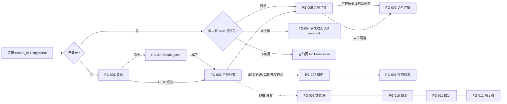

# HuntAI SRE 交互设计摘要

- **Status**: Draft（Stage 4 交互链路产出；非原型、非 PRD、非已冻结）
- **日期**: 2026-09-14（随 Business Model 二期增补重放）
- **输入（唯一业务权威）**: [`docs/03_problem_modeling/business_model.md`](../03_problem_modeling/business_model.md)（Draft；一期 2026-09-13，二期增补 2026-09-14）
- **纪律**: 页面、任务流、控件只映射 Business Model 已拍板能力。禁止把竞品、研究包或未写入 BR 的能力写成界面。一期交互不得把 §11 做成一期验收。业务不足以支撑交互决策时标 **[TBD-BIZ]**。实现假设标 **[ASSUMPTION]**，不得当作已批准产品结论。本文件不规定视觉值（无 Design Tokens）。

**一句话**: Web 是唯一产品入口。被呼叫的人用深链或告警列表打开同一条 Alertmanager firing 告警，完成可区分的 cited RCA 或 `inconclusive`。**一期**仅人工点「调查」；**二期**在 `severity=critical` 时可自动开查，调查内可 Citation Loki LogQL，写修复仅人批 `restart`/`scale`，并展示 60 分钟零 token 扫描的 Finding。界面始终不提供 silence / ack / 呼叫 / delete / apply / exec，也永不做无 `alert_id` 的对话首页。

**阶段标注**: 无标注 = 一期必须。标 **〔二期〕** 的页面区域、导航、任务流 **不进入一期验收**（Business Model §8 / §11）。原型与 PRD 一期不得实现这些入口。

---

## 0. 交互范围

### 0.1 一期做（映射 MVP / 权限矩阵）

| 交互能力 | 业务来源 |
|---|---|
| OIDC 登录；禁止匿名 | BR-010、NFR-020、MVP-1 |
| 恰好一个 break-glass 本地管理员入口（非日常调查） | BR-011 |
| 告警列表：firing / resolved；范围随角色 | BR-017、BR-022、MVP-5 |
| 稳定深链 `cluster_id` + fingerprint；未入库文案固定 | BR-051、§2.4、G1 |
| 人工点「调查」创建 Investigation；入库不自动开调查 | BR-030、MVP-6 |
| 调查中展示只读工具过程、Skill 加载态、成本闸 | BR-033、BR-038、BR-040 |
| `completed` 与 `inconclusive` 主界面可区分；零 Citation 不得像已找到根因 | BR-031、BR-032 |
| 关闭 LLM 时 firing 告警仍作 finding 展示 | BR-026、BR-050、G3 |
| SRE 对某一 `cluster_id` 按需整集群规则扫描 | BR-027、MVP-12 |
| RelatedLink 保存 Grafana / Loki / Kibana / Elastic **URL**（非 Citation） | BR-034、MVP-17 |
| 打开告警详情时写入本地「看过」AuditEvent（不露出站同步） | BR-045 |
| SRE / break-glass：数据源、Skill 映射、TeamBinding、日额度临时放行、组织 token 闸 | §4、BR-014、BR-041、BR-042 |

### 0.2 〔二期〕做（§11，独立验收）

| 交互能力 | 业务来源 |
|---|---|
| `severity=critical` 自动开查结果出现在告警详情 / 调查详情；人可打开并「继续查」；不改发起人 | BR-070–BR-074、BR-089 |
| 调查内 Loki LogQL 工具结果可作 Citation；开发强制 namespace；无凭证则无 Loki | BR-075–BR-077 |
| 调查内人批卡片：preview → 第二次点击 confirm；仅 restart / scale | BR-080–BR-088 |
| 开发只读 Finding（namespace 相交）；不可触发扫描；历史含 `scheduled` | BR-078、BR-079 |
| ClusterSource 配置 `env`、`write_remediation`、`scale_max`、LokiCredential、WriteIdentity | BR-081、BR-086、BR-087、§4 |

### 0.3 永不做（禁止出现的控件 / 页面）

任何阶段都不得以按钮、菜单、表单或「即将上线」入口出现。来源：§4 禁止列与 §9。

- Alertmanager silence；xMatters ack / 关单 / 评论；HuntAI 呼叫 / 升级 / IM / 出站邮件
- kubectl delete / apply / exec；读 secrets；服务端 Playwright
- 对任意 firing 自动开查；把缺 `severity` 当成自动开查放行
- Elasticsearch 查询 API；浏览器扒页 Loki / Elastic
- 把用户粘贴文本当 Citation；独立对话首页 / 无 `alert_id` 的 Ask
- 开发触发整集群或 namespace 扫描；用户自助勾选 TeamBinding
- NOC / 经理角色；移动端 App；Incident / 邮箱 / 知识库上传 / MTTR 看板

**一期相对二期的禁用（一期界面必须遵守）**

- 不展示自动开查徽章、不展示 LogQL 工具条、不展示 ApprovalRequest、不展示定时 ScanRun、不展示 `env` / `write_remediation` / `scale_max` / Loki / WriteIdentity 配置项
- 一期 PG-005 **禁止** Restart / Scale 按钮（二期也只允许出现在 PG-006 人批卡片，不允许告警详情直接写集群）

Webhook 入库无登录用户界面：不提供「入库监控台」。失败表现为深链未命中（PG-004）或列表为空，不伪造 Alert（BR-051）。

---

## 1. 信息架构

### 1.1 导航结构

未登录只允许 PG-001、PG-002。已登录使用应用壳（NAV-000），不单独编号为业务页。

```text
未登录
├── PG-001 登录（OIDC）
└── PG-002 Break-glass 登录（次要入口，链自 PG-001）

已登录 · NAV-000
├── 告警（所有角色默认落地）
│   ├── PG-003 告警列表
│   ├── PG-004 深链未入库
│   ├── PG-005 告警详情
│   └── PG-006 调查详情   〔二期〕含 Loki 证据、人批卡片、「继续查」
├── 扫描
│   ├── 一期：仅 SRE / break-glass
│   ├── 〔二期〕开发可见只读 Finding，无「分析该集群」
│   ├── PG-007 集群扫描 / Finding 入口
│   └── PG-008 扫描结果
└── 设置（仅 SRE / break-glass；开发始终不出现）
    ├── PG-009 数据源     〔二期〕增 env / 写修复开关 / scale_max / Loki / WriteIdentity
    ├── PG-010 Skill 映射
    ├── PG-011 团队绑定
    └── PG-012 额度与成本闸
```

不新增「审批中心」「对话首页」「Ask」页（BR-089、§9.24–26）。人批只活在所属 Investigation 上。

**导航规则（IX-NAV）**

| ID | 规则 | 追溯 |
|---|---|---|
| IX-NAV-01 | **一期**开发主导航只有「告警」。扫描与设置**隐藏**（不是置灰）。 | BR-017、BR-027、§4 |
| IX-NAV-01b | **〔二期〕**开发主导航为「告警 + 扫描」。扫描内无触发按钮。设置仍隐藏。 | BR-079 |
| IX-NAV-02 | SRE 与 break-glass 可见「告警 / 扫描 / 设置」。break-glass 常驻非日常横幅。 | BR-011、§4 |
| IX-NAV-03 | 无「我的团队」自助切换器。 | BR-014 |
| IX-NAV-04 | 无多 Organization 切换。 | BR-002、NFR-016 |
| IX-NAV-05 | 壳展示显示名与角色。登录页不写未定 IdP 商标。 | BR-010 **[TBD-BIZ]** IdP 名 |
| IX-NAV-06 | 深链可直达 PG-005 / PG-004；未登录先 TF-01/TF-02 再回跳。 | BR-051、BR-010 |
| IX-NAV-07 | `auto-investigator` 不可出现登录入口，不可出现 confirm 按钮的可点主体。 | BR-073 |

### 1.2 页面清单

| ID | 页面 | 用途 | 谁进入 | 不在本页做的事 |
|---|---|---|---|---|
| PG-001 | 登录 | 公司 IdP OIDC 进入产品 | 未登录任何人 | 匿名预览、无 alert 的对话 |
| PG-002 | Break-glass 登录 | 唯一本地管理员紧急进入 | 持有该账号的人 | 日常调查主入口（文案约束） |
| PG-003 | 告警列表 | 按角色范围列出 Alert，定位 `cluster_id` + fingerprint | 已登录 | 不在列表上直接开调查；不 silence |
| PG-004 | 深链未入库 | 深链参数合法但库中无该 Alert | 已登录且查找未命中 | 不伪造 Alert 卡片 |
| PG-005 | 告警详情 | 一条 Alert；人工调查；RelatedLink；写「看过」。〔二期〕展示自动调查入口 | 对该 Alert 可见的用户 | 不 ack、不 page、不在本页执行 restart/scale |
| PG-006 | 调查详情 | 一次 Investigation 的运行与终态。〔二期〕Loki citation、人批、继续查 | 能打开其所属 Alert 的用户（含他人发起与 auto，BR-055） | 不编辑 Claim；不把写执行当 Citation；无独立聊天 |
| PG-007 | 集群扫描 | 一期：SRE 选集群并发起按需扫描。〔二期〕兼 Finding 只读入口 | 一期仅 SRE/break-glass；二期开发只读 | 开发不可触发；无 namespace 扫描器 |
| PG-008 | 扫描结果 | 一次 ScanRun 的 Finding 快照 | 有权看该次结果的人 | 无 Finding ack/close；不据此自动开调查 |
| PG-009 | 数据源 | 2–5 个 ClusterSource；AM / Prom / 分析器。〔二期〕env 与写/Loki 凭证 | SRE / break-glass | 不上传 kubeconfig；不回显密钥明文 |
| PG-010 | Skill 映射 | Git 仓库映射（全局 / 集群 / team） | SRE / break-glass | 不在此编辑 SKILL.md 正文 |
| PG-011 | 团队绑定 | IdP 组 → 标签值 | SRE / break-glass | 禁止自助勾选 |
| PG-012 | 额度与成本闸 | 日额度临时放行；组织 token 闸 | SRE / break-glass | 无「申请放行」工单；不把自动开查计入用户 30 次的说明须在二期可见 |

**URL 形态 [TBD-FE]**：必须能用 `cluster_id` 与 fingerprint 打开告警（BR-051）。本阶段只约束「深链参数 = 这两项，未命中走 PG-004」。

### 1.3 各页信息层级

层级：L1 决策、L2 范围校验、L3 排障 / 证据 / 配置。L1 在 1440 首屏可见；375 先 L1。

#### PG-001 登录

| 层 | 信息 |
|---|---|
| L1 | 产品名；主按钮「使用公司账号登录」 |
| L2 | 禁止匿名（一句） |
| L3 | 次要链「紧急管理员登录」→ PG-002 |

#### PG-002 Break-glass 登录

| 层 | 信息 |
|---|---|
| L1 | 「紧急本地管理员」；用户名 / 密码；提交 |
| L2 | 「不用于日常调查」 |
| L3 | 返回 OIDC |

#### PG-003 告警列表

| 层 | 信息 |
|---|---|
| L1 | 筛选：集群、`firing` / `resolved`；每行 alertname、状态、`cluster_id` |
| L2 | `team` / `owner` / `namespace`；`unscoped`（仅 SRE 可见该类行）；最近接收时间。〔二期〕可展示标签 `severity`（精确值，不做大小写映射） |
| L3 | fingerprint（可复制）；LLM 不可用横幅 |

行操作：进入 PG-005。列表不放「调查」，避免未看范围就消耗日额度。

关闭 LLM 时本页仍列出 firing 告警，Alert 本身即 finding（BR-026）：不另包 Finding 对象，无「关闭 finding」。

〔二期〕列表**不**因 `severity=critical` 自动跳进调查；自动开查是系统行为，人仍从详情进入。

#### PG-004 深链未入库

| 层 | 信息 |
|---|---|
| L1 | **尚未收到 AM webhook** |
| L2 | 只读 `cluster_id`、fingerprint |
| L3 | 回 PG-003；无假告警字段 |

#### PG-005 告警详情

| 层 | 信息 |
|---|---|
| L1 | alertname；`firing` / `resolved`；`cluster_id`；主操作「调查」（计入该用户日额度） |
| L2 | 标签（含 team/owner/namespace 或 `unscoped`）；fingerprint；当日剩余可**人工**新建次数（IX-INV-02）。〔二期〕`severity` 原值；若有 `trigger=auto` 调查则 L1 次按钮「打开自动调查」 |
| L3 | Investigation 列表（状态可区分；〔二期〕每条标明 `human` / `auto`）；RelatedLink；深链复制。〔二期〕若本次 firing 因并发上限跳过自动开查，SRE 可见一句「自动开查已跳过（并发上限）」——对应 AuditEvent，不提供「补开自动」按钮（BR-072 不排队） |

打开本页即写「看过」（BR-045）。无「标记已读」按钮。

本页禁止：Silence、Ack、Page、IM、邮件、以及任何直接执行的 Restart/Scale。

#### PG-006 调查详情

| 层 | 信息 |
|---|---|
| L1 | 徽章 `running` / `completed` / `inconclusive` 必须可区分；`inconclusive` 主标题**禁止**「根因是…」。〔二期〕`trigger` 徽章；发起人为用户或「自动调查（不可登录）」。**〔二期〕等人批**：工具/LLM 已停且有 pending ApprovalRequest 时，L1 固定为「只读调查已结束，等待确认写操作」，禁止「正在分析 / 正在调查」（BR-090） |
| L2 | Skill：已加载 / **未加载组织约束**；成本闸 LLM n/8、工具 n/12（〔二期〕含 Loki 次数）、墙钟 ≤150s（等人批时墙钟暂停，显示「收集已停止」）。无 LLM 时横幅：「AI 不可用，本次只收集只读证据，不会生成根因结论」（BR-053） |
| L3 | Claim + Citation；失败工具不可引用；RelatedLink 标「外部链接，不是证据」。〔二期〕Loki 成功结果可出现在 Citation；WriteAction 人批区（见下）；「继续查」输入绑定本 Investigation / 原 Alert |

`completed`：主内容为 Claim + Citation。
`inconclusive`：L1 为证据不足或成本闸；失败工具不得渲染成证据卡。

**〔二期〕人批区（仅 `write_remediation` 开且已配 WriteIdentity 时出现）**

| 层 | 信息 |
|---|---|
| L1 | preview：集群、`env`、namespace、资源（Deployment / StatefulSet）、动词 `restart` 或 `scale`；scale 时当前副本与目标副本 |
| L2 | 独立按钮「确认执行」（第二次点击）与「拒绝」；说明模型不能自批 |
| L3 | 状态 `pending` / `confirmed` / `rejected` / `void`；执行结果只读；**明确「写结果不是 Citation」** |

开发在 `env=production` 或未填（视为 production）或 namespace 不在绑定内：看不到可点的确认，或看到卡片但为 No Permission（IX-PERM-09）。

**〔二期〕「继续查」**（BR-089）：输入提交后仍停留 PG-006，不离开原 Alert。禁止跳到无 `alert_id` 的会话。调查已结束是否仍可继续 **[TBD-BIZ]**；未定前 **[ASSUMPTION]** 仅 `running` 可继续，结束后只读，人对同一 Alert 再点「调查」开新的 `trigger=human`。

#### PG-007 集群扫描

| 层 | 信息 |
|---|---|
| L1 | SRE：目标 `cluster_id` +「分析该集群」+「零 LLM、整集群」。〔二期〕开发：无该按钮，L1 为「我的 namespace Finding」 |
| L2 | ScanRun 历史：时间、状态。〔二期〕`trigger=manual \| scheduled` |
| L3 | 无 namespace 选择器 |

#### PG-008 扫描结果

| 层 | 信息 |
|---|---|
| L1 | 集群、ScanRun 状态、当前用户可见 Finding 条数 |
| L2 | Finding 列表（CrashLoop / ImagePull 等）。〔二期〕开发仅 namespace 相交的行 |
| L3 | 无 ack / close；无「据此自动开调查」 |

#### PG-009 数据源

| 层 | 信息 |
|---|---|
| L1 | ClusterSource 列表；「注册集群」（上限 5） |
| L2 | 每集群：AM webhook（与 OIDC 分离）；Prom 只读；分析器。〔二期〕必选 `env`（`production` \| `non_production`）；`write_remediation` 默认关；`scale_max` 可空（空 = 禁止 scale，禁止填假默认）；LokiCredential 已配置/未配置；WriteIdentity 已配置/未配置 |
| L3 | 只读 SA 禁止加写动词；禁止个人 kubeconfig；密钥不回显 |

Webhook 凭证如何展示 **[TBD-BIZ]**（BR-016）。

#### PG-010 Skill 映射

| 层 | 信息 |
|---|---|
| L1 | 映射范围：全局 / 集群 / team |
| L2 | Git 地址（**[TBD-BIZ]**，空仓库允许） |
| L3 | 「空仓库允许上线；调查时提示未加载组织约束」 |

无 SKILL.md 在线编辑器。

#### PG-011 团队绑定

| 层 | 信息 |
|---|---|
| L1 | 组 → `team` / `owner` / `namespace` |
| L2 | 无 `team` 时以 `namespace` 为缺省匹配键 |
| L3 | 最近变更审计提示（谁、何时、授予哪些值）。无独立审计台。〔二期〕可提示「无 namespace 绑定则该开发不能跑 Loki」（BR-076），不是新表单 |

#### PG-012 额度与成本闸

| 层 | 信息 |
|---|---|
| L1 | 指定用户 +「临时放行今日调查额度」；「关闭新调查」 |
| L2 | 每用户每日人工新建 ≤ 30。〔二期〕只读说明：自动开查不计入该 30 次 |
| L3 | 组织日 token 未配置时必须显示「闸未配置，不得视为无限」。默认数字 **[TBD-BIZ]**。关闸/未配置说明须写明：**同时阻断自动开查**（BR-042），禁止写「自动仍开」或「无限自动」 |

### 1.4 导航关系



回退：PG-006 → PG-005 → PG-003；PG-004 → PG-003；PG-008 → PG-007。

---

## 2. 核心任务流

每条 **TF** 一条主流程；**EX-n.m** 与之对应。格式：用户操作 → 系统响应 → 页面变化。TF-01–TF-12 = 一期。TF-13–TF-17 = 〔二期〕，一期原型禁止实现。

### TF-01 公司账号登录进入告警列表

**追溯**: BR-010、NFR-020、MVP-1、MVP-20

| 步 | 用户操作 | 系统响应 | 页面变化 |
|---|---|---|---|
| 1 | 打开产品 Web | 无有效会话 | PG-001 Default |
| 2 | 点「使用公司账号登录」 | 跳转公司 IdP（名 **[TBD-BIZ]**） | PG-001 Submitting |
| 3 | 完成 IdP | 建会话；禁止匿名 | PG-003（或回跳 URL） |

| 异常 ID | 触发 | 用户操作 | 系统响应 | 页面变化 |
|---|---|---|---|---|
| EX-01.1 | 未登录访问 PG-003–PG-012 或深链 | 打开受保护 URL | 拒绝匿名；记回跳 | PG-001，成功后回跳 |
| EX-01.2 | IdP 拒绝 / 取消 / 超时 | 在 IdP 失败 | 不建会话 | PG-001 Error：「登录未完成」 |
| EX-01.3 | 会话过期 | 继续操作 | 拒绝后续写 | PG-001 Error：「会话已过期」 |
| EX-01.4 | TeamBinding 为空 | 登录后看列表 | 开发可见集为空；SRE 仍看全部。是否阻断开发登录 **[TBD-BIZ]** | **[ASSUMPTION]** 进 PG-003 Empty |

### TF-02 Break-glass 紧急登录

**追溯**: BR-011、§4

| 步 | 用户操作 | 系统响应 | 页面变化 |
|---|---|---|---|
| 1 | PG-001 点「紧急管理员登录」 | 无 OIDC | PG-002 Default |
| 2 | 提交本地账号密码 | 校验唯一 break-glass | PG-002 Submitting |
| 3 | — | 权限同 SRE | PG-003 + 常驻「非日常调查」横幅 |

| 异常 ID | 触发 | 用户操作 | 系统响应 | 页面变化 |
|---|---|---|---|---|
| EX-02.1 | 凭证错误 | 提交 | 拒绝；不区分无用户/密码错 | PG-002 Error |
| EX-02.2 | 用该账号日常调查 | 点「调查」 | §4 允许；BR-011 不用于日常 | **[TBD-BIZ]** 是否硬阻断。交互：**不阻断**，只留横幅 |
| EX-02.3 | 重复提交 | 连点 | IX-DUP-01 忽略第二次 | 保持 Submitting |

### TF-03 从呼叫深链打开同一条告警

**追溯**: G1、§2.4、BR-051、BR-017、BR-022

| 步 | 用户操作 | 系统响应 | 页面变化 |
|---|---|---|---|
| 1 | 打开 xMatters 中的 HuntAI 深链 | 未登录则 TF-01/TF-02 回跳 | 登录后停留深链路由 |
| 2 | — | 按 `cluster_id`+fingerprint 查找并鉴权 | 命中且可见 → PG-005；写「看过」 |
| 3 | 可点「调查」（TF-05）。〔二期〕若已有自动调查可打开 PG-006 | — | 停留 PG-005 或进入 PG-006 |

模板未改深链时人走 TF-04。产品不提供「去改 xMatters 模板」按钮。

| 异常 ID | 触发 | 用户操作 | 系统响应 | 页面变化 |
|---|---|---|---|---|
| EX-03.1 | 尚未入库 | 打开深链 | 不伪造 Alert | **PG-004**「尚未收到 AM webhook」 |
| EX-03.2 | 已入库但不可见 | 打开深链 | 拒绝 | **No Permission**（不泄露正文） |
| EX-03.3 | 缺参数 | 打开坏链 | 无法定位 | PG-004 Error：「链接不完整」 |
| EX-03.4 | 会话人不是被叫人 | 打开转发链接 | 按当前用户绑定鉴权 | 可见 PG-005，否则 EX-03.2 |

### TF-04 在列表中定位告警

**追溯**: G1、G3、BR-017、BR-022、BR-026、MVP-5

| 步 | 用户操作 | 系统响应 | 页面变化 |
|---|---|---|---|
| 1 | 进入「告警」 | SRE 全部（含 `unscoped`）；开发仅匹配 | PG-003 Default 或 Empty |
| 2 | 筛选集群、firing/resolved | 服务端过滤 | 零命中 → No Result |
| 3 | 点一行 | 打开 Alert；写「看过」 | PG-005 |

关闭 LLM：步骤不变，加横幅「AI 调查不可用，告警列表仍有效」。

| 异常 ID | 触发 | 用户操作 | 系统响应 | 页面变化 |
|---|---|---|---|---|
| EX-04.1 | 可见范围 0 条 | 打开列表 | 空集 | PG-003 **Empty** |
| EX-04.2 | 筛选过窄 | 改筛选 | 空集 | PG-003 **No Result**；可清除筛选 |
| EX-04.3 | 加载失败 | 打开/刷新 | 错误（无栈/SQL） | PG-003 **Error** |
| EX-04.4 | 开发用参数看 unscoped/他人团队 | 改查询串 | 读模型不可见 | 列表不出现；直链走 EX-03.2 |

按 alertname 搜索 **[TBD-BIZ]**。本期 **不做** 全文搜索。

### TF-05 人工发起只读调查

**追溯**: §2.2、BR-030、BR-017、BR-041、BR-042、NFR-011、MVP-6、MVP-9

| 步 | 用户操作 | 系统响应 | 页面变化 |
|---|---|---|---|
| 1 | 在可见 PG-005 点「调查」 | 确认层（IX-CNF-01）：占 1 次日额度、墙钟≤150s、只读 | PG-005 确认层 |
| 2 | 确认 | 校验可见性、日额度、组织闸（不校验人点并发硬闸，BR-054）；创建 `trigger=human`、`running` | Submitting → PG-006 |
| 3 | — | 拉 Skill；只读工具循环 | PG-006 Loading → Default（运行中） |

〔二期〕同一 Alert 上已有 `trigger=auto` **不阻止**再开人工调查（一对多）。自动开查不占该用户 30 次（BR-073）。

| 异常 ID | 触发 | 用户操作 | 系统响应 | 页面变化 |
|---|---|---|---|---|
| EX-05.1 | 不可见 | 点调查 | 拒绝；不落 running | PG-005 No Permission |
| EX-05.2 | 当日人工新建已 30 | 确认 | 拒绝新开 | Success-Failure：「今日调查次数已用尽」。可说明需 SRE 在 PG-012 放行（无申请按钮） |
| EX-05.3 | 组织关闭新调查，或闸未配置 fail-close | 确认 | 拒绝 | 「组织已关闭新调查」或「组织成本闸未配置」 |
| EX-05.4 | 人点 `running` 已达 NFR-011 规划值（一期 5） | 确认 | **不拒绝**（BR-054） | 正常进入 PG-006；不提示「已达上限」 |
| EX-05.5 | 双击确认 | 连点 | IX-DUP-02 只创建一条 | 保持 Submitting |
| EX-05.6 | 无 LLM / 禁出域 | 点「调查」 | 仍创建；只跑只读工具；LLM=0（BR-053） | PG-006 横幅「AI 不可用，本次只收集只读证据，不会生成根因结论」；终态 `inconclusive`，不得声称已完成 RCA |
| EX-05.7 | 创建接口失败 / 额度闸拒绝 | 确认 | 不落成功调查；**不占**当日次数（BR-041） | PG-005 Error 或 Success-Failure |

### TF-06 调查运行至可区分终态

**追溯**: §2.2、§5.2、BR-031–BR-033、BR-038、BR-040、BR-043、NFR-001–003

| 步 | 用户操作 | 系统响应 | 页面变化 |
|---|---|---|---|
| 1 | 停留或稍后打开 PG-006 | 展示工具调用与成本闸 | PG-006 `running` Default |
| 2 | 点 Citation | 打开本调查已成功只读 ToolCall 副本 | 只读证据层 |
| 3 | — | citation≥1 且未触闸 → `completed`（无 pending 人批时） | L1 完成态 |
| 4 | — | 否则 → `inconclusive`（无 pending 人批时） | L1 证据不足/成本闸；禁止「根因是…」 |
| 5 | 〔二期〕有 pending 人批 | 工具/LLM 已停 | 主状态仍 `running` | L1：「只读调查已结束，等待确认写操作」（BR-090） |

`trigger=auto` 不得因无登录用户而跳过 citation 规则（§5.2）。

| 异常 ID | 触发 | 用户操作 | 系统响应 | 页面变化 |
|---|---|---|---|---|
| EX-06.1 | Citation=0 | 等待结束 | 必须 `inconclusive` | PG-006 inconclusive（无引用） |
| EX-06.2 | LLM>8 或工具>12 或墙钟>150s | 等待 | 停止；`inconclusive`（成本） | 用量打满；成功工具可展示但 L1 不像完整 RCA |
| EX-06.3 | 某次只读工具失败 | — | 该次无 Citation | 时间线标失败，不可点成 Citation |
| EX-06.4 | 无 Skill / 空仓库 | — | 调查不中断 | 固定「未加载组织约束」 |
| EX-06.5 | 刷新/断网/关页 | 离开 | 服务端继续直至闸或结束。无「取消调查」BR | 再打开见当前状态。**[ASSUMPTION]** 不可取消 |
| EX-06.6 | 输出超上下文 | — | 截断；Citation 指向截断副本（阈值 **[TBD-BIZ]**） | 证据标注「已截断」 |
| EX-06.7 | 点 RelatedLink | 开外部 URL | 不写入 Citation | 标明不是证据 |
| EX-06.9 | 〔二期〕工具循环已停、仍有 pending | 打开 PG-006 | 保持 running；墙钟暂停 | L1 不得写「正在分析」。人批区可见 |

PG-006 **无 Editing Claim**。〔二期〕人批确认不算改 Claim，见 TF-15。

### TF-07 SRE 按需整集群规则扫描

**追溯**: §2.3、BR-027、BR-050、G3

| 步 | 用户操作 | 系统响应 | 页面变化 |
|---|---|---|---|
| 1 | SRE 打开「扫描」 | 角色校验 | PG-007 Default |
| 2 | 选 `cluster_id`，点「分析该集群」 | 确认（IX-CNF-02）；ScanRun=`running`，零 LLM，`trigger=manual` | Submitting → 该行 running |
| 3 | 打开该次运行 | Finding 快照 | PG-008 `completed` |

| 异常 ID | 触发 | 用户操作 | 系统响应 | 页面变化 |
|---|---|---|---|---|
| EX-07.1 | 开发进入扫描 URL（一期）或点「分析该集群」（二期） | 访问/点击 | 拒绝触发 | 一期整页 No Permission；二期无按钮，直调则 No Permission |
| EX-07.2 | 集群不可达 / 扫描器错误 | 已发起 | `scan_failed` | Success-Failure；可再开新 ScanRun |
| EX-07.3 | 同一集群连点 | 连点 | IX-DUP-03。并行 ScanRun **[TBD-BIZ]** | **[ASSUMPTION]** 已有 `running` 则禁用 |
| EX-07.4 | 选 namespace 子集 | — | 无此 API | **不提供**控件 |

### TF-08 保存 RelatedLink

**追溯**: BR-034、BR-037、MVP-17

| 步 | 用户操作 | 系统响应 | 页面变化 |
|---|---|---|---|
| 1 | PG-005「添加链接」 | 进入 Editing | URL 表单 |
| 2 | 保存 | 校验 URL；存 RelatedLink | Default；**不**进 Citation 区 |

| 异常 ID | 触发 | 用户操作 | 系统响应 | 页面变化 |
|---|---|---|---|---|
| EX-08.1 | 空 / 非 URL | 保存 | 拒绝 | 内联错误 |
| EX-08.2 | 把链接当证据 | 在调查里找 Citation | 不铸造 | PG-006 标注「外部链接，不是证据」。Loki **界面 URL** 仍是 RelatedLink；Loki **LogQL 查询结果**才是〔二期〕Citation（BR-075 vs BR-034） |
| EX-08.3 | 删除/编辑已存链接 | — | 未规定 | **[TBD-BIZ]**。未拍板只提供添加与只读列表 |

host 允许列表 **[TBD-BIZ]**；未定前只做 URL 句法校验。

### TF-09 配置集群数据源（一期字段）

**追溯**: §4、BR-004、BR-016、BR-023、BR-046–BR-048、NFR-013、MVP-3、MVP-14

| 步 | 用户操作 | 系统响应 | 页面变化 |
|---|---|---|---|
| 1 | 打开数据源 | 列出 ClusterSource | PG-009 Default |
| 2 | 注册并填 AM / Prom / 分析器 | `cluster_id` 唯一；接入身份 ≠ OIDC | Editing → Submitting → Default |
| 3 | — | 写 AuditEvent；密钥不回显 | 成功反馈 |

〔二期〕额外字段见 TF-17，一期表单不得出现那些字段。

| 异常 ID | 触发 | 用户操作 | 系统响应 | 页面变化 |
|---|---|---|---|---|
| EX-09.1 | 开发访问 | 打开 | 拒绝 | No Permission |
| EX-09.2 | 必填缺失或 id 冲突 | 保存 | 拒绝 | 保持 Editing |
| EX-09.3 | 已有 5 个仍新增 | 点注册 | 上限 2–5 | 禁用「注册集群」 |
| EX-09.4 | 上传 kubeconfig | — | 禁止 | **不提供**上传 |
| EX-09.5 | 保存失败 | 保存 | fail-close | Error |

### TF-10 管理 TeamBinding

**追溯**: BR-013–BR-015、§4、MVP-2

| 步 | 用户操作 | 系统响应 | 页面变化 |
|---|---|---|---|
| 1 | 打开团队绑定 | 列出映射 | PG-011 Default |
| 2 | 修改并确认 | 写入 + AuditEvent | 确认 → Submitting → Default |

| 异常 ID | 触发 | 用户操作 | 系统响应 | 页面变化 |
|---|---|---|---|---|
| EX-10.1 | 开发访问 / 自助勾选 | 打开或找「加入团队」 | 禁止 | 无入口；直链 No Permission |
| EX-10.2 | 标签值为空或非法 | 保存 | 拒绝 | 表单错误 |
| EX-10.3 | 保存失败 | 保存 | 不写审计也不改绑定 | Error |

无撤销栈：再改 = 另一次审计变更。

### TF-11 临时放行用户日调查额度

**追溯**: BR-041、§4、MVP-9

| 步 | 用户操作 | 系统响应 | 页面变化 |
|---|---|---|---|
| 1 | PG-012 选用户，「临时放行」 | 确认（IX-CNF-03） | 确认层 |
| 2 | 确认 | 放行 + AuditEvent | 成功反馈 |

| 异常 ID | 触发 | 用户操作 | 系统响应 | 页面变化 |
|---|---|---|---|---|
| EX-11.1 | 开发访问 | 打开 PG-012 | 拒绝 | No Permission |
| EX-11.2 | 未选用户 | 提交 | 拒绝 | 表单错误 |
| EX-11.3 | 放行额度与时限 | — | 只说「临时」 | **[TBD-BIZ]**。禁止填造「+10 次 / 24h」 |

### TF-12 配置或关闭组织日 token 闸

**追溯**: BR-042、NFR-015

| 步 | 用户操作 | 系统响应 | 页面变化 |
|---|---|---|---|
| 1 | 查看闸开关 | 展示闸存在；数字未定则未配置 | 不得显示无限 |
| 2 | 「关闭新调查」并确认 | 之后 TF-05 走 EX-05.3 | 确认 → 成功 |

| 异常 ID | 触发 | 用户操作 | 系统响应 | 页面变化 |
|---|---|---|---|---|
| EX-12.1 | 未填数字却画成无限 | （设计禁令） | 违反 BR-042 | 禁止该状态 |
| EX-12.2 | 误关闸 | 点开关 | 必须确认 | 未确认不改 |
| EX-12.3 | 默认 token 数字 | — | **[TBD-BIZ]** | 可空；空 = 未配置，新调查 fail-close |
| EX-12.4 | 〔二期〕关闸或闸未配置后 automatic 开查 | — | **阻断**（BR-042）：跳过 auto 并审计 | PG-012 说明「同时阻断自动开查」；SRE 在告警详情可见跳过原因（与并发上限同类 L3，文案区分「组织闸」） |

---

### TF-13 〔二期〕打开自动开查结果

**追溯**: §2.5、BR-070–BR-074、G6

主路径是**人打开已由系统创建的调查**（创建本身无登录用户）。

| 步 | 用户操作 | 系统响应 | 页面变化 |
|---|---|---|---|
| 1 | 打开可见且 `severity=critical` 的 firing 告警 | 若已有本轮 firing 的 `trigger=auto` 调查则列入 PG-005 | PG-005 展示自动调查及其状态 |
| 2 | 点「打开自动调查」 | 不改发起人 `auto-investigator`；不计入该用户 30 次 | PG-006，徽章 `auto` |
| 3 | 阅读 Claim / 继续查（TF-13 与 TF-06 同终态规则） | citation 规则不因无登录用户而放宽 | 同 TF-06 完成或 inconclusive |

| 异常 ID | 触发 | 用户操作 | 系统响应 | 页面变化 |
|---|---|---|---|---|
| EX-13.1 | 无 `severity` 或缺不是精确 `critical`（含 `Critical`） | 打开告警 | 不开自动 | PG-005 仅人工「调查」。**不**提示「将为你自动开查」 |
| EX-13.2 | 本轮 firing 已有一次 auto | （系统） | 不再开第二次 | PG-005 只列已有那条 auto |
| EX-13.3 | 自动 `running` 已达 5 | （系统）跳过并审计；Alert 仍在 | 不排队 | SRE 见「已跳过（并发上限）」；人仍可 TF-05 |
| EX-13.4 | 开发打开 unscoped / 不可见的 critical | 打开 | 与一期相同拒绝 | EX-03.2 |
| EX-13.5 | 人把 auto 调查当成自己发起可确认写操作 | 点 confirm | `auto-investigator` 不能当确认人；确认人必须是当前登录有权用户 | 人批区用当前用户身份，不显示「以自动调查身份确认」 |

运营前置（非本系统页）：集群 Alertmanager 必须打 `severity` 键。键不齐只许人点调查。产品不提供「给 AM 打标签」编辑器（§9.2）。

### TF-14 〔二期〕调查内 Loki LogQL 作为 Citation

**追溯**: BR-075–BR-077、BR-035、NFR-003

用户不单独打开「LogQL 控制台」页。Loki 是调查工具循环的一部分；人在 PG-006 看到成功查询副本并可 Citation。

| 步 | 用户操作 | 系统响应 | 页面变化 |
|---|---|---|---|
| 1 | 打开 `running`/`completed` 的 PG-006 | 若集群有 LokiCredential，工具白名单含 LogQL；次数计入 12 | 时间线可出现 Loki 调用 |
| 2 | 点该 Citation | 打开成功只读查询副本（可截断） | 证据层；**不是** RelatedLink |

| 异常 ID | 触发 | 用户操作 | 系统响应 | 页面变化 |
|---|---|---|---|---|
| EX-14.1 | 该集群无 LokiCredential | — | 不得调 Loki；不得扒页 | 无 Loki 工具行；不假装已查日志 |
| EX-14.2 | 开发无 TeamBinding.`namespace` | — | 禁止该用户跑 Loki | 若有失败行：业务失败「未绑定 namespace，不能查询 Loki」，不可 Citation |
| EX-14.3 | 开发查询去掉 namespace 约束 | — | 拒绝执行 | 失败行；不可 Citation |
| EX-14.4 | 开发查询他人 namespace | — | 注入约束后无数据或拒绝 | 不得展示越权日志原文 |
| EX-14.5 | 用户想查 Elastic | — | 禁止 | **不提供** Elastic 查询入口 |

SRE / break-glass 不限 namespace（BR-076）。界面不为 SRE 提供「切换到开发视图」的伪装过滤。

### TF-15 〔二期〕人批 restart / scale

**追溯**: §2.6、§5.4、BR-080–BR-088、NFR-019、NFR-028

| 步 | 用户操作 | 系统响应 | 页面变化 |
|---|---|---|---|
| 1 | 在 `running` 且写修复已开的 PG-006 看到 pending 卡片 | 模型只生成 preview，不执行 | PG-006 人批区 Default（pending） |
| 2 | 有权人点「确认执行」（第二次点击） | 校验 R2、env、namespace、scale 上限；用 WriteIdentity 执行 | 人批区 Submitting |
| 3 | — | 成功则 `confirmed` + AuditEvent | Success；执行结果只读且**不能**点成 Citation |

| 异常 ID | 触发 | 用户操作 | 系统响应 | 页面变化 |
|---|---|---|---|---|
| EX-15.1 | `write_remediation` 关或无 WriteIdentity | — | 写工具不出现 | 无人批区。禁止置灰「即将开通」 |
| EX-15.2 | 开发在 production / 未填 env / 错误 namespace | 点确认 | 拒绝 | No Permission 或按钮禁用+原因 |
| EX-15.3 | scale 目标 > 当前×2 或 > `scale_max` | 确认 | 拒绝 | Success-Failure，保持 pending 或转 rejected（以后端为准） |
| EX-15.4 | 当前 replicas=0 仍 scale 拉起 | 确认 | 禁止 | 业务失败文案；不提供「从 0 拉起」 |
| EX-15.5 | `scale_max` 未配置 | — | 该集群禁止 scale | 人批区不出现 scale，或出现但确认禁用「未配置 scale_max」。**禁止**填假默认 |
| EX-15.6 | Investigation 已离开 running | 再点确认 | pending → `void` | 确认消失；状态 void |
| EX-15.7 | 有权人点「拒绝」 | 拒绝 | `rejected` | 不执行 |
| EX-15.8 | 连点确认 | 连点 | IX-DUP-04 | 只执行一次 |
| EX-15.9 | WriteIdentity 失败 | 确认 | 禁止 fallback kubeconfig / 只读 SA | Error：「写身份不可用」 |
| EX-15.10 | 提议 delete/apply/exec 或改 YAML | — | 禁止 | **不渲染**这些动词 |
| EX-15.11 | 把执行结果拖进 Claim | — | Citation 不得指向写结果 | 证据区不可选该输出 |

preview 必须含：集群 / namespace / 资源 / 当前与目标副本（scale）。缺 preview 不得出确认按钮（BR-082）。

### TF-16 〔二期〕只读查看定时扫描 Finding

**追溯**: §2.7、BR-078、BR-079、NFR-018

| 步 | 用户操作 | 系统响应 | 页面变化 |
|---|---|---|---|
| 1 | 开发打开「扫描」 | 不发起扫描；返回 namespace 相交的 Finding | PG-007 Default 或 Empty |
| 2 | 打开某次 `scheduled`/`manual` 结果 | 过滤 Finding | PG-008 |
| 3 | SRE 打开同一导航 | 可见全部 Finding；仍可 TF-07 手动触发 | PG-007 含「分析该集群」 |

| 异常 ID | 触发 | 用户操作 | 系统响应 | 页面变化 |
|---|---|---|---|---|
| EX-16.1 | 开发点触发 | 寻找「分析该集群」 | 禁止 | 无按钮；直调 No Permission |
| EX-16.2 | 开发无 namespace 绑定 | 打开扫描 | 相交为空 | PG-007 Empty，说明需管理员绑定 namespace |
| EX-16.3 | 定时 ScanRun `scan_failed` | 打开 | 状态失败 | PG-008 Success-Failure；开发仍不能重跑（SRE 可手动） |
| EX-16.4 | 用 UI 隐藏冒充「我触发了扫描」 | — | 禁止 | 历史只读；无「运行中且由我触发」的假主体 |

### TF-17 〔二期〕配置 env / 写修复 / Loki / WriteIdentity

**追溯**: BR-077、BR-081、BR-084、BR-086、BR-087、§4

| 步 | 用户操作 | 系统响应 | 页面变化 |
|---|---|---|---|
| 1 | SRE 在 PG-009 打开某集群 | 展示二期字段；`write_remediation` 默认关 | Editing |
| 2 | 必选 `env`；可选开写修复、填 `scale_max`、配置 Loki/WriteIdentity | 未选 env 不得静默保存。空 `scale_max` = 禁止 scale | 确认敏感开关（IX-CNF-05）→ Submitting |
| 3 | — | AuditEvent；密钥不回显 | Default |

| 异常 ID | 触发 | 用户操作 | 系统响应 | 页面变化 |
|---|---|---|---|---|
| EX-17.1 | 开发访问 | 打开 | 拒绝 | No Permission |
| EX-17.2 | 用集群名推断 env | — | 禁止 | 无「从名称猜测」按钮；`env` 必选 |
| EX-17.3 | 只读 SA 上勾选写动词 | — | 禁止 | 无此控件 |
| EX-17.4 | 开 `write_remediation` 但未配 WriteIdentity | 保存 | 写工具仍不得出现（BR-081 两条件） | 保存可成功，但展示警告「写身份未配置，调查中不会出现修复」 |
| EX-17.5 | 上传个人 kubeconfig 当 WriteIdentity | — | 禁止 | **不提供**上传 |

---

## 3. 交互规则

前端隐藏/禁用 **不是** 安全边界。

### 3.1 表单校验（IX-VAL）

| ID | 适用 | 规则 | 追溯 |
|---|---|---|---|
| IX-VAL-01 | PG-001 | 主路径无本地字段；禁止跳过登录 | BR-010 |
| IX-VAL-02 | PG-002 | 用户名密码必填；错误不区分账号是否存在 | BR-011 |
| IX-VAL-03 | PG-005 链接 | 绝对 URL；失败不落库 | BR-034 |
| IX-VAL-04 | PG-007 | 必须先选已注册 `cluster_id`；无「全部集群一键扫」 | BR-027 |
| IX-VAL-05 | PG-009 一期 | `cluster_id` 必填唯一；其余空值不得保存 | BR-023、BR-004 |
| IX-VAL-06 | PG-010 | 仓库可空；填写则须 Git URL 句法 | BR-038、BR-039 |
| IX-VAL-07 | PG-011 | 至少一类标签值；禁止空映射冒充全员可见 | BR-013、BR-022 |
| IX-VAL-08 | PG-012 | 放行必须指定用户；token 数字为正整数或空 | BR-041、BR-042 |
| IX-VAL-09 | 全局 | 失焦提示、提交阻断；密钥不在回显中打全量 | BR-052 |
| IX-VAL-10 | 〔二期〕PG-009 | `env` 必选两枚举之一，禁止空提交后默认为 production 而不告知；若实现允许空，保存前必须明示「将视为 production」 | BR-087 |
| IX-VAL-11 | 〔二期〕scale 预览 | 目标为正整数；UI 预先提示 ≤当前×2 且 ≤`scale_max`；当前为 0 时确认不可用 | BR-084 |
| IX-VAL-12 | 〔二期〕继续查 | 输入不得创建无 Alert 的新会话 | BR-089 |

### 3.2 操作反馈（IX-FB）

| ID | 规则 | 追溯 |
|---|---|---|
| IX-FB-01 | 调查创建成功以跳转 PG-006 为准，不以 Toast 代替 | TF-05 |
| IX-FB-02 | 额度/闸/无权限/`scan_failed`/`inconclusive`/`void` 用页内状态，不静默 | §5 |
| IX-FB-03 | 系统错误不展示栈、SQL、密钥、Prompt、未脱敏日志 | BR-049、BR-052 |
| IX-FB-04 | `completed` 与 `inconclusive` 在徽章、主标题、主内容三处可区分 | BR-032、G1 |
| IX-FB-05 | 工具失败可见但不可引用 | BR-031 |
| IX-FB-06 | 「看过」无成功 Toast | BR-045、BR-044 |
| IX-FB-07 | LLM 关闭：列表/详情横幅，不隐藏告警 | BR-026 |
| IX-FB-08 | 〔二期〕`auto` 与 `human` 徽章可区分；自动 inconclusive 同样不得像已找到根因 | BR-032、BR-074 |
| IX-FB-09 | 〔二期〕人批成功不得把卡片升级成「根因已修复」的 RCA 标题 | BR-088 |
| IX-FB-10 | 〔二期〕Loki RelatedLink 与 Loki Citation 分区展示 | BR-034、BR-075 |
| IX-FB-11 | 〔二期〕工具/LLM 已停且有 pending 人批：L1 必须为「只读调查已结束，等待确认写操作」；禁止「正在分析 / 正在调查」 | BR-090 |
| IX-FB-12 | 无 LLM 调查：横幅「AI 不可用，本次只收集只读证据，不会生成根因结论」；终态按 inconclusive 渲染 | BR-053 |

### 3.3 确认与撤销（IX-CNF）

| ID | 动作 | 确认 | 撤销 | 追溯 |
|---|---|---|---|---|
| IX-CNF-01 | 发起人工调查 | 必须 | 确认前可取消；创建后无取消 | BR-030、BR-041 |
| IX-CNF-02 | 分析该集群 | 必须 | 无撤回 Finding | BR-027 |
| IX-CNF-03 | 临时放行额度 | 必须 | 无一键撤销 | BR-041 |
| IX-CNF-04 | 关闭组织新调查 | 必须 | 再开 = 另一次配置 | BR-042 |
| IX-CNF-05 | 改 TeamBinding；〔二期〕打开 `write_remediation` | 必须 | 无撤销栈 | BR-014、BR-081 |
| IX-CNF-06 | 保存 RelatedLink | 否 | 删除 **[TBD-BIZ]** | BR-034 |
| IX-CNF-07 | 登录 / 看过 | 否 | 看过不能撤回 | BR-010、BR-045 |
| IX-CNF-08 | 〔二期〕确认写修复 | **必须**（preview 之后的第二次点击） | 拒绝 = rejected；离开 running = void | BR-082、BR-085 |

### 3.4 防重复提交（IX-DUP）

| ID | 规则 | 追溯 |
|---|---|---|
| IX-DUP-01 | PG-002 提交后禁用至返回 | BR-011 |
| IX-DUP-02 | 「调查」确认后禁用至进入 PG-006 或失败。同一 Alert **允许**再开另一次人工调查，但每次走额度 | 实体 1—N |
| IX-DUP-03 | 该集群已有 `running` ScanRun 时禁用再分析 **[ASSUMPTION]** | BR-027 |
| IX-DUP-04 | 设置保存中禁用；〔二期〕「确认执行」提交中禁用 | BR-082 |
| IX-DUP-05 | 调查运行中不提供「再跑一遍工具」手工按钮（系统循环）。〔二期〕「继续查」受同一 8/12/150s 闸 | BR-040、BR-074 |

### 3.5 权限表现（IX-PERM）

| ID | 情境 | 表现 | 追溯 |
|---|---|---|---|
| IX-PERM-01 | 一期开发：扫描、设置 | **隐藏** | §4 |
| IX-PERM-01b | 〔二期〕开发：设置仍隐藏；扫描只读 | 扫描可见、触发隐藏 | BR-079 |
| IX-PERM-02 | 开发不可见 Alert | 列表不出现；深链 No Permission，不用锁定卡片泄露 alertname | BR-017、BR-022 |
| IX-PERM-03 | 开发可见 Alert 的「调查」 | 主按钮可用 | §4 |
| IX-PERM-04 | 关闸或日额用尽 | 「调查」禁用+原因 | BR-041、BR-042 |
| IX-PERM-05 | `unscoped` | 仅 SRE/break-glass 列表可见 | BR-022 |
| IX-PERM-06 | 直链越权 | 页级 No Permission | §4 |
| IX-PERM-07 | break-glass | 导航同 SRE + 横幅 | BR-011 |
| IX-PERM-08 | silence 等永禁能力 | **不渲染**，不用置灰暗示存在 | BR-044 |
| IX-PERM-09 | 〔二期〕开发 confirm 写 | 仅 `non_production` 且 namespace ∈ 绑定；否则无确认或 No Permission | BR-083 |
| IX-PERM-10 | 〔二期〕开发 Loki | 无 namespace 则不能跑；UI 不提供去约束开关 | BR-076 |
| IX-PERM-11 | 〔二期〕写工具默认 | 关写修复或无 WriteIdentity = 整块不出现 | BR-081 |
| IX-PERM-12 | 他人 / auto 调查 | 能见该 Alert 则可只读打开其下全部 Investigation | BR-055 |

跨用户查看他人 Investigation：已拍板（BR-055）。不可见 Alert 的调查 URL → No Permission。

---

## 4. 页面状态矩阵

### 4.1 状态定义

| 状态 | 含义 |
|---|---|
| Default | 有权限、主数据已到、非编辑、非提交 |
| Loading | 首屏或刷新等待 |
| Empty | 合法空：该作用域从未有对象 |
| No Result | 作用域有数据，当前筛选为 0 |
| Error | 系统/网络失败 |
| No Permission | 角色或 Alert/namespace/`env` 范围不足 |
| Editing | 表单编辑中 |
| Submitting | 已提交等待写结果 |
| Success-Failure | 写操作结束后的业务成功或业务失败（含 `completed` / `inconclusive` / `scan_failed` / 额度拒绝 / `confirmed`/`rejected`/`void`）。不是系统 Error |

### 4.2 总表（每页 9 态）

| 页面 | Default | Loading | Empty | No Result | Error | No Permission | Editing | Submitting | Success-Failure |
|---|---|---|---|---|---|---|---|---|---|
| PG-001 | 适用：登录主屏 | 适用：探测会话 | 不适用：无对象集合 | 不适用：无筛选 | 适用：OIDC 失败返回 | 不适用：本页即未授权入口 | 不适用：无本地主字段 | 适用：等待 IdP | 适用：取消/失败登录 |
| PG-002 | 适用 | 适用 | 不适用 | 不适用 | 适用 | 不适用：本页即紧急入口 | 适用：填账号密码 | 适用 | 适用：凭证错误 |
| PG-003 | 适用 | 适用 | 适用：可见 0 条 | 适用：筛选 0 条 | 适用 | 适用：会话角色异常（少见） | 不适用：改筛选不算 Editing | 不适用：无写提交 | 不适用：无写终态；LLM 关闭叠横幅于 Default |
| PG-004 | 适用：主文案即未入库 | 适用：查找中 | 不适用：与 Default 同义 | 不适用 | 适用：查询失败或参数残缺 | 适用：鉴权失败不应落到本页（走 No Permission 以免泄露是否入库） | 不适用 | 不适用 | 不适用：未入库不是写失败 |
| PG-005 | 适用 | 适用 | 不适用：无 Alert 走 PG-004 | 不适用 | 适用 | 适用：不可见 | 适用：RelatedLink | 适用：保存链接或创建调查 | 适用：额度/闸拒绝；链接保存成功。〔二期〕跳过自动开查用 L3 说明叠 Default，不算独立 Success-Failure |
| PG-006 | 适用：running 时间线或终态已渲染 | 适用 | 适用：保留期满删除 | 不适用 | 适用 | 适用 | 不适用改 Claim。〔二期〕继续查输入算轻量 Editing | 不适用创建（在 PG-005）。〔二期〕确认写修复算 Submitting | 适用：completed 与 inconclusive 必须用本态区分。〔二期〕confirmed/rejected/void |
| PG-007 | 适用 | 适用 | 适用：无 ScanRun；〔二期〕开发无相交 Finding | 不适用：一期无扫描筛选。〔二期〕若增加筛选再启用 | 适用 | 适用：一期非 SRE 整页；二期开发触发时 | 适用：SRE 选集群 | 适用：发起扫描 | 适用：发起失败 |
| PG-008 | 适用：completed 且有可见 Finding | 适用 | 适用：completed 但可见 Finding=0 | 不适用 | 适用 | 适用 | 不适用：无 ack 表单 | 不适用 | 适用：`scan_failed` |
| PG-009 | 适用 | 适用 | 适用：0 个集群 | 不适用 | 适用 | 适用 | 适用 | 适用 | 适用 |
| PG-010 | 适用 | 适用 | 适用：空仓库/无映射（允许） | 不适用 | 适用 | 适用 | 适用 | 适用 | 适用 |
| PG-011 | 适用 | 适用 | 适用：尚无映射 | 不适用 | 适用 | 适用 | 适用 | 适用 | 适用 |
| PG-012 | 适用：闸未配置而非无限 | 适用 | 不适用：不是集合空态 | 不适用 | 适用 | 适用 | 适用 | 适用 | 适用 |

### 4.3 关键态说明

**PG-004 vs No Permission（BR-051、BR-017）**

- 可见性失败：No Permission，不引用 alertname。
- 确定无记录：PG-004「尚未收到 AM webhook」。
- 开发深链未命中是否统一 No Permission 以防探测 **[TBD-BIZ]**。未定前：无记录 → PG-004，不可见 → No Permission。

**PG-006 终态**

| 业务状态 | 主标题约束 | 主内容 |
|---|---|---|
| `completed` | 「调查完成」类；可含引用条数 | 每条 Claim ≥1 Citation |
| `inconclusive` | 禁止「根因是…」；原因：无引用 / 成本闸 / 无 LLM 只收集证据 | 可展示工具，L1 不像已找到根因 |
| 〔二期〕`running` + 人批等待 | 「只读调查已结束，等待确认写操作」 | preview + 确认；墙钟显示已停止 |
| 〔二期〕`pending` 人批 | 从属于上述 running，不单独当 RCA 完成 | preview + 确认 |
| 〔二期〕`void` | 「调查已结束，未执行」 | 确认不可点 |

`running` 用 Default + Loading 片段，不用 Success-Failure。

**PG-003 Empty vs No Result**：无筛选仍 0 条 = Empty；用户改筛选后 0 条 = No Result。

**PG-008 Empty**：扫描成功但无命中（或开发过滤后 0 条）= Empty，不是 `scan_failed`。

---

## 5. 响应式行为

一期无移动端 App（§9.32）。下列为 Web 在 **1440px** 与 **375px**。G1 呼叫到调查必须在手机浏览器可完成。〔二期〕人批确认在 375 同样要能看完 preview 再点确认（生产事故也可能只用手机）。

### 5.1 全局

| 断点 | 壳 | 列表 | 主操作 |
|---|---|---|---|
| 1440px | 左侧导航（按角色） | 表格式；L1+L2 可见 | 页头右侧主按钮 |
| 375px | 底部导航：一期开发仅「告警」；SRE「告警 / 更多」。〔二期〕开发「告警 / 扫描」 | 卡片；L3 默认折叠 | 主按钮粘底 |

- 触控目标 ≥44px（调查、分析该集群、确认执行、登录）。
- 横幅全宽置顶；确认层 375 用整页 sheet，1440 用模态。确认文案不得因窄屏省略「只读 / preview 字段」。
- 不因窄屏增减业务能力（不隐藏 Citation，不隐藏人批 preview 的副本数字）。

### 5.2 分页面

| 页面 | 1440px | 375px |
|---|---|---|
| PG-001 / 002 | 居中 ≤400px | 全宽 16px 边距 |
| PG-003 | 筛选横向；表 | chips + 卡片 |
| PG-004 | 居中说明 | 主文案不得图标-only |
| PG-005 | 左告警、右调查历史 | 单列；「调查」粘底；〔二期〕「打开自动调查」次于人工调查但不折叠消失 |
| PG-006 | 左 Claim、右证据/成本闸；〔二期〕人批卡片在 Claim 下、证据上 | 顺序：状态 → 原因 → 〔二期〕人批 preview → Claim → Citation → 工具 → 成本闸。inconclusive 的 L1 在首屏 |
| PG-007 | 左集群右历史 | 先选集群；〔二期〕开发无选择器则直接 Finding 列表 |
| PG-008 | Finding 表 | Finding 卡片 |
| PG-009–012 | 双列表单 | 单列；〔二期〕`env` 与写开关在 375 仍可提交 |

### 5.3 调查运行时（375 必保）

1. 深链 → 登录 → PG-005 → 确认调查 → PG-006。〔二期〕亦可深链 → 打开已有自动调查。
2. 成本闸压缩为一行；超限后原因换行完整展示。
3. 〔二期〕确认执行前，preview 的目标副本与集群名必须可见；不得只留图标确认。

---

## 6. 可追溯性

### 6.1 页面 → 业务规则

| 页面 | 一期 BR | 〔二期〕增量 BR |
|---|---|---|
| PG-001 | BR-010、BR-012 | — |
| PG-002 | BR-011 | — |
| PG-003 | BR-017、BR-022、BR-026、BR-050 | BR-070（只展示 severity，不开查） |
| PG-004 | BR-051、BR-023 | — |
| PG-005 | BR-030、BR-034、BR-044、BR-045、BR-051 | BR-070–BR-073 |
| PG-006 | BR-031–BR-033、BR-038、BR-040、BR-043、BR-053、BR-055、BR-060 | BR-074–BR-076、BR-080–BR-090 |
| PG-007 / 008 | BR-027 | BR-078、BR-079 |
| PG-009 | BR-004、BR-016、BR-046–BR-048 | BR-077、BR-081、BR-086、BR-087 |
| PG-010 | BR-038、BR-039 | — |
| PG-011 | BR-013–BR-015 | BR-076（无 namespace 则禁 Loki，仅提示） |
| PG-012 | BR-041、BR-042、BR-054 | BR-073（自动不计入 30）；BR-042 阻断 auto |

### 6.2 任务流 → 异常一一对应

| 任务流 | 阶段 | 主路径 BR | 异常 |
|---|---|---|---|
| TF-01 | 一期 | BR-010 | EX-01.1–01.4 |
| TF-02 | 一期 | BR-011 | EX-02.1–02.3 |
| TF-03 | 一期 | BR-051、§2.4 | EX-03.1–03.4 |
| TF-04 | 一期 | BR-017、BR-026 | EX-04.1–04.4 |
| TF-05 | 一期 | BR-030、BR-041、BR-042、BR-053、BR-054 | EX-05.1–05.7 |
| TF-06 | 一期 | BR-031、BR-032、BR-040、BR-090 | EX-06.1–06.9 |
| TF-07 | 一期 | BR-027 | EX-07.1–07.4 |
| TF-08 | 一期 | BR-034 | EX-08.1–08.3 |
| TF-09 | 一期 | §4 配置 | EX-09.1–09.5 |
| TF-10 | 一期 | BR-014、BR-015 | EX-10.1–10.3 |
| TF-11 | 一期 | BR-041 | EX-11.1–11.3 |
| TF-12 | 一期 | BR-042 | EX-12.1–12.4 |
| TF-13 | 二期 | BR-070–BR-074 | EX-13.1–13.5 |
| TF-14 | 二期 | BR-075–BR-077 | EX-14.1–14.5 |
| TF-15 | 二期 | BR-080–BR-088 | EX-15.1–15.11 |
| TF-16 | 二期 | BR-078、BR-079 | EX-16.1–16.4 |
| TF-17 | 二期 | BR-081、BR-086、BR-087 | EX-17.1–17.5 |

---

## 7. [TBD-BIZ] / [ASSUMPTION] 汇总

| 标记 | 议题 | 卡在哪 |
|---|---|---|
| [TBD-BIZ] | IdP 产品名 | BR-010 |
| [TBD-BIZ] | 开发空绑定是否允许登录 | BR-014 |
| [TBD-BIZ] | 临时放行额度与时限 | BR-041 |
| [TBD-BIZ] | 组织日 token 默认数字；pending 人批等待超时秒数 | BR-042、BR-090 |
| [TBD-BIZ] | 脱敏字段清单、截断字节、`scale_max` 整数 | BR-049、BR-043、BR-084 |
| [TBD-BIZ] | Skill Git 地址；IngestCredential 展示 | BR-039、BR-016 |
| [TBD-BIZ] | RelatedLink 删除与 host 允许列表 | BR-034 |
| [TBD-BIZ] | 同一集群并行 ScanRun | BR-027 |
| [TBD-BIZ] | 开发深链未命中是否统一 No Permission | BR-051 vs BR-022 |
| [TBD-BIZ] | 列表 alertname 搜索 | G1 |
| [TBD-BIZ] | 调查结束后「继续查」是否仍可用 | BR-089 vs BR-040 |
| [TBD-FE] | 深链 URL path | BR-051 |
| [ASSUMPTION] | 创建后不可取消调查 | 无取消 BR |
| [ASSUMPTION] | 自然日界 `Asia/Shanghai` | BR-041 |
| [ASSUMPTION] | 集群已有 running 扫描则禁用再发起 | — |
| [ASSUMPTION] | 一期设置页不做表内搜索 | 20 人规模 |
| [ASSUMPTION] | 仅 `running` 可「继续查」 | 见上 TBD |

---

## 8. 完成前自检

- [x] 信息架构含 PG-001–PG-012、用途、信息层级、导航关系；二期不另造对话首页/审批中心
- [x] 一期 TF-01–TF-12 与二期 TF-13–TF-17：用户操作 → 系统响应 → 页面变化；每条主流程有对应 EX
- [x] 交互规则覆盖校验、反馈、确认撤销、防重复、权限表现
- [x] 每页 9 类状态逐一判定，不适用已写理由（§4.2）
- [x] 异常与主流程一一对应（§6.2）
- [x] 响应式写明 1440px 与 375px（Web，非 App）
- [x] 未把 §9 永不做写成控件；未把 §11 标进一期验收
- [x] `completed` 与 `inconclusive` 可区分；PG-004 文案锁定「尚未收到 AM webhook」
- [x] `severity` 仅精确 `critical` 才表现自动开查；缺键 fail-close
- [x] 写修复仅 preview 后第二次 confirm；写结果不是 Citation
- [x] 每个核心交互可追溯至 BR-xxx / NFR / §4
- [x] 2026-09-14：无 LLM 只跑工具；人点并发不硬拒绝；拒绝不占日额；关闸阻断 auto；能见 Alert 可读他人调查；人批等待 L1 文案锁定
