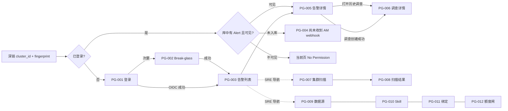

# HuntAI SRE 交互设计摘要

- **Status**: Draft（Stage 4 交互链路产出；非原型、非 PRD、非已冻结）
- **日期**: 2026-09-14
- **输入（唯一业务权威）**: [`docs/03_problem_modeling/business_model.md`](../03_problem_modeling/business_model.md)（Draft，2026-09-13）
- **纪律**: 页面、任务流、控件只映射 Business Model 已拍板能力。禁止把竞品、研究包或未写入 BR 的能力写成一期界面。业务不足以支撑交互决策时标 **[TBD-BIZ]**。实现假设标 **[ASSUMPTION]**，不得当作已批准产品结论。本文件不规定视觉值（无 Design Tokens）。

**一句话**: Web 是唯一产品入口。被呼叫的人用深链或告警列表打开同一条 Alertmanager firing 告警，人工点「调查」后进入可区分的 cited RCA 或 `inconclusive`；SRE 另有按需零 LLM 扫描与配置。界面不提供 silence / ack / 呼叫 / kubectl 写。

---

## 0. 交互范围

### 0.1 做（映射 MVP / 权限矩阵）

| 交互能力 | 业务来源 |
|---|---|
| OIDC 登录；禁止匿名 | BR-010、NFR-020、MVP-1 |
| 恰好一个 break-glass 本地管理员入口（非日常调查） | BR-011 |
| 告警列表：firing / resolved；范围随角色 | BR-017、BR-022、MVP-5 |
| 稳定深链 `cluster_id` + fingerprint；未入库文案固定 | BR-051、§2.4、G1 |
| 人工点「调查」创建 Investigation；入库不自动开调查 | BR-030、MVP-6 |
| 调查中展示只读工具过程、Skill 加载态、成本闸 | BR-033、BR-038、BR-040 |
| `completed` 与 `inconclusive` 主界面可区分；零 Citation 不得像已找到根因 | BR-031、BR-032 |
| 关闭 LLM 时 firing 告警仍作 finding 展示 | BR-026、BR-050、G3 |
| SRE 对某一 `cluster_id` 按需整集群规则扫描 | BR-027、MVP-12 |
| RelatedLink 保存 Grafana / Loki / Kibana / Elastic **URL**（非 Citation） | BR-034、MVP-17 |
| 打开告警详情时写入本地「看过」AuditEvent（不露出站同步） | BR-045 |
| SRE / break-glass：数据源、Skill 映射、TeamBinding、日额度临时放行、组织 token 闸 | §4 权限矩阵、BR-014、BR-041、BR-042 |

### 0.2 不做（禁止出现的控件 / 页面）

下列在任何页面不得以按钮、菜单、表单或「即将上线」入口出现。来源：Business Model §4 禁止列与 §9 Out of Scope。

- Alertmanager silence；xMatters ack / 关单 / 评论；HuntAI 呼叫 / 升级 / IM / 出站邮件
- kubectl 写（restart / scale / delete / exec）、读 secrets、服务端 Playwright
- 入库或按 severity 自动开调查；24/7 LLM 巡检；定时零 token 巡检
- Loki / Elastic 官方查询作为调查工具；把用户粘贴文本当 Citation
- 开发 on-call 整集群扫描；「只扫一个 namespace」
- 用户自助勾选 TeamBinding；NOC / 经理角色；移动端 App
- Incident / 审批 / 邮箱 / 知识库上传 / MTTR 数字看板

Webhook 入库（§2.1）无登录用户界面：不提供「入库监控台」。失败表现为深链未命中（PG-004）或列表为空，不伪造 Alert（BR-051）。

---

## 1. 信息架构

### 1.1 导航结构

未登录只允许 PG-001、PG-002。已登录使用应用壳（NAV-000），不单独编号为业务页。

```text
未登录
├── PG-001 登录（OIDC）
└── PG-002 Break-glass 登录（次要入口，链自 PG-001）

已登录 · NAV-000
├── 告警（所有角色默认落地）
│   ├── PG-003 告警列表
│   ├── PG-004 深链未入库（路由与告警深链相同，未命中时的页面）
│   ├── PG-005 告警详情
│   └── PG-006 调查详情
├── 扫描（仅 SRE / break-glass；开发 on-call 导航中不出现）
│   ├── PG-007 集群扫描
│   └── PG-008 扫描结果
└── 设置（仅 SRE / break-glass；开发 on-call 导航中不出现）
    ├── PG-009 数据源（ClusterSource / webhook / Prom / 分析器）
    ├── PG-010 Skill 映射
    ├── PG-011 团队绑定
    └── PG-012 额度与成本闸
```

**导航规则（IX-NAV）**

| ID | 规则 | 追溯 |
|---|---|---|
| IX-NAV-01 | 开发 on-call 主导航只有「告警」。扫描与设置**不出现**（隐藏，不是置灰）。 | BR-017、BR-027、§4 |
| IX-NAV-02 | SRE 与 break-glass 可见「告警 / 扫描 / 设置」。break-glass 登录后须持续展示非日常用途提示。 | BR-011、§4 |
| IX-NAV-03 | 无「我的团队」自助切换器。可见范围只来自 IdP 映射与管理员改绑定。 | BR-014 |
| IX-NAV-04 | 无多 Organization 切换。一期单组织。 | BR-002、NFR-016 |
| IX-NAV-05 | 壳内品牌区可展示当前用户显示名与角色（SRE / 开发 on-call / 本地管理员）。IdP 产品名未定，登录页不写具体 IdP 商标。 | BR-010、BR-012 **[TBD-BIZ]** IdP 产品名 |
| IX-NAV-06 | 深链可绕过列表直达 PG-005 或 PG-004；未登录先完成 TF-01/TF-02，成功后回跳原 URL。 | BR-051、BR-010 |

### 1.2 页面清单

| ID | 页面 | 用途 | 谁进入 | 不在本页做的事 |
|---|---|---|---|---|
| PG-001 | 登录 | 公司 IdP OIDC 进入产品 | 任何人（未登录） | 不采集告警、不提供匿名预览 |
| PG-002 | Break-glass 登录 | 唯一本地管理员紧急进入 | 持有该账号的人 | 不作为日常调查入口（文案约束） |
| PG-003 | 告警列表 | 按角色范围列出 Alert，定位 `cluster_id` + fingerprint | 已登录 | 不自动开调查；不 silence |
| PG-004 | 深链未入库 | 深链参数合法但库中无该 Alert | 已登录且鉴权通过后仍未命中 | 不伪造 Alert 卡片 |
| PG-005 | 告警详情 | 展示一条 Alert；发起调查；RelatedLink；写「看过」 | 对该 Alert 可见的用户 | 不 ack、不 page、不把 RelatedLink 当证据 |
| PG-006 | 调查详情 | 展示一次 Investigation 的运行与终态 | 能打开其所属 Alert 的用户；跨用户是否可看 **[TBD-BIZ]** | 不编辑 Claim；不补造 Citation |
| PG-007 | 集群扫描 | 选择 `cluster_id` 并发起按需规则扫描 | SRE / break-glass | 开发不可见；不提供 namespace 范围 |
| PG-008 | 扫描结果 | 展示一次 ScanRun 的 Finding 快照 | 能看该 ScanRun 的 SRE / break-glass | 无 Finding ack / close |
| PG-009 | 数据源 | 注册/查看 2–5 个 ClusterSource；配置 AM webhook、Prom 只读、分析器 | SRE / break-glass | 不上传 kubeconfig；不展示密钥明文 |
| PG-010 | Skill 映射 | 管理 Skill 仓库映射（全局 / 集群 / team） | SRE / break-glass | 不在此编辑 SKILL.md 正文（Git 为源） |
| PG-011 | 团队绑定 | 管理 IdP 组 → `team` / `owner` / `namespace` 映射 | SRE / break-glass | 禁止被绑定人自助勾选 |
| PG-012 | 额度与成本闸 | 对指定用户临时放行日调查额度；配置/关闭组织 token 闸 | SRE / break-glass | 不提供「申请放行」工单流 |

**URL 形态 [TBD-FE]**：必须能用 `cluster_id` 与 fingerprint 打开告警（BR-051）。具体 path 由 Stage 6/9 定，本阶段只约束「深链参数 = 这两项，未命中走 PG-004」。

### 1.3 各页信息层级

层级约定：L1 决策所需、L2 校验范围所需、L3 排障 / 证据 / 配置细节。L1 在 Desktop 首屏可见；Mobile 先 L1，L2/L3 可折叠或续屏。

#### PG-001 登录

| 层 | 信息 |
|---|---|
| L1 | 产品名；主按钮「使用公司账号登录」 |
| L2 | 禁止匿名的说明（一句） |
| L3 | 次要文字链「紧急管理员登录」→ PG-002（视觉权重最低） |

#### PG-002 Break-glass 登录

| 层 | 信息 |
|---|---|
| L1 | 「紧急本地管理员」；用户名 / 密码；提交 |
| L2 | 明确「不用于日常调查」 |
| L3 | 返回 OIDC 登录 |

#### PG-003 告警列表

| 层 | 信息 |
|---|---|
| L1 | 筛选：集群、`firing` / `resolved`；每行：alertname、状态、`cluster_id` |
| L2 | `team` / `owner` / `namespace`；`unscoped` 标记（仅 SRE 能见到带该标记的行）；最近接收时间 |
| L3 | fingerprint（可复制）；LLM 不可用时的全局提示条（列表仍可用） |

行操作：进入 PG-005。列表上不放「调查」，避免未看标签范围就消耗日额度（IX-INV-01）。

关闭 LLM 时本页仍列出 firing 告警，并把 Alert 本身当作 finding 展示（BR-026）：不另做 Finding 对象包装，不增加「关闭 finding」操作。

#### PG-004 深链未入库

| 层 | 信息 |
|---|---|
| L1 | 固定主文案：**尚未收到 AM webhook** |
| L2 | 只读展示请求中的 `cluster_id`、fingerprint（便于对运营核对接入） |
| L3 | 链到 PG-003「打开告警列表」；不展示假的告警字段、时间、标签 |

#### PG-005 告警详情

| 层 | 信息 |
|---|---|
| L1 | alertname；`firing` / `resolved`；`cluster_id`；主操作「调查」 |
| L2 | 标签（含 team/owner/namespace 或 `unscoped`）；fingerprint；该用户当日剩余可新建调查次数（IX-INV-02） |
| L3 | 既有 Investigation 列表（状态必须可区分）；RelatedLink 列表与「添加链接」；深链复制 |

打开本页即写「看过」AuditEvent（BR-045）。无「标记已读」按钮（避免被理解成已向 xMatters/AM 同步）。

主操作区**禁止**出现：Silence、Ack、Page、发 IM、发邮件、Restart/Scale。

#### PG-006 调查详情

| 层 | 信息 |
|---|---|
| L1 | 终态或运行态徽章（`running` / `completed` / `inconclusive` 三色/三文案可区分）；`inconclusive` 主标题**禁止**「根因是…」 |
| L2 | Skill 加载结果（已加载 / **未加载组织约束**）；成本闸用量：LLM n/8、工具 n/12、墙钟 ≤150s |
| L3 | Claim 列表（每条下挂 Citation）；Citation 打开只读 ToolCall 副本；工具失败条目标明失败且不可被引用；RelatedLink 若从告警带出则标「外部链接，不是证据」 |

`completed`：L1 可为「调查完成（含引用）」一类中性完成态，正文以 Claim + Citation 为主。
`inconclusive`：L1 必须是未完成/证据不足/成本闸原因之一；不得把工具失败输出渲染成证据卡片（BR-031）。

#### PG-007 集群扫描

| 层 | 信息 |
|---|---|
| L1 | 目标 `cluster_id`；主操作「分析该集群」；说明「零 LLM、整集群」 |
| L2 | 历史 ScanRun 列表：时间、状态 `running` / `completed` / `scan_failed` |
| L3 | 无 namespace 选择器（一期禁止） |

#### PG-008 扫描结果

| 层 | 信息 |
|---|---|
| L1 | 所属集群、ScanRun 状态、Finding 条数 |
| L2 | Finding 列表（如 CrashLoop / ImagePull 命中） |
| L3 | 无 ack / close；无「据此自动开调查」 |

#### PG-009 数据源

| 层 | 信息 |
|---|---|
| L1 | ClusterSource 列表（`cluster_id`、接入状态摘要）；「注册集群」（上限 5） |
| L2 | 每集群：AM webhook 接入（IngestCredential 与 OIDC 分离的说明）；Prom 只读数据源；分析器启用 |
| L3 | 只读 ServiceAccount 约束说明（禁止个人 kubeconfig）；密钥只可「已配置 / 重新生成」，不回显明文 |

Webhook 接收 URL 与凭证如何展示、是否一次性明文 **[TBD-BIZ]**（业务只要求 IngestCredential 不得复用调查人会话，BR-016）。

#### PG-010 Skill 映射

| 层 | 信息 |
|---|---|
| L1 | 当前映射范围：全局 / 集群 / team |
| L2 | Git 仓库地址（仓库地址本身 **[TBD-BIZ]**，空仓库允许上线） |
| L3 | 「空仓库允许上线；调查时将提示未加载组织约束」 |

本页不提供 SKILL.md 在线编辑器（Skill 实体在 Git，BR-038）。

#### PG-011 团队绑定

| 层 | 信息 |
|---|---|
| L1 | 用户 / IdP 组 → 标签值（`team` / `owner` / `namespace`） |
| L2 | 无 `team` 时以 `namespace` 为缺省匹配键的说明（BR-013） |
| L3 | 最近变更写入 AuditEvent 的只读提示（谁、何时、授予哪些值）。**不**提供独立审计检索台（Business Model 未给审计查询 UI） |

#### PG-012 额度与成本闸

| 层 | 信息 |
|---|---|
| L1 | 指定用户 +「临时放行今日调查额度」；组织「关闭新调查」开关 |
| L2 | 每用户每日上限 30 的只读说明；组织日 token 硬闸配置位 |
| L3 | 未配置组织日 token 数字时，界面必须显示「闸未配置，不得视为无限」，禁止写「无限制」（BR-042）。默认数字 **[TBD-BIZ]** |

### 1.4 导航关系



回退：PG-006 → PG-005 → PG-003；PG-004 → PG-003；PG-008 → PG-007。设置四页互为同级，经 NAV-000「设置」分组。

---

## 2. 核心任务流

图例：每条 **TF** 含一条主流程；**EX-n.m** 是该主流程的异常/分支，与主流程一一对应。步骤格式：用户操作 → 系统响应 → 页面变化。

### TF-01 公司账号登录进入告警列表

**追溯**: BR-010、NFR-020、MVP-1、MVP-20

| 步 | 用户操作 | 系统响应 | 页面变化 |
|---|---|---|---|
| 1 | 打开产品 Web | 判定无有效会话 | 进入 PG-001 Default |
| 2 | 点「使用公司账号登录」 | 跳转公司 IdP OIDC（产品名 **[TBD-BIZ]**） | PG-001 Submitting（等待 IdP） |
| 3 | 在 IdP 完成认证 | 建立会话；禁止匿名 | 进入 PG-003 Default（若有回跳 URL 则回跳） |

| 异常 ID | 触发 | 用户操作 | 系统响应 | 页面变化 |
|---|---|---|---|---|
| EX-01.1 | 未登录访问 PG-003–PG-012 或深链 | 直接打开受保护 URL | 拒绝匿名；记录回跳 | 进入 PG-001；成功后回跳原 URL |
| EX-01.2 | IdP 拒绝、取消或超时 | 在 IdP 失败或关闭 | 不建会话 | 回 PG-001 Error：「登录未完成」 |
| EX-01.3 | 会话过期 | 在已登录页继续操作 | 拒绝后续写操作 | 回到 PG-001 Error：「会话已过期」；深链回跳保留 |
| EX-01.4 | 已登录用户在 IdP 无任何可映射组，TeamBinding 为空 | 登录成功后看列表 | 开发 on-call 可见 Alert 为空集；SRE 仍可看全部。空绑定是否应阻断开发登录 **[TBD-BIZ]** | **[ASSUMPTION]** 允许进入 PG-003 Empty，不自造角色 |

### TF-02 Break-glass 紧急登录

**追溯**: BR-011、§4

| 步 | 用户操作 | 系统响应 | 页面变化 |
|---|---|---|---|
| 1 | 在 PG-001 点「紧急管理员登录」 | 无 OIDC | 进入 PG-002 Default |
| 2 | 提交本地账号密码 | 校验唯一 break-glass 账号 | PG-002 Submitting |
| 3 | — | 成功则会话权限与 SRE 相同（紧急排障） | 进入 PG-003，壳上常驻「本地管理员 · 非日常调查」 |

| 异常 ID | 触发 | 用户操作 | 系统响应 | 页面变化 |
|---|---|---|---|---|
| EX-02.1 | 用户名或密码错误 | 提交 | 拒绝；不泄露账号是否存在的细节超出一般登录失败 | PG-002 Error |
| EX-02.2 | 用该账号做日常调查 | 在 PG-005 点「调查」 | 业务未禁止 break-glass 点调查（§4「允许」），但 BR-011 规定不用于日常 | **[TBD-BIZ]** 是否硬阻断日常调查。本期交互：**不阻断按钮**，仅保留横幅（不发明新权限） |
| EX-02.3 | 重复提交登录表 | 连续点击提交 | 忽略第二次（IX-DUP-01） | 保持 Submitting，直到返回 |

### TF-03 从呼叫深链打开同一条告警

**追溯**: G1、§2.4、BR-051、BR-017、BR-022

| 步 | 用户操作 | 系统响应 | 页面变化 |
|---|---|---|---|
| 1 | 在 xMatters 通知中打开 HuntAI 深链（`cluster_id` + fingerprint） | 若未登录走 TF-01/TF-02 回跳 | 登录后停留在深链路由 |
| 2 | — | 按 fingerprint + `cluster_id` 查找 Alert；校验可见性 | 命中且可见 → PG-005 Default；并写「看过」AuditEvent（BR-045） |
| 3 | 用户阅读详情，可点「调查」（接 TF-05） | — | 停留 PG-005 |

运营未把深链写入 xMatters 模板时，人改走 TF-04。这是运营路径，不是本系统写失败；产品不提供「去 xMatters 改模板」的按钮。

| 异常 ID | 触发 | 用户操作 | 系统响应 | 页面变化 |
|---|---|---|---|---|
| EX-03.1 | 该 fingerprint 尚未入库 | 打开深链 | 不得伪造 Alert | **PG-004 Default**，主文案「尚未收到 AM webhook」 |
| EX-03.2 | Alert 已入库但当前用户不可见（开发 + 标签不匹配，或 `unscoped`） | 打开深链 | 拒绝访问；与列表过滤一致 | 当前路由 **No Permission**（不泄露标签原文与告警正文） |
| EX-03.3 | 深链缺 `cluster_id` 或 fingerprint | 打开损坏链接 | 无法定位 | PG-004 的 Error 变体：「链接不完整」，仍不得伪造 Alert |
| EX-03.4 | 已登录但会话用户与被叫人不是同一人 | 打开别人转发的深链 | 按当前用户 TeamBinding 鉴权，不按呼叫对象 | 可见则 PG-005，不可见则 EX-03.2。HuntAI 不读取个人邮箱（BR-025） |

### TF-04 在列表中定位告警

**追溯**: G1、G3、BR-017、BR-022、BR-026、MVP-5

| 步 | 用户操作 | 系统响应 | 页面变化 |
|---|---|---|---|
| 1 | 登录后进入「告警」 | 按角色返回可见 Alert：SRE 全部（含 `unscoped`）；开发仅 TeamBinding 匹配 | PG-003 Default 或 Empty |
| 2 | 筛选集群、`firing` / `resolved` | 服务端过滤（前端筛选不是安全边界） | 表格/卡片刷新；零命中 → No Result |
| 3 | 点某一行 | 打开该 Alert；写「看过」 | 进入 PG-005 |

关闭 LLM / 禁止出域：步骤 1–3 **不变**，仅增加 L1 提示条「AI 调查不可用，告警列表仍有效」（BR-026、BR-050）。该提示条不是 EX，是主路径降级。

| 异常 ID | 触发 | 用户操作 | 系统响应 | 页面变化 |
|---|---|---|---|---|
| EX-04.1 | 可见范围内从未有 Alert | 打开列表 | 返回空集 | PG-003 **Empty**（开发：可能是绑定空或尚无匹配告警；SRE：可能尚未接入 webhook） |
| EX-04.2 | 有告警但当前筛选过窄 | 改筛选 | 返回空集 | PG-003 **No Result**；提供「清除筛选」 |
| EX-04.3 | 列表加载失败 | 打开或刷新 | 错误（不暴露栈/SQL） | PG-003 **Error**，可重试 |
| EX-04.4 | 开发尝试用 URL 参数看 `unscoped` 或他人团队 | 改查询串 | 读模型不可见，不得当作全员可见 | 列表不出现；若直链详情则 EX-03.2 |

按 alertname 文本搜索是否提供：**[TBD-BIZ]**（G1 只要求列表或深链能定位到 `cluster_id` + fingerprint；一期 20 人下列表 + 集群/状态筛选足够）。本期 **不**做全文搜索，以免发明检索产品。

### TF-05 人工发起只读调查

**追溯**: §2.2、BR-030、BR-017、BR-041、BR-042、NFR-011、MVP-6、MVP-9

| 步 | 用户操作 | 系统响应 | 页面变化 |
|---|---|---|---|
| 1 | 在可见的 PG-005 点「调查」 | 弹出确认（IX-CNF-01）：将占用 1 次日额度、墙钟最多 150s、只读 | PG-005 确认层；按钮进入可撤销确认前的等待 |
| 2 | 确认 | 校验可见性、日额度、组织闸、并发上限；通过则创建 Investigation=`running` | PG-005 Submitting → 进入 PG-006 `running` |
| 3 | — | 拉取匹配 Skill；开始只读工具循环（用户无需再点） | PG-006 Loading 转入 Default（运行中） |

| 异常 ID | 触发 | 用户操作 | 系统响应 | 页面变化 |
|---|---|---|---|---|
| EX-05.1 | 对该 Alert 不可见 | 点调查或直接 POST | 拒绝；不落 `running`（状态模型 `rejected` 不落库展示） | 保持 PG-005 **No Permission** 或回到列表 |
| EX-05.2 | 该 User 当日已新建 30 个 Investigation | 确认调查 | 拒绝新开 | PG-005 **Success-Failure（业务失败）**：「今日调查次数已用尽」。开发无自助放行；文案可说明需 SRE 在 PG-012 临时放行（不提供「申请」按钮） |
| EX-05.3 | 组织 token 闸已关闭新调查，或闸存在但未配置且实现 fail-close | 确认调查 | 拒绝新开（BR-042：未配置不得假装无限） | PG-005 Success-Failure：「组织已关闭新调查」或「组织成本闸未配置」 |
| EX-05.4 | 组织内 `running` 已达一期 5 | 确认调查 | NFR-011 为容量指标，是否硬拒绝 **[TBD-BIZ]** | **[ASSUMPTION]** 拒绝新开并提示「同时进行的调查已达上限」，避免静默排队成新业务 |
| EX-05.5 | 双击 / 重复确认 | 连续点确认 | 第一次进入提交锁（IX-DUP-02）；第二次忽略 | 保持 Submitting，只创建一条 Investigation |
| EX-05.6 | 无 LLM Key 或禁止出域 | 点「调查」 | 业务保证列表与扫描仍可用，**未规定**调查按钮禁用还是允许只跑工具 | **[TBD-BIZ]**。在拍板前按钮仍展示，确认后若服务端拒绝则 PG-005 Success-Failure，文案不得声称已完成 RCA |
| EX-05.7 | 创建接口系统失败 | 确认调查 | 不落成功调查 | PG-005 **Error**，可重试；不扣成功创建才计的额度（额度是否在拒绝时占用 **[TBD-BIZ]**；界面以服务端结果为准） |

### TF-06 调查运行至可区分终态

**追溯**: §2.2、§5.2、BR-031、BR-032、BR-033、BR-038、BR-040、BR-043、NFR-001–003

| 步 | 用户操作 | 系统响应 | 页面变化 |
|---|---|---|---|
| 1 | 停留或稍后打开 PG-006 | 流式或轮询展示工具调用；刷新成本闸计数 | PG-006 `running` Default |
| 2 | 点 Citation（完成后） | 打开本调查内已成功 ToolCall 的存储副本（可截断） | 侧栏或下层只读证据；非新业务实体 |
| 3 | — | citation≥1 且每条 Claim 有 Citation 且未触闸 → `completed` | L1 转为完成态；Claim 为主内容 |
| 4 | — | 否则 → `inconclusive` | L1 转为证据不足/成本闸原因；**禁止**「根因是…」主标题 |

| 异常 ID | 触发 | 用户操作 | 系统响应 | 页面变化 |
|---|---|---|---|---|
| EX-06.1 | Citation 数为 0 | 等待结束 | 状态必须 `inconclusive`，不得 `completed` | PG-006 Success-Failure 中的 **inconclusive（无引用）** |
| EX-06.2 | LLM>8 或工具>12 或墙钟>150s | 等待或离开后再打开 | 停止；`inconclusive`（成本）；已发生的成功 ToolCall 仍可展示但不得冒充完整 RCA | PG-006 `inconclusive`（成本闸），用量打满 |
| EX-06.3 | 某次只读工具失败 | — | 该次无 Citation；禁止用失败输出当证据 | 工具时间线标失败；失败块不可点成 Citation |
| EX-06.4 | 无匹配 Skill 或空仓库 | 调查仍进行 | 调查不中断 | PG-006 固定展示 **「未加载组织约束」**（BR-038） |
| EX-06.5 | 运行中刷新、断网、关页 | 用户离开 | 调查在服务端继续，直到闸或结束（**[ASSUMPTION]**：创建后无「取消调查」业务） | 再打开 PG-006：Loading → 当前状态；无「已取消」 |
| EX-06.6 | 工具输出超上下文预算 | — | 截断或落盘；Citation 只指向截断副本（阈值字节 **[TBD-BIZ]**） | 证据视图标注「已截断」 |
| EX-06.7 | 用户点击 RelatedLink | 打开外部 URL | 新标签打开；**不**写入 Citation | 浏览器离开 HuntAI；PG-006 仍标明外部链接不是证据 |
| EX-06.8 | 90 天保留到期 | 打开旧调查 URL | 记录已删（BR-060） | PG-006 Empty/Error：「调查已按保留策略删除」。删除时限小时数 **[TBD-BIZ]** |

PG-006 **无 Editing**：Claim / Citation 由服务端铸造，用户不能改断言、不能手写 Citation id（BR-031）。

### TF-07 SRE 按需整集群规则扫描

**追溯**: §2.3、BR-027、BR-050、G3

| 步 | 用户操作 | 系统响应 | 页面变化 |
|---|---|---|---|
| 1 | SRE 打开「扫描」 | 校验角色 = SRE 或 break-glass | PG-007 Default |
| 2 | 选择 `cluster_id`，点「分析该集群」 | 确认层（IX-CNF-02）；通过后启动 ScanRun=`running`，**零 LLM** | PG-007 Submitting → 该行 `running` |
| 3 | 打开该次运行 | 分析器返回 Finding 快照 | 进入 PG-008 `completed` |

| 异常 ID | 触发 | 用户操作 | 系统响应 | 页面变化 |
|---|---|---|---|---|
| EX-07.1 | 开发 on-call 进入扫描 URL | 直接访问 PG-007 | 拒绝 | PG-007 **No Permission**；导航中本无入口 |
| EX-07.2 | 集群只读身份不可达或扫描器错误 | 已发起 | `scan_failed` | PG-007 / PG-008 Success-Failure：`scan_failed`，可重试（新 ScanRun，不发明「恢复」） |
| EX-07.3 | 同一集群重复点击分析 | 连续点击 | 提交锁（IX-DUP-03）。同一集群是否允许并行 ScanRun **[TBD-BIZ]** | **[ASSUMPTION]** 该集群已有 `running` 时禁用按钮并提示「扫描进行中」 |
| EX-07.4 | 试图选择 namespace 子集 | — | 一期无此 API | **不提供**该控件（不是置灰选项） |

### TF-08 保存 RelatedLink

**追溯**: BR-034、BR-037、MVP-17

| 步 | 用户操作 | 系统响应 | 页面变化 |
|---|---|---|---|
| 1 | 在 PG-005 点「添加链接」 | 进入 Editing | PG-005 Editing（URL 表单） |
| 2 | 填写 URL 并保存 | 校验为 URL；存为 RelatedLink | Submitting → Default；列表多一条；**不**出现在 Citation 区 |

| 异常 ID | 触发 | 用户操作 | 系统响应 | 页面变化 |
|---|---|---|---|---|
| EX-08.1 | 空、非 URL、过长 | 保存 | 拒绝 | 表单内联错误，不关闭 Editing |
| EX-08.2 | 用户把链接理解成证据 | 保存成功后在调查里寻找该链接的 Citation | 系统不铸造 Citation | PG-006 若展示该 Alert 的链接，必须标注「外部链接，不是证据」 |
| EX-08.3 | 删除 / 编辑已存链接 | — | 业务未规定 | **[TBD-BIZ]**。未拍板前只提供添加与只读列表，不发明删除工作流 |

允许的产品名是 Grafana / Loki / Kibana / Elastic 的**界面地址**。是否做 host 允许列表 **[TBD-BIZ]**；未定前只做 URL 句法校验，文案提示「仅用于跳转，不作为引用」。

### TF-09 配置集群数据源

**追溯**: §4、BR-004、BR-016、BR-023、BR-046–BR-048、NFR-013、MVP-3、MVP-14

| 步 | 用户操作 | 系统响应 | 页面变化 |
|---|---|---|---|
| 1 | SRE 打开设置 → 数据源 | 列出 ClusterSource | PG-009 Default |
| 2 | 注册集群并填写 AM webhook / Prom 只读 / 分析器 | 校验 `cluster_id` 唯一；接入身份与 OIDC 分离 | Editing → Submitting → Default |
| 3 | — | 成功写入；配置变更写 AuditEvent | 成功反馈；密钥不回显 |

| 异常 ID | 触发 | 用户操作 | 系统响应 | 页面变化 |
|---|---|---|---|---|
| EX-09.1 | 开发访问 | 打开 PG-009 | 拒绝 | No Permission |
| EX-09.2 | 必填缺失或 `cluster_id` 冲突 | 保存 | 拒绝 | 表单错误，保持 Editing |
| EX-09.3 | 已有 5 个集群仍要新增 | 点注册 | 一期上限 2–5（BR-004、NFR-013） | 隐藏或禁用「注册集群」，说明已达一期上限 |
| EX-09.4 | 试图上传 kubeconfig | — | 已部署实例禁止 | **不提供**上传控件（BR-046、BR-047） |
| EX-09.5 | 保存失败 | 保存 | 不写部分成功配置 **[ASSUMPTION]** fail-close | PG-009 Error |

### TF-10 管理 TeamBinding

**追溯**: BR-013、BR-014、BR-015、§4、MVP-2

| 步 | 用户操作 | 系统响应 | 页面变化 |
|---|---|---|---|
| 1 | SRE 打开团队绑定 | 列出映射 | PG-011 Default |
| 2 | 修改组到标签值的映射并确认 | 写入；AuditEvent（谁、何时、授予哪些标签值） | 确认层 → Submitting → Default |

| 异常 ID | 触发 | 用户操作 | 系统响应 | 页面变化 |
|---|---|---|---|---|
| EX-10.1 | 开发访问或用户想自助勾选 | 打开本页 / 寻找「加入团队」 | 禁止自助 | 无入口；直链 No Permission |
| EX-10.2 | 标签值为空或非法 | 保存 | 拒绝 | 表单错误 |
| EX-10.3 | 保存失败 | 保存 | 不写审计也不改绑定 | Error |

无撤销栈：撤销 = 再次提交另一次绑定变更（仍写审计）。不提供「撤销上一次」快捷操作（避免绕过审计语义）。

### TF-11 临时放行用户日调查额度

**追溯**: BR-041、§4、MVP-9

| 步 | 用户操作 | 系统响应 | 页面变化 |
|---|---|---|---|
| 1 | SRE 在 PG-012 选择用户，点「临时放行」 | 确认层（IX-CNF-03） | 确认 |
| 2 | 确认 | 放行并写 AuditEvent | Submitting → 成功反馈 |

| 异常 ID | 触发 | 用户操作 | 系统响应 | 页面变化 |
|---|---|---|---|---|
| EX-11.1 | 开发访问 | 打开 PG-012 | 拒绝 | No Permission |
| EX-11.2 | 未选用户或用户不存在 | 提交 | 拒绝 | 表单错误 |
| EX-11.3 | 放行的有效期、放行后额度变成多少 | — | 业务只说「临时放行」 | **[TBD-BIZ]**。未定前交互只收集「用户」，确认文案写「临时放行（具体额度与时限待业务确认）」，**禁止**在界面填造「+10 次 / 24h」等假默认 |

### TF-12 配置或关闭组织日 token 闸

**追溯**: BR-042、NFR-015

| 步 | 用户操作 | 系统响应 | 页面变化 |
|---|---|---|---|
| 1 | SRE 在 PG-012 查看闸开关位 | 展示「闸存在」；数字未定时明确未配置 | Default，**不得**显示无限 |
| 2 | 打开「关闭新调查」并确认 | 之后 TF-05 走 EX-05.3 | 确认 → 成功；全产品调查主按钮进入禁用+原因（IX-PERM-04） |

| 异常 ID | 触发 | 用户操作 | 系统响应 | 页面变化 |
|---|---|---|---|---|
| EX-12.1 | 数字未填却把 UI 画成无限 | （设计禁令） | 违反 BR-042 | 本摘要禁止该状态 |
| EX-12.2 | 关闭新调查误触 | 点开关 | 必须确认（IX-CNF-04） | 未确认则不改 |
| EX-12.3 | 默认 token 数字 | — | **[TBD-BIZ]** | 输入框可空；空 = 未配置，新调查 fail-close |

---

## 3. 交互规则

规则编号 **IX-***。每条能追溯到 BR / NFR；前端表现不是安全边界（鉴权以后端为准）。

### 3.1 表单校验（IX-VAL）

| ID | 适用页 | 规则 | 追溯 |
|---|---|---|---|
| IX-VAL-01 | PG-001 | 主路径无本地表单字段；禁止「跳过登录」 | BR-010 |
| IX-VAL-02 | PG-002 | 用户名、密码必填；错误信息不区分「无此用户 / 密码错」 | BR-011 |
| IX-VAL-03 | PG-005 RelatedLink | 必填；须为绝对 URL（含 scheme）；失败不落库 | BR-034 |
| IX-VAL-04 | PG-007 | 必须先选已注册 `cluster_id`；无「全部集群」一键扫（未规定该能力） | BR-027 |
| IX-VAL-05 | PG-009 | `cluster_id` 必填且唯一；Prom / webhook 必填项未列字段级清单 **[TBD-BIZ]**，未定前空值不得保存 | BR-023、BR-004 |
| IX-VAL-06 | PG-010 | 仓库地址可空（空仓库允许上线）；若填写则须为 Git URL 句法 | BR-038、BR-039 |
| IX-VAL-07 | PG-011 | 至少一类标签值：`team` / `owner` / `namespace`；禁止提交「全员可见」空映射来绕过 BR-022 | BR-013、BR-014、BR-022 |
| IX-VAL-08 | PG-012 | 临时放行必须指定用户；组织 token 数字要么合法正整数要么空（空=未配置） | BR-041、BR-042 |
| IX-VAL-09 | 全局 | 校验时机：失焦给提示，提交时阻断。密钥类字段禁止在校验回显中打出完整值 | BR-052 |

### 3.2 操作反馈（IX-FB）

| ID | 规则 | 追溯 |
|---|---|---|
| IX-FB-01 | 成功：非阻断轻反馈（如「已保存」）。调查创建成功不以 Toast 代替跳转 PG-006 | TF-05 |
| IX-FB-02 | 业务拒绝（额度、闸、无权限、scan_failed、inconclusive）用页面内状态，不静默 | §5、BR-032 |
| IX-FB-03 | 系统错误不展示栈、SQL、密钥、Prompt 原文、未脱敏日志 | BR-049、BR-052 |
| IX-FB-04 | `completed` 与 `inconclusive` 必须在徽章、主标题、主内容三处同时可区分 | BR-032、G1 |
| IX-FB-05 | 工具失败：时间线可见，证据区不可引用 | BR-031 |
| IX-FB-06 | 「看过」无成功 Toast（避免理解成已 ack xMatters） | BR-045、BR-044 |
| IX-FB-07 | LLM 关闭：PG-003/PG-005 横幅，不隐藏告警行 | BR-026 |

### 3.3 确认与撤销（IX-CNF）

| ID | 动作 | 确认 | 撤销 | 追溯 |
|---|---|---|---|---|
| IX-CNF-01 | 发起调查 | **必须确认**（消耗日额度与成本闸） | 确认前可取消；创建后**无**取消/撤销调查 | BR-030、BR-041、BR-040 |
| IX-CNF-02 | 分析该集群 | **必须确认**（整集群只读扫描） | 确认前可取消；无「撤回 Finding」 | BR-027 |
| IX-CNF-03 | 临时放行额度 | **必须确认** | 无一键撤销；再次变更另写审计 | BR-041、BR-015 同类 |
| IX-CNF-04 | 关闭组织新调查 | **必须确认** | 再打开开关 = 另一次配置变更 | BR-042 |
| IX-CNF-05 | 修改 TeamBinding | **必须确认** | 无撤销栈，只能再改并审计 | BR-014、BR-015 |
| IX-CNF-06 | 保存 RelatedLink | 不确认 | 删除 **[TBD-BIZ]** | BR-034 |
| IX-CNF-07 | 登录 | 不确认 | 登出即可 | BR-010 |
| IX-CNF-08 | 打开告警（看过） | 不确认 | 不能撤回 AuditEvent | BR-045 |

### 3.4 防重复提交（IX-DUP）

| ID | 规则 | 追溯 |
|---|---|---|
| IX-DUP-01 | PG-002 提交后按钮禁用至响应返回 | BR-011 |
| IX-DUP-02 | 「调查」从确认提交起禁用，直到进入 PG-006 或明确失败；同一 Alert 上是否允许连续开多次调查：数据模型允许一对多，**不**在 UI 禁止第二次调查，但每一次都走额度校验 | BR-030、实体关系 Alert 1—N Investigation |
| IX-DUP-03 | 「分析该集群」在该集群 ScanRun=`running` 期间禁用 **[ASSUMPTION]** | BR-027、NFR 未给并行扫描 |
| IX-DUP-04 | PG-009/010/011/012 保存按钮提交中禁用 | 配置审计完整性 |
| IX-DUP-05 | 调查运行中不提供「再跑一遍工具」手工按钮（工具循环由系统执行） | BR-033、BR-040 |

### 3.5 权限表现（IX-PERM）

前端隐藏/禁用 **不是** 安全边界。

| ID | 情境 | 表现 | 追溯 |
|---|---|---|---|
| IX-PERM-01 | 开发：扫描、设置 | **隐藏**导航与页内入口 | §4、BR-027 |
| IX-PERM-02 | 开发：不可见 Alert | **不出现在列表**；深链 → No Permission，不展示「锁定卡片」以免泄露 alertname 正文 | BR-017、BR-022 |
| IX-PERM-03 | 开发：可见 Alert 的「调查」 | **可用**（主按钮） | §4 |
| IX-PERM-04 | 组织关闭新调查或个人日额度用尽 | 「调查」**禁用**并附原因；SRE 在额度用尽时同样禁用，另在 PG-012 放行（SRE 不能在详情页给自己「无审计」绕过） | BR-041、BR-042 |
| IX-PERM-05 | `unscoped` | 仅 SRE/break-glass 列表可见；开发无「申请可见」 | BR-022 |
| IX-PERM-06 | 直链越权（开发打开 PG-007 等） | 页面级 No Permission，不重定向到列表假装无事 | §4 |
| IX-PERM-07 | break-glass | 导航同 SRE + 非日常横幅 | BR-011 |
| IX-PERM-08 | 禁止能力（silence 等） | **不渲染控件**，不用「无权限」置灰（置灰暗示功能存在） | BR-044 |

跨用户查看他人 Investigation：**[TBD-BIZ]**。未定前 **[ASSUMPTION]**：能看见该 Alert 即可打开其下调查只读（仍无编辑）。若拍板为仅发起人可见，再改 PG-005 列表过滤。

---

## 4. 页面状态矩阵

### 4.1 状态定义

| 状态 | 含义 |
|---|---|
| Default | 有权限、主数据已到、非编辑、非提交 |
| Loading | 首屏或刷新等待 |
| Empty | 合法空：该作用域从未有对象 |
| No Result | 作用域有数据，当前筛选/查找为 0 |
| Error | 系统/网络/5xx 类失败 |
| No Permission | 角色或 Alert 范围不足 |
| Editing | 表单编辑中、未提交 |
| Submitting | 已提交、等待写结果 |
| Success-Failure | 写操作结束后的业务成功或业务失败（含 `completed` / `inconclusive` / `scan_failed` / 额度拒绝）。**不是**系统 Error |

「不适用」必须写理由。下列矩阵逐页 9 态。

### 4.2 总表

| 页面 | Default | Loading | Empty | No Result | Error | No Permission | Editing | Submitting | Success-Failure |
|---|---|---|---|---|---|---|---|---|---|
| PG-001 | 适用：登录主屏 | 适用：探测已有会话 | 不适用：无对象集合 | 不适用：无筛选 | 适用：OIDC 失败返回 | 不适用：本页即未授权入口；已登录访问可重定向走 | 不适用：无本地字段主路径 | 适用：等待 IdP | 适用：登录失败业务提示（与 Error 可合并展示，但取消登录算业务失败） |
| PG-002 | 适用 | 适用：进入页 | 不适用：无对象集合 | 不适用 | 适用：系统故障 | 不适用：本页即紧急入口 | 适用：填写账号密码 | 适用：校验中 | 适用：凭证错误 |
| PG-003 | 适用：有可见告警 | 适用 | 适用：可见范围 0 条 | 适用：筛选 0 条 | 适用 | 适用：会话角色异常 **[ASSUMPTION]** 少见；开发不因「看不到别人的告警」进本态 | 不适用：无写表单；改筛选不算 Editing | 不适用：无写提交 | 不适用：无写操作终态；LLM 关闭用横幅叠在 Default 上 |
| PG-004 | 适用：主文案即未入库 | 适用：查找中 | 不适用：与 Default 同义，避免双空态 | 不适用：无筛选 | 适用：查询失败；链接参数残缺 | 适用：若查找前先鉴权失败则不应落到本页（走 No Permission 以免泄露是否入库）**见下** | 不适用 | 不适用 | 不适用：未入库不是写失败 |
| PG-005 | 适用 | 适用 | 不适用：无此 Alert 应走 PG-004 而非空详情 | 不适用 | 适用 | 适用：不可见 Alert | 适用：RelatedLink 表单 | 适用：保存链接或创建调查 | 适用：额度/闸拒绝；链接保存成功 |
| PG-006 | 适用：`running` 已有时间线或终态已渲染 | 适用：拉调查中 | 适用：保留期满删除 | 不适用：无筛选 | 适用 | 适用：不可见 | 不适用：不可编辑 Claim | 不适用：用户无二次提交（创建发生在 PG-005） | 适用：`completed` 与 `inconclusive` 必须用本态区分 |
| PG-007 | 适用 | 适用 | 适用：尚无 ScanRun | 不适用：一期无扫描筛选器 | 适用 | 适用：非 SRE | 适用：选择集群视为轻量表单 | 适用：发起扫描 | 适用：发起失败 |
| PG-008 | 适用：`completed` 且有 Finding | 适用 | 适用：`completed` 但 Finding=0 | 不适用：无二次筛选 **[ASSUMPTION]** | 适用 | 适用 | 不适用：无 ack/close 表单 | 不适用 | 适用：`scan_failed` |
| PG-009 | 适用 | 适用 | 适用：0 个集群（允许，但接入未完成） | 不适用：无搜索 | 适用 | 适用 | 适用：注册/编辑表单 | 适用 | 适用：保存成功或业务校验失败已在 Editing 内联时，提交后的闸门失败走本态 |
| PG-010 | 适用 | 适用 | 适用：空仓库/无映射（允许上线） | 不适用 | 适用 | 适用 | 适用 | 适用 | 适用 |
| PG-011 | 适用 | 适用 | 适用：尚无映射行 | 不适用：一期无搜索 **[ASSUMPTION]** | 适用 | 适用 | 适用 | 适用 | 适用 |
| PG-012 | 适用：展示闸未配置而非无限 | 适用 | 不适用：闸与放行是配置，不是集合空态 | 不适用 | 适用 | 适用 | 适用 | 适用 | 适用：放行成功/失败；关闭新调查成功 |

### 4.3 关键态说明（避免原型误用）

**PG-004 与 No Permission 的边界（BR-051、BR-017）**

- 对当前用户**可见性校验失败**：用 No Permission，文案不引用 alertname、不说明「库里有但你没权」，以免开发用深链探测 `unscoped`。
- 可见性通过（SRE）或尚未能判定对象存在、查询结果确定为无记录：PG-004 Default「尚未收到 AM webhook」。
- **[TBD-BIZ]** 开发用户深链未命中时，是否统一用 No Permission 以防止探测入库。未定前：无记录 → PG-004（与 BR-051 文案一致），不可见 → No Permission。

**PG-006 Success-Failure 二分**

| 业务状态 | 主标题约束 | 主内容 |
|---|---|---|
| `completed` | 可用「调查完成」；可用引用条数 | 每条 Claim ≥1 Citation |
| `inconclusive` | **禁止**「根因是…」；须给原因：无引用 / 成本闸（LLM、工具、墙钟） | 可展示已执行工具，但 L1 不得看起来像已找到根因 |

`running` 用 Default + Loading 片段（时间线追加），不用 Success-Failure。

**PG-003 Empty vs No Result**

- Empty：无筛选或仅默认「当前 firing」且本来就 0 条。
- No Result：用户主动改了集群或状态后 0 条。

**PG-008 Empty**

- 扫描成功但无 CrashLoop / ImagePull 等命中：Empty（合法空快照），不是 Error，也不是 `scan_failed`。

---

## 5. 响应式行为

一期无移动端 App（§9.32）。下列是 **Web** 在 Desktop **1440px** 与窄屏 **375px** 的布局行为，保证 G1 呼叫到调查在手机浏览器可完成。

### 5.1 全局

| 断点 | 壳 | 列表 | 主操作 |
|---|---|---|---|
| 1440px | 左侧固定导航（告警 / 扫描 / 设置按角色） | 表格式；L1+L2 列可见，fingerprint 可收为悬浮复制 | 页头右侧主按钮 |
| 375px | 底部 1–2 个主导航（开发仅「告警」；SRE 为「告警 / 更多」含扫描与设置） | 卡片式：L1 必见，L2 折入卡片次行，L3 默认折叠 | 主按钮固定页底，不挡住 L1 状态徽章 |

通用：

- 触控目标最小 44px（调查、分析该集群、登录）。
- 横幅（LLM 关闭、break-glass、组织关闸）在 375 全宽置顶，不使用仅 hover 才出现的信息。
- 确认层在 375 用整页 sheet；1440 用模态。确认文案完整保留额度/成本信息，不得因窄屏省略「只读、不 silence」。
- 不因窄屏增加或减少业务能力（例如不在 375 隐藏 Citation）。

### 5.2 分页面

| 页面 | 1440px | 375px |
|---|---|---|
| PG-001 / PG-002 | 居中单列 ≤ 400px 表单 | 全宽边距 16px；紧急入口仍低于主按钮 |
| PG-003 | 筛选条横向；表：状态、alertname、集群、范围标签、时间 | 筛选改为可滚动 chips；卡片点击进详情；`unscoped` 徽章保留 |
| PG-004 | 居中说明 + 只读参数 + 回列表 | 同信息架构，主文案不缩小为图标-only |
| PG-005 | 左：告警 L1/L2；右：调查历史 + RelatedLink | 单列：L1 →「调查」粘底 → 标签 → 历史 → 链接 |
| PG-006 | 左：状态 + Claim；右：Citation / 工具时间线 / 成本闸 | 单列强制顺序：状态徽章 → 原因/完成说明 → Claim → Citation → 工具 → 成本闸。`inconclusive` 的 L1 在首屏 |
| PG-007 | 左选集群，右历史表 | 先选集群，历史为卡片 |
| PG-008 | Finding 表 | Finding 卡片；无横向滚动必填列 |
| PG-009–012 | 双列表单（标签+字段） | 单列表单；设置类在 375 **可用但不作为 on-call 主路径**；密钥字段不自动填充截图友好的明文 |

### 5.3 调查运行时（375 必保）

呼叫场景下 on-call 可能只用手机浏览器：

1. 深链 →（登录）→ PG-005 → 确认调查 → PG-006。
2. `running` 时成本闸（n/8、n/12、秒）在 375 压缩为一行，但超限转 `inconclusive` 后原因必须换行完整展示。
3. 证据文本允许纵向滚动；不在窄屏把截断副本自动视为「完整日志」（BR-043）。

PG-009–012 在 375 不做「功能裁剪」：开发本来看不见；SRE 紧急改绑定在窄屏必须仍能提交（TF-10），以避免把设置锁死在桌面。

---

## 6. 可追溯性

### 6.1 页面 → 业务规则

| 页面 | 主要 BR |
|---|---|
| PG-001 | BR-010、BR-012 |
| PG-002 | BR-011 |
| PG-003 | BR-017、BR-022、BR-026、BR-050 |
| PG-004 | BR-051、BR-023 |
| PG-005 | BR-030、BR-034、BR-044、BR-045、BR-051 |
| PG-006 | BR-031、BR-032、BR-033、BR-038、BR-040、BR-043、BR-060 |
| PG-007 / PG-008 | BR-027、BR-028（不提供定时巡检入口） |
| PG-009 | BR-004、BR-016、BR-046–BR-048 |
| PG-010 | BR-038、BR-039 |
| PG-011 | BR-013、BR-014、BR-015 |
| PG-012 | BR-041、BR-042 |

### 6.2 任务流 → 业务规则

| 任务流 | 主路径 BR | 异常是否覆盖主路径闸门 |
|---|---|---|
| TF-01 | BR-010 | EX-01.1–01.4 覆盖匿名、IdP 失败、过期、空绑定 |
| TF-02 | BR-011 | EX-02.1–02.3 覆盖凭证、误用提示、重复提交 |
| TF-03 | BR-051、§2.4 | EX-03.1–03.4 覆盖未入库、无权限、坏链、身份不一致 |
| TF-04 | BR-017、BR-026 | EX-04.1–04.4 覆盖 Empty、No Result、加载失败、越权探测 |
| TF-05 | BR-030、BR-041、BR-042 | EX-05.1–05.7 覆盖权限、日额、组织闸、并发、重复、无 LLM、系统失败 |
| TF-06 | BR-031、BR-032、BR-040 | EX-06.1–06.8 覆盖零引用、成本闸、工具失败、无 Skill、断线、截断、外链、保留删除 |
| TF-07 | BR-027 | EX-07.1–07.4 覆盖角色、scan_failed、重复、namespace |
| TF-08 | BR-034 | EX-08.1–08.3 覆盖校验、误当 Citation、删除未定 |
| TF-09 | §4 配置 | EX-09.1–09.5 覆盖角色、校验、集群上限、kubeconfig、保存失败 |
| TF-10 | BR-014、BR-015 | EX-10.1–10.3 覆盖自助、校验、保存失败 |
| TF-11 | BR-041 | EX-11.1–11.3 覆盖角色、未选用户、时限未定 |
| TF-12 | BR-042 | EX-12.1–12.3 覆盖无限禁令、误触、数字 TBD |

---

## 7. [TBD-BIZ] / [ASSUMPTION] 汇总

由仓库维护人在后续阶段确认；确认前实现不得填假默认值。

| 标记 | 议题 | 卡在哪 | 建议确认阶段 |
|---|---|---|---|
| [TBD-BIZ] | IdP 产品名 | BR-010 | 设置/架构 |
| [TBD-BIZ] | 无 LLM 时「调查」禁用还是允许只跑工具 | G3 vs BR-030 | 问题建模补丁 |
| [TBD-BIZ] | 组织并发 `running`=5 是否硬拒绝 | NFR-011 | 问题建模补丁 |
| [TBD-BIZ] | 开发空 TeamBinding 是否允许登录 | BR-014 | 问题建模 |
| [TBD-BIZ] | 跨用户是否可看他人 Investigation | 实体未写 ACL | 问题建模 |
| [TBD-BIZ] | 日额拒绝是否占用次数；临时放行的额度与时限 | BR-041 | 问题建模 |
| [TBD-BIZ] | 组织日 token 默认数字 | BR-042、NFR-015 | 问题建模 |
| [TBD-BIZ] | 脱敏字段清单、截断字节 | BR-049、BR-043 | 架构 |
| [TBD-BIZ] | Skill Git 地址 | BR-039 | 设置 |
| [TBD-BIZ] | IngestCredential 展示/轮换 UX | BR-016 | 数据/API |
| [TBD-BIZ] | RelatedLink 是否可删、host 允许列表 | BR-034 | 问题建模 |
| [TBD-BIZ] | 同一集群并行 ScanRun | BR-027 | 问题建模 |
| [TBD-BIZ] | 开发深链未命中是否统一 No Permission 防探测 | BR-051 vs BR-022 | 问题建模 |
| [TBD-BIZ] | 列表是否提供 alertname 搜索 | G1 | 交互/PRD |
| [TBD-FE] | 深链 URL path 形态 | BR-051 | 架构/前端 |
| [ASSUMPTION] | 创建后不可取消调查 | 无取消 BR | 若要取消须先改 Business Model |
| [ASSUMPTION] | 能见 Alert 则只读其调查 | 见上 TBD | — |
| [ASSUMPTION] | 集群已有 running 扫描则禁用再发起 | 防重复 | — |
| [ASSUMPTION] | 设置页一期不做表内搜索 | 20 人规模 | — |

---

## 8. 完成前自检

- [x] 信息架构含页面清单 PG-001–PG-012、用途、信息层级、导航关系
- [x] 核心任务流 TF-01–TF-12：用户操作 → 系统响应 → 页面变化；每条主流程有对应 EX-n.m
- [x] 交互规则覆盖表单校验、操作反馈、确认撤销、防重复提交、权限表现
- [x] 每页 9 类状态逐一判定，不适用已写理由（§4.2）
- [x] 异常流程与主流程一一对应（§6.2）
- [x] 响应式写明 Desktop 1440px 与 Mobile 375px（Web，非 App）
- [x] 未创造 Business Model 没有的业务能力；缺口为 [TBD-BIZ] / [ASSUMPTION]
- [x] 每个核心交互可追溯至 BR-xxx / NFR / §4
- [x] `completed` 与 `inconclusive` 界面可区分；PG-004 文案锁定为「尚未收到 AM webhook」
- [x] 禁止类能力不以置灰按钮出现
