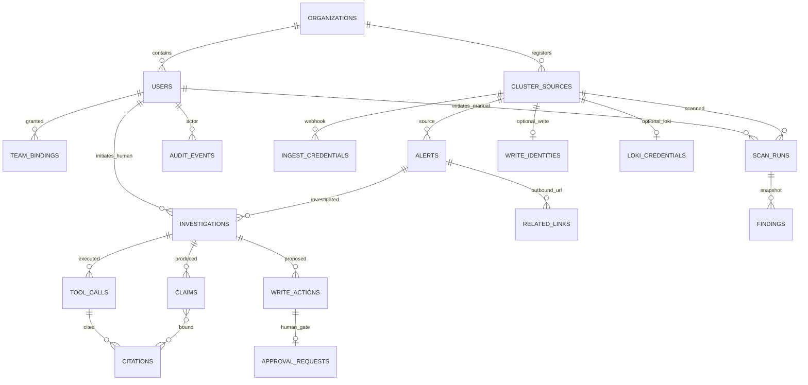
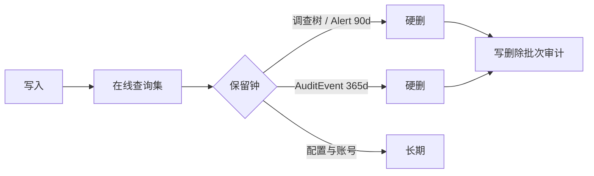

# HuntAI SRE 数据模型规格

- **Status**: Draft（Stage 7 数据模型；**非已冻结**）
- **日期**: 2026-09-15
- **文件名**: Stage 7 约定产出 `data_model_spec.md`
- **输入**: [`../03_problem_modeling/business_model.md`](../03_problem_modeling/business_model.md)（实体与规则闭集）；[`../06_architecture_design/architecture_spec.md`](../06_architecture_design/architecture_spec.md)（持久化与模块边界）。用户入口若写 `docs/07_backend_design/architecture_spec.md`，以 Stage 6 路径为准（`AGENTS.md`：架构正文不进 07）。
- **技术底座**: PostgreSQL **18.x（最低 18.6）**；SQLAlchemy 2 async + Alembic；驱动仅 psycopg 3（ADR-0005、ADR-0008 / `tech_stack.md`）。
- **纪律**: 只承载 Business Model §3 实体与已拍板规则。禁止新增未确认业务实体。禁止把交互稿的页面 L1/L2/L3 直接落成列。无法确定的标 **[TBD-BE]** / **[TBD-BIZ]** / **[TBD-INFRA]**，禁止假默认值。

**一句话**: 控制面与审计的权威在 PostgreSQL。Git 中的 Skill 与系统身份 `auto-investigator` 不建业务表。证据默认截断后入库；对象存储仍 **[TBD-INFRA]**。

---

## 1. 范围、约定与非目标

### 1.1 范围

- 一期与二期 **全部** Business Model §3 实体的落库或不落库说明。
- 表清单、ER、字段、主外键、唯一约束、索引、状态字段。
- 数据生命周期（BR-060–062、NFR-030–033）。
- 字段分级：公开 / 内部 / 敏感 / 高敏；高敏必须有加密与脱敏策略。
- 审计字段与 Alembic 迁移要求。

### 1.2 非目标

- OpenAPI / JSON 响应形状（`api_interface_spec.md`）。
- 实现代码、编排、备份频率（Stage 12 / **[TBD-INFRA]**）。
- 把 LangGraph checkpointer 表当成领域对象。
- Incident、Mailbox、无 `alert_id` 的 ChatSession、用户上传文件等 §9 永不做对象。

### 1.3 物理约定

| 项 | 约定 |
|---|---|
| 表名 | snake_case **复数**（`project_rules.md` §1.3） |
| 列名 | snake_case |
| 主键 | `id` UUID，`[ASSUMPTION]` `gen_random_uuid()`（UUIDv7 **[TBD-BE]**） |
| 时间 | `TIMESTAMPTZ`，存储 UTC；自然日界 **[ASSUMPTION]** `Asia/Shanghai`（BR-041） |
| 枚举 | `TEXT` + `CHECK`，不建独立枚举表（避免把页面选项当成主数据） |
| JSONB | 标签、注解、preview、规则命中载荷、审计载荷 |
| 删除 | 保留到期 **硬删**；无业务「关闭 Finding」软删 |

### 1.4 分级口径

本产品禁止匿名（NFR-020）。行内业务数据 **最低为内部**。「公开」只用于不含组织上下文的 **受控词表本身**（状态/动词字符串），不表示可匿名读取。

与架构 L0–L4（`03_security_reliability_and_operations.md` §3.1，`[ASSUMPTION]`）对齐：

| 本文分级 | 架构级 | 含义 |
|---|---|---|
| 公开 | — | 受控词表（如 `firing`），非行载荷 |
| 内部 | 计数、状态、配置非密钥、UUID | 需登录；非密钥、非遥测原文 |
| 敏感 | L1 / L2 / L4 | 告警标签、工具副本、Claim、用户主体标识 |
| 高敏 | L0 | 凭证、口令哈希、可调用集群/Loki/Prom 的秘密 |

脱敏清单字段集合仍 **[TBD-BIZ]**（BR-049）。清单未定前：高敏不得出域、不得进 Citation / 应用日志；敏感遥测 **禁止出域**（NFR-025 fail-close）。

---

## 2. 实体 → 表（闭集）

每个 Business Model §3 实体必须出现在下表。关系表 `claim_citations` 只实现 Claim–Citation 多对多，**不是**新实体。

| 实体 | 阶段 | 落库 | 说明 |
|---|---|---|---|
| Organization | 一期 | `organizations` | 恰好 1 行（BR-002、NFR-016） |
| User | 一期 | `users` | OIDC 主体；恰好一个 break-glass |
| TeamBinding | 一期 | `team_bindings` | 每行一个 `(user, label_key, label_value)` |
| ClusterSource | 一期；字段二期 | `cluster_sources` | Prom 只读账号与只读 SA **作为本表高敏列**，不另建实体 |
| IngestCredential | 一期 | `ingest_credentials` | 与 OIDC 分离（BR-016） |
| Alert | 一期 | `alerts` | 身份 = `cluster_id` + `fingerprint` |
| Investigation | 一期；`trigger` 二期 | `investigations` | `rejected` **不落库**（创建失败不插 `running`） |
| ToolCall | 一期；二期含 Loki | `tool_calls` | 截断后的输入/输出副本 |
| Citation | 一期 | `citations` | 仅控制面铸造 id |
| Claim | 一期 | `claims` + `claim_citations` | 每条 Claim ≥1 Citation |
| ScanRun | 一期；`scheduled` 二期 | `scan_runs` | |
| Finding | 一期 | `findings` | 随 completed 快照冻结；无 ack/close 状态 |
| Skill | 一期 | **不落库** | Git `SKILL.md` 为权威（BR-038/039）。调查行只记是否加载与匹配范围快照 |
| RelatedLink | 一期 | `related_links` | 只存 URL，不得当 Citation |
| AuditEvent | 一期；类型二期增补 | `audit_events` | append-only |
| WriteIdentity | 二期 | `write_identities` | 0..1 / 集群 |
| LokiCredential | 二期 | `loki_credentials` | 0..1 / 集群 |
| WriteAction | 二期 | `write_actions` | 写修复 **提议**；执行结果不是 Citation |
| ApprovalRequest | 二期 | `approval_requests` | 1 条 WriteAction 对应 0..1 审批 |
| SystemPrincipal | 二期 | **不落库** | 固定字符串 `auto-investigator`；禁止插入 `users` |

**禁止落库（已拍板）**

| 对象 | 原因 |
|---|---|
| 个人 kubeconfig | BR-046、NFR-021 |
| LLM API Key / 网关密钥 | 仅运行时配置（根 `.env`），禁止进调查库（BR-052） |
| 用户粘贴文本 | 一期不作为功能；若未来存储必须标 `user-supplied` 且不得当 Citation（BR-037） |
| xMatters 事件、AM silence、邮件原文 | 系统不读、不写 |
| 会话 cookie 明文、IdP client secret | **[TBD-BE]** 会话存储形态；密钥只在 `.env` |
| Playwright 作业、向量库文档 | §9 |

**技术表（非业务实体，禁止当领域模型消费）**

| 表 | 用途 |
|---|---|
| `alembic_version` | 迁移版本 |
| LangGraph PostgreSQL checkpointer 表 | 调查图耐久；`thread_id` = Investigation `id`。表名随框架，**[TBD-BE]** 是否由 Alembic 托管。禁止当 ApprovalRequest 账本（ADR-0004） |

日调查额度（BR-041）与组织 token 消耗（BR-042）**不新建实体**：由 `investigations` 计数/求和，创建时对 `users` / `organizations` 行级锁。是否物化日计数表 **[TBD-BE]**（仅当锁争用成为问题）。

---

## 3. ER 图

逻辑不变量（已拍板，不是新规则）：

1. Organization 基数 = 1。
2. Alert 不跨 `cluster_id` 合并。
3. Citation 只指向 **本调查内已成功的只读** ToolCall。
4. RelatedLink 与 user-supplied 不得成为 Citation。
5. Citation 不得指向 WriteAction 执行结果。
6. `auto-investigator` 不得作为 ApprovalRequest 确认人。
7. `trigger=auto` 时 `initiator_user_id` 必须为空。

Skill 在图中不出现：调查开始时从 Git 拉取，结果写在 `investigations` 快照列。

---

## 4. 表清单

| 表 | 阶段 | 可变性 | 保留 |
|---|---|---|---|
| `organizations` | 一期 | 可变（闸） | 长期 |
| `users` | 一期 | 可变 | 长期 |
| `team_bindings` | 一期 | 可变 | 长期；变更写审计 |
| `cluster_sources` | 一期 | 可变 | 长期 |
| `ingest_credentials` | 一期 | 可变（轮换） | 随集群 |
| `alerts` | 一期 | upsert | 90 天（BR-062） |
| `related_links` | 一期 | 可变 | 随 Alert |
| `investigations` | 一期 | 主状态机 | 90 天（BR-060） |
| `tool_calls` | 一期 | 追加后只读 | 随调查 90 天 |
| `citations` | 一期 | 铸造后只读 | 随调查 90 天 |
| `claims` | 一期 | 调查中追加 | 随调查 90 天 |
| `claim_citations` | 一期 | 随 Claim | 随调查 90 天 |
| `scan_runs` | 一期 | 状态机 | **[TBD-BE]**（BR 未给 TTL） |
| `findings` | 一期 | completed 后冻结 | 随 ScanRun |
| `audit_events` | 一期 | **禁止 UPDATE/DELETE**（到期作业除外） | 365 天（BR-061） |
| `write_identities` | 二期 | 可变 | 随集群 |
| `loki_credentials` | 二期 | 可变 | 随集群 |
| `write_actions` | 二期 | 提议只读 + 执行回填 | 随调查 90 天 |
| `approval_requests` | 二期 | 状态机 | 随调查 90 天 |

一期 Alembic 初版 **只建一期表**。二期表走后续迁移。`cluster_sources` 的二期列（`env` / `write_remediation` / `scale_max`）允许在一期预建并 fail-close 默认，但一期 API/设置页 **禁止读写**（边界规范 §4）。

---

## 5. 公共列与状态字段

### 5.1 审计列（所有业务表）

| 列 | 类型 | 空 | 分级 | 规则 |
|---|---|---|---|---|
| `id` | UUID | NO | 内部 | PK |
| `created_at` | TIMESTAMPTZ | NO | 内部 | 插入时 `now()`；之后禁止改 |
| `updated_at` | TIMESTAMPTZ | NO | 内部 | 可变表必有；append-only 表 **禁止此列** |

适用 `updated_at` 的表：`organizations`、`users`、`team_bindings`、`cluster_sources`、`ingest_credentials`、`alerts`、`related_links`、`investigations`、`scan_runs`、`write_identities`、`loki_credentials`、`write_actions`、`approval_requests`。

**禁止 `updated_at`**：`audit_events`、`tool_calls`、`citations`、`claims`、`claim_citations`、`findings`（Finding 随 ScanRun 冻结后不再改；扫描过程只 INSERT）。

`audit_events` 另用 `occurred_at`（事件发生时间，可与 `created_at` 相同）。

谁在何时改配置：不靠 `updated_by` 列推断，**必须**写 `audit_events`（BR-015、MVP-18）。可变配置表不强制 `updated_by`，避免与审计双源。

### 5.2 状态字段总表

库内主状态 **⊆** Business Model §5。不把界面 L1 文案做成状态。

| 表 | 列 | 允许值 | 转移 |
|---|---|---|---|
| `alerts` | `status` | `firing` \| `resolved` | webhook 驱动；同 fingerprint 更新行 |
| `alerts` | `unscoped` | boolean | **不是状态**；缺 `team`/`owner`/`namespace` 时为真（BR-022） |
| `investigations` | `status` | `running` \| `completed` \| `inconclusive` | 见 §5.2 业务状态机；`rejected` 不落库 |
| `investigations` | `trigger` | `human` \| `auto` | 一期仅写 `human`；二期才写 `auto` |
| `scan_runs` | `status` | `running` \| `completed` \| `scan_failed` | 无 Finding 工作流状态 |
| `scan_runs` | `trigger` | `manual` \| `scheduled` | 一期仅 `manual` |
| `tool_calls` | `outcome` | `succeeded` \| `failed` | 失败不得被 Citation 指向 |
| `approval_requests` | `status` | `pending` \| `confirmed` \| `rejected` \| `void` | 二期；Investigation 离开 `running` → 全部 pending 变 `void`（BR-085） |

`completed` 的 Investigation：`citation` 计数 ≥ 1，且每条 Claim 经 `claim_citations` 至少 1 条 Citation（BR-031、BR-032）。应用强制；建议 INSERT/UPDATE 触发器，纯 `CHECK` 无法跨表。

有 `pending` 审批时主状态保持 `running`（BR-090）。界面「只读调查已停、等待确认」是 **派生展示**，不是第三终态。派生条件：`status=running` 且 `readonly_loop_finished_at IS NOT NULL` 且存在 `pending` 审批。

---

## 6. 字段定义

列「分级」覆盖该列 100%。高敏列的加密/脱敏见 §8。

### 6.1 `organizations`

单行。用 `singleton_key = 1` 唯一约束，禁止第二组织。

| 列 | 类型 | 空 | 分级 | 说明 |
|---|---|---|---|---|
| `id` | UUID | NO | 内部 | PK |
| `singleton_key` | SMALLINT | NO | 公开 | 恒为 1；UNIQUE |
| `name` | TEXT | NO | 内部 | 展示名；非 SaaS slug |
| `new_investigations_paused` | BOOLEAN | NO | 内部 | 关闭新调查（BR-042）；默认 `false` |
| `token_gate_configured` | BOOLEAN | NO | 内部 | 「闸存在」开关位。`false` = 未配置 = **不得**当无限（BR-042） |
| `daily_token_limit` | INTEGER | YES | 内部 | 仅当 `token_gate_configured=true` 有意义；数字 **[TBD-BIZ]**，禁止填假默认 |
| `skill_git_url` | TEXT | YES | 内部 | Skill 仓库 **[TBD-BIZ]**；空允许上线（BR-039） |
| `created_at` / `updated_at` | TIMESTAMPTZ | NO | 内部 | §5.1 |

约束：`CHECK (singleton_key = 1)`；`CHECK (daily_token_limit IS NULL OR daily_token_limit > 0)`。

禁出域开关、LLM 网关地址：**[TBD-BE]** 放本表还是仅 `.env`。未决前不当列。

### 6.2 `users`

| 列 | 类型 | 空 | 分级 | 说明 |
|---|---|---|---|---|
| `id` | UUID | NO | 内部 | PK |
| `organization_id` | UUID | NO | 内部 | FK → `organizations` |
| `idp_subject` | TEXT | YES | 敏感 | OIDC `sub`；break-glass 为空 |
| `role` | TEXT | NO | 内部 | `sre` \| `developer`。break-glass 权限同 SRE，用下一列区分审计 |
| `is_break_glass` | BOOLEAN | NO | 内部 | 全表最多一行 `true`（BR-011） |
| `password_hash` | TEXT | YES | 高敏 | **仅** break-glass；OIDC 用户必须 NULL |
| `display_name` | TEXT | YES | 内部 | 是否持久化 **[TBD-BE]**（也可每次从 IdP 声明读取） |
| `email` | TEXT | YES | 敏感 | 是否持久化 **[TBD-BE]**；禁止当告警源（BR-025） |
| `quota_override_until` | TIMESTAMPTZ | YES | 内部 | 临时放行截止；额度数字 **[TBD-BIZ]** |
| `quota_override_extra` | INTEGER | YES | 内部 | 放行增加次数；无批准数字则保持 NULL，禁止写 +10 |
| `created_at` / `updated_at` | TIMESTAMPTZ | NO | 内部 | |

约束：

- `CHECK (role IN ('sre','developer'))`
- `CHECK (is_break_glass = false OR password_hash IS NOT NULL)`
- `CHECK (is_break_glass = true OR (idp_subject IS NOT NULL AND password_hash IS NULL))`
- 部分唯一：`UNIQUE (idp_subject) WHERE idp_subject IS NOT NULL`
- 部分唯一：`UNIQUE (is_break_glass) WHERE is_break_glass`（恰好一个）

索引：`organization_id`；`(role)`。

### 6.3 `team_bindings`

| 列 | 类型 | 空 | 分级 | 说明 |
|---|---|---|---|---|
| `id` | UUID | NO | 内部 | PK |
| `user_id` | UUID | NO | 内部 | FK → `users` ON DELETE CASCADE |
| `label_key` | TEXT | NO | 内部 | `team` \| `owner` \| `namespace`（BR-013） |
| `label_value` | TEXT | NO | 敏感 | 与告警标签匹配的值 |
| `created_at` / `updated_at` | TIMESTAMPTZ | NO | 内部 | |

约束：`UNIQUE (user_id, label_key, label_value)`；`CHECK (label_key IN ('team','owner','namespace'))`。禁止用户自助插入（BR-014）——授权在 API，不在表。

索引：`(label_key, label_value)`（反向查「谁能看见该标签」）。

### 6.4 `cluster_sources`

| 列 | 类型 | 空 | 分级 | 说明 |
|---|---|---|---|---|
| `id` | UUID | NO | 内部 | PK |
| `organization_id` | UUID | NO | 内部 | FK → `organizations` |
| `cluster_id` | TEXT | NO | 内部 | 业务键；深链与 webhook 用；UNIQUE |
| `display_name` | TEXT | YES | 内部 | 页面标题用；可与 `cluster_id` 相同 |
| `prometheus_base_url` | TEXT | YES | 内部 | Prom 只读入口 |
| `prometheus_credential_ciphertext` | BYTEA | YES | 高敏 | Prom 只读账号；未配置则该集群 Prom 工具失败 |
| `prometheus_credential_key_id` | TEXT | YES | 内部 | KEK 版本 |
| `kube_api_url` | TEXT | YES | 内部 | 已部署实例连 apiserver |
| `kube_sa_token_ciphertext` | BYTEA | YES | 高敏 | 只读 SA；禁止 secrets/exec/写（BR-047） |
| `kube_sa_token_key_id` | TEXT | YES | 内部 | |
| `env` | TEXT | NO | 内部 | 二期：`production` \| `non_production`；未填视为 `production`（BR-087）。一期预建时默认 `production` |
| `write_remediation` | BOOLEAN | NO | 内部 | 二期；默认 `false`（BR-081） |
| `scale_max` | INTEGER | YES | 内部 | 二期；NULL = 禁止 scale（BR-084）。整数值 **[TBD-BIZ]** |
| `last_scheduled_scan_at` | TIMESTAMPTZ | YES | 内部 | 调度水位；二期 60 分钟（NFR-018） |
| `created_at` / `updated_at` | TIMESTAMPTZ | NO | 内部 | |

约束：`UNIQUE (cluster_id)`；`CHECK (env IN ('production','non_production'))`；`CHECK (scale_max IS NULL OR scale_max >= 1)`。集群数上限 5 由应用强制（NFR-013），不在 CHECK 里写死以免迁移痛苦。

**不存**：kubeconfig 文件、集群名推断 `env`、写动词到只读 SA 列。

### 6.5 `ingest_credentials`

| 列 | 类型 | 空 | 分级 | 说明 |
|---|---|---|---|---|
| `id` | UUID | NO | 内部 | PK |
| `cluster_source_id` | UUID | NO | 内部 | FK → `cluster_sources` ON DELETE CASCADE |
| `label` | TEXT | YES | 内部 | 轮换备注，非密钥 |
| `secret_hash` | TEXT | YES | 高敏 | 若 webhook 为静态 bearer：**只存哈希**，入库不可逆 |
| `secret_ciphertext` | BYTEA | YES | 高敏 | 若算法需要共享密钥（如 HMAC）才加密存储 |
| `secret_key_id` | TEXT | YES | 内部 | |
| `is_active` | BOOLEAN | NO | 内部 | 轮换时可多行，仅 active 验收 |
| `last_used_at` | TIMESTAMPTZ | YES | 内部 | |
| `created_at` / `updated_at` | TIMESTAMPTZ | NO | 内部 | |

认证算法 **[TBD-BE]**（架构开放问题）。约束：`CHECK (secret_hash IS NOT NULL OR secret_ciphertext IS NOT NULL)`。二者同时非空的策略 **[TBD-BE]**。

索引：`(cluster_source_id) WHERE is_active`。

### 6.6 `alerts`

**不是** Alertmanager 规则库。只存 HuntAI 收到的去重实例。

| 列 | 类型 | 空 | 分级 | 说明 |
|---|---|---|---|---|
| `id` | UUID | NO | 内部 | PK |
| `cluster_source_id` | UUID | NO | 内部 | FK → `cluster_sources` |
| `cluster_id` | TEXT | NO | 内部 | 冗余深链键，与 `cluster_sources.cluster_id` 一致（BR-051） |
| `fingerprint` | TEXT | NO | 内部 | AM 自带；否则 `alertname`+稳定标签哈希（排除 `startsAt`/`value`，BR-020） |
| `alertname` | TEXT | YES | 内部 | 列表展示；不可见时 API **不得**返回（IX-PERM-02） |
| `status` | TEXT | NO | 公开 | `firing` \| `resolved` |
| `unscoped` | BOOLEAN | NO | 内部 | 见 BR-022 |
| `labels` | JSONB | NO | 敏感 | 含 `team`/`owner`/`namespace`/`severity` 等 |
| `annotations` | JSONB | NO | 敏感 | |
| `starts_at` | TIMESTAMPTZ | YES | 内部 | AM `startsAt` |
| `ends_at` | TIMESTAMPTZ | YES | 内部 | |
| `generator_url` | TEXT | YES | 内部 | 可作 RelatedLink 来源，本身不是 Citation |
| `firing_cycle` | INTEGER | NO | 内部 | `resolved→firing` 时 +1；支撑 BR-071 |
| `last_webhook_at` | TIMESTAMPTZ | NO | 内部 | upsert 时间 |
| `created_at` / `updated_at` | TIMESTAMPTZ | NO | 内部 | |

约束：

- `UNIQUE (cluster_id, fingerprint)`
- `CHECK (status IN ('firing','resolved'))`
- **不存**未解析 webhook 原文（降低密钥落入 L4 的风险）。规范化失败则拒绝入库，不留半行。

索引：

- `(status, last_webhook_at DESC)` 列表
- `(unscoped, status)` SRE/开发分流
- `(labels->>'team')`、`(labels->>'owner')`、`(labels->>'namespace')` 表达式 btree（开发 ACL）
- `(cluster_id, fingerprint)` 已由 UNIQUE 覆盖

`severity=critical` 的判定读 `labels->>'severity'` **精确等于** `critical`（BR-070），不单独做状态列，避免与标签双源。

### 6.7 `related_links`

| 列 | 类型 | 空 | 分级 | 说明 |
|---|---|---|---|---|
| `id` | UUID | NO | 内部 | PK |
| `alert_id` | UUID | NO | 内部 | FK → `alerts` ON DELETE CASCADE |
| `kind` | TEXT | NO | 公开 | `grafana` \| `loki` \| `kibana` \| `elastic` |
| `url` | TEXT | NO | 内部 | 只存 URL；host 允许列表 **[TBD-BIZ]** |
| `created_by_user_id` | UUID | YES | 内部 | FK → `users`；ON DELETE SET NULL |
| `created_at` / `updated_at` | TIMESTAMPTZ | NO | 内部 | |

约束：`CHECK (kind IN ('grafana','loki','kibana','elastic'))`。删除 RelatedLink **[TBD-BIZ]**（交互 IX-CNF-06）。

### 6.8 `investigations`

| 列 | 类型 | 空 | 分级 | 说明 |
|---|---|---|---|---|
| `id` | UUID | NO | 内部 | PK；亦作 LangGraph `thread_id` |
| `alert_id` | UUID | NO | 内部 | FK → `alerts` |
| `firing_cycle_at_start` | INTEGER | NO | 内部 | 创建时复制 `alerts.firing_cycle`；支撑 BR-071 |
| `trigger` | TEXT | NO | 内部 | `human` \| `auto` |
| `initiator_user_id` | UUID | YES | 内部 | FK → `users`；`auto` 必须 NULL |
| `initiator_principal` | TEXT | NO | 内部 | `user` 或 `auto-investigator` |
| `status` | TEXT | NO | 公开 | `running` \| `completed` \| `inconclusive` |
| `terminal_reason` | TEXT | YES | 内部 | 见下 CHECK；`running` 时 NULL |
| `idempotency_key` | TEXT | YES | 内部 | 人点连点 `[ASSUMPTION]`；auto 可空 |
| `llm_call_count` | INTEGER | NO | 内部 | ≤ 8（BR-040） |
| `readonly_tool_call_count` | INTEGER | NO | 内部 | ≤ 12（含二期 Loki） |
| `wall_clock_ms` | INTEGER | NO | 内部 | 只计 LLM+只读工具；pending 等待不加（BR-040） |
| `token_usage` | INTEGER | YES | 内部 | 组织日闸求和用；计量口径 **[TBD-BE]** |
| `readonly_loop_finished_at` | TIMESTAMPTZ | YES | 内部 | BR-090 派生展示用 |
| `skill_loaded` | BOOLEAN | NO | 内部 | false → UI「未加载组织约束」，不是失败状态 |
| `skill_match_scope` | TEXT | YES | 内部 | `global` \| `cluster` \| `team`；未匹配 NULL |
| `skill_snapshot` | TEXT | YES | 敏感 | 本次实际加载的 Skill 文本快照；Git 仍是权威 |
| `alert_snapshot` | JSONB | YES | 敏感 | 开查时 Alert 副本，供图使用；禁止含密钥 |
| `visibility_snapshot` | JSONB | YES | 敏感 | 开查时 TeamBinding 固化 `[ASSUMPTION]` |
| `created_at` / `updated_at` | TIMESTAMPTZ | NO | 内部 | |

约束：

- `CHECK (status IN ('running','completed','inconclusive'))`
- `CHECK (trigger IN ('human','auto'))`
- `CHECK ( (trigger='human' AND initiator_user_id IS NOT NULL AND initiator_principal='user') OR (trigger='auto' AND initiator_user_id IS NULL AND initiator_principal='auto-investigator') )`
- `CHECK (terminal_reason IS NULL OR terminal_reason IN ('zero_citation','cost_llm','cost_tools','cost_wall_clock','no_llm'))`
- `CHECK (NOT (status='completed' AND terminal_reason IS NOT NULL))` —— 完成不得带成本/无证据原因
- 部分唯一：`UNIQUE (idempotency_key) WHERE idempotency_key IS NOT NULL`
- 部分唯一（BR-071）：`UNIQUE (alert_id, firing_cycle_at_start) WHERE trigger='auto'`

索引：

- `(alert_id, created_at DESC)`
- `(initiator_user_id, created_at)` 日额（BR-041）
- 部分：`(status) WHERE status='running' AND trigger='auto'`（NFR-017 计数）
- 部分：`(status) WHERE status='running'`（运维观察；**不是**人点硬闸）

### 6.9 `tool_calls`

| 列 | 类型 | 空 | 分级 | 说明 |
|---|---|---|---|---|
| `id` | UUID | NO | 内部 | PK |
| `investigation_id` | UUID | NO | 内部 | FK → `investigations` ON DELETE CASCADE |
| `seq` | INTEGER | NO | 内部 | 调查内从 1 递增 |
| `tool_name` | TEXT | NO | 内部 | 白名单名：kube get/describe/events/logs、prom_alerts、promql；二期 `logql`。**禁止**写动词名作为可 citation 工具 |
| `is_readonly` | BOOLEAN | NO | 内部 | Citation 要求 `true` |
| `input_truncated` | JSONB | NO | 敏感 | 截断后入参副本 |
| `output_truncated` | TEXT | YES | 敏感 | 截断后输出；失败也可存错误摘要（仍不得含密钥） |
| `truncated` | BOOLEAN | NO | 内部 | BR-043；阈值字节 **[TBD-BIZ]** |
| `outcome` | TEXT | NO | 内部 | `succeeded` \| `failed` |
| `started_at` / `finished_at` | TIMESTAMPTZ | YES | 内部 | |
| `created_at` | TIMESTAMPTZ | NO | 内部 | 无 `updated_at` |

约束：`UNIQUE (investigation_id, seq)`；`CHECK (outcome IN ('succeeded','failed'))`；`CHECK (tool_name <> ALL (ARRAY['restart','scale','delete','apply','exec']))` 或等价白名单 **[TBD-BE]**（白名单随二期 Loki 扩展，建议应用注册表 + CHECK 可迁）。

对象存储指针列：一期 **不建**（默认库内；**[TBD-INFRA]**）。

### 6.10 `citations`

| 列 | 类型 | 空 | 分级 | 说明 |
|---|---|---|---|---|
| `id` | UUID | NO | 内部 | **仅控制面铸造**；禁止模型写入（BR-031） |
| `investigation_id` | UUID | NO | 内部 | 必须等于所指向 ToolCall 的调查 |
| `tool_call_id` | UUID | NO | 内部 | FK → `tool_calls` |
| `created_at` | TIMESTAMPTZ | NO | 内部 | |

约束：`UNIQUE (tool_call_id)`（一次成功只读调用铸造一条）。跨表：ToolCall 必须 `outcome=succeeded AND is_readonly=true AND investigation_id` 一致 —— 用触发器或写入路径强制。

### 6.11 `claims` / `claim_citations`

`claims`

| 列 | 类型 | 空 | 分级 | 说明 |
|---|---|---|---|---|
| `id` | UUID | NO | 内部 | PK |
| `investigation_id` | UUID | NO | 内部 | FK → `investigations` ON DELETE CASCADE |
| `seq` | INTEGER | NO | 内部 | |
| `statement` | TEXT | NO | 敏感 | 因果断言正文 |
| `created_at` | TIMESTAMPTZ | NO | 内部 | |

`UNIQUE (investigation_id, seq)`。

`claim_citations`（关系表）

| 列 | 类型 | 空 | 分级 | 说明 |
|---|---|---|---|---|
| `claim_id` | UUID | NO | 内部 | FK → `claims` ON DELETE CASCADE |
| `citation_id` | UUID | NO | 内部 | FK → `citations` |
| `created_at` | TIMESTAMPTZ | NO | 内部 | |

PK `(claim_id, citation_id)`。写入路径必须保证 citation 与 claim 同属一调查。无 Citation 的 Claim 不得存在（BR-031）—— 用事务：先插 citation 绑定，再插 claim，或延迟约束 **[TBD-BE]**。

### 6.12 `scan_runs`

| 列 | 类型 | 空 | 分级 | 说明 |
|---|---|---|---|---|
| `id` | UUID | NO | 内部 | PK |
| `cluster_source_id` | UUID | NO | 内部 | FK → `cluster_sources` |
| `trigger` | TEXT | NO | 内部 | `manual` \| `scheduled` |
| `initiated_by_user_id` | UUID | YES | 内部 | 手动必填；`scheduled` 必须 NULL |
| `status` | TEXT | NO | 公开 | `running` \| `completed` \| `scan_failed` |
| `error_summary` | TEXT | YES | 内部 | 失败原因；禁止堆栈/密钥 |
| `created_at` / `updated_at` | TIMESTAMPTZ | NO | 内部 | |

约束：`UNIQUE (cluster_source_id) WHERE status='running'`（A03 同集群互斥）。`CHECK` 与 trigger/initiator 的配对类似 Investigation。

索引：`(cluster_source_id, created_at DESC)`。

### 6.13 `findings`

| 列 | 类型 | 空 | 分级 | 说明 |
|---|---|---|---|---|
| `id` | UUID | NO | 内部 | PK |
| `scan_run_id` | UUID | NO | 内部 | FK → `scan_runs` ON DELETE CASCADE |
| `rule_id` | TEXT | NO | 内部 | 如 `CrashLoop`、`ImagePull`；**不是**独立规则实体表 |
| `namespace` | TEXT | YES | 敏感 | 开发 ACL 相交键（BR-079）；无 namespace 的命中仅 SRE 可见 **[ASSUMPTION]** |
| `resource_kind` | TEXT | YES | 内部 | |
| `resource_name` | TEXT | YES | 敏感 | |
| `summary` | TEXT | NO | 敏感 | |
| `payload` | JSONB | YES | 敏感 | 规则专用字段；禁止密钥 |
| `created_at` | TIMESTAMPTZ | NO | 内部 | |

索引：`(scan_run_id)`；`(namespace)`。无 `status`（BR-027：不关 finding）。

BR-026：关闭 LLM 时 firing Alert **仍作为 finding 展示** —— 那是 Alert 行的读模型，**不**为 Alert 再包一层 Finding 行。

### 6.14 `audit_events`

| 列 | 类型 | 空 | 分级 | 说明 |
|---|---|---|---|---|
| `id` | UUID | NO | 内部 | PK |
| `occurred_at` | TIMESTAMPTZ | NO | 内部 | |
| `created_at` | TIMESTAMPTZ | NO | 内部 | 无 `updated_at` |
| `actor_user_id` | UUID | YES | 内部 | 人；系统动作为 NULL |
| `actor_principal` | TEXT | NO | 内部 | `user` \| `ingest` \| `auto-investigator` \| `retention-job` |
| `action` | TEXT | NO | 内部 | 受控词，见下 |
| `target_type` | TEXT | YES | 内部 | |
| `target_id` | TEXT | YES | 内部 | UUID 或 `cluster_id`+fingerprint |
| `payload` | JSONB | YES | 敏感 | **禁止**密钥、Prompt 原文、未脱敏日志、密文（BR-052） |

一期 `action` 至少：`login`、`team_binding_changed`、`investigation_created`、`scan_started`、`cluster_source_changed`、`quota_override_granted`、`alert_seen`。二期增补：`auto_investigate_skipped`、`write_confirmed`、`write_rejected`、`approval_voided`。词表扩展用迁移，不在应用里自由字符串。精确枚举 **[TBD-BE]**（须覆盖 MVP-18，可多不可少）。

索引：`(occurred_at)` 保留删除；`(actor_user_id, occurred_at)`；`(action, occurred_at)`。

禁止：UPDATE；禁止业务 DELETE（仅保留作业）。可用 `REVOKE UPDATE, DELETE` 给应用角色，保留作业用单独角色 **[TBD-BE]**。

### 6.15 `write_identities`（二期）

| 列 | 类型 | 空 | 分级 | 说明 |
|---|---|---|---|---|
| `id` | UUID | NO | 内部 | PK |
| `cluster_source_id` | UUID | NO | 内部 | UNIQUE；FK → `cluster_sources` |
| `token_ciphertext` | BYTEA | NO | 高敏 | 仅 restart/scale；与只读 SA 分离（BR-086） |
| `token_key_id` | TEXT | NO | 内部 | |
| `created_at` / `updated_at` | TIMESTAMPTZ | NO | 内部 | |

失败禁止 fallback 到本表以外的身份——这是运行时规则，不是列。

### 6.16 `loki_credentials`（二期）

| 列 | 类型 | 空 | 分级 | 说明 |
|---|---|---|---|---|
| `id` | UUID | NO | 内部 | PK |
| `cluster_source_id` | UUID | NO | 内部 | UNIQUE |
| `base_url` | TEXT | NO | 内部 | |
| `credential_ciphertext` | BYTEA | NO | 高敏 | 只读 LogQL（BR-077） |
| `credential_key_id` | TEXT | NO | 内部 | |
| `created_at` / `updated_at` | TIMESTAMPTZ | NO | 内部 | |

无行 ⇒ 该集群调查不得调用 Loki，不得扒 UI。

### 6.17 `write_actions`（二期）

| 列 | 类型 | 空 | 分级 | 说明 |
|---|---|---|---|---|
| `id` | UUID | NO | 内部 | PK |
| `investigation_id` | UUID | NO | 内部 | FK → `investigations` ON DELETE CASCADE |
| `verb` | TEXT | NO | 公开 | `restart` \| `scale`（NFR-028） |
| `target_kind` | TEXT | NO | 内部 | `Deployment` 或 `StatefulSet`（scale 仅 Deployment，BR-080） |
| `target_namespace` | TEXT | NO | 敏感 | |
| `target_name` | TEXT | NO | 敏感 | |
| `current_replicas` | INTEGER | YES | 内部 | preview 用 |
| `desired_replicas` | INTEGER | YES | 内部 | `scale` 必填 |
| `preview` | JSONB | NO | 敏感 | 人批卡片；模型不可执行 |
| `execution_result` | JSONB | YES | 敏感 | 执行后回填；**禁止**被 Citation 指向（BR-088） |
| `executed_at` | TIMESTAMPTZ | YES | 内部 | |
| `created_at` / `updated_at` | TIMESTAMPTZ | NO | 内部 | |

`CHECK (verb IN ('restart','scale'))`。`scale` 上限在 confirm 路径校验（当前×2 且 ≤ `scale_max`；当前 0 禁止），不把「2」复制成多处魔法列。

### 6.18 `approval_requests`（二期）

| 列 | 类型 | 空 | 分级 | 说明 |
|---|---|---|---|---|
| `id` | UUID | NO | 内部 | PK |
| `write_action_id` | UUID | NO | 内部 | UNIQUE；FK → `write_actions` |
| `status` | TEXT | NO | 公开 | `pending` \| `confirmed` \| `rejected` \| `void` |
| `confirmed_by_user_id` | UUID | YES | 内部 | 必须是登录 User，禁止 `auto-investigator` |
| `decided_at` | TIMESTAMPTZ | YES | 内部 | |
| `void_reason` | TEXT | YES | 内部 | 如 `investigation_left_running`、`wait_timeout` |
| `created_at` / `updated_at` | TIMESTAMPTZ | NO | 内部 | |

等待超时秒数 **[TBD-BIZ]**，本表不存默认秒数。confirm 幂等：按本行 `id` 行锁（架构 6.1）。

---

## 7. 主外键、唯一约束、索引（汇总）

### 7.1 外键

| 从表 | 列 | 到 | ON DELETE |
|---|---|---|---|
| `users` | `organization_id` | `organizations.id` | RESTRICT |
| `cluster_sources` | `organization_id` | `organizations.id` | RESTRICT |
| `team_bindings` | `user_id` | `users.id` | CASCADE |
| `ingest_credentials` | `cluster_source_id` | `cluster_sources.id` | CASCADE |
| `alerts` | `cluster_source_id` | `cluster_sources.id` | RESTRICT（先留存告警 TTL） |
| `related_links` | `alert_id` | `alerts.id` | CASCADE |
| `related_links` | `created_by_user_id` | `users.id` | SET NULL |
| `investigations` | `alert_id` | `alerts.id` | CASCADE（同 90 天） |
| `investigations` | `initiator_user_id` | `users.id` | RESTRICT |
| `tool_calls` | `investigation_id` | `investigations.id` | CASCADE |
| `citations` | `investigation_id` | `investigations.id` | CASCADE |
| `citations` | `tool_call_id` | `tool_calls.id` | RESTRICT |
| `claims` | `investigation_id` | `investigations.id` | CASCADE |
| `claim_citations` | `claim_id` / `citation_id` | 对应表 | CASCADE / RESTRICT |
| `scan_runs` | `cluster_source_id` | `cluster_sources.id` | RESTRICT |
| `scan_runs` | `initiated_by_user_id` | `users.id` | RESTRICT |
| `findings` | `scan_run_id` | `scan_runs.id` | CASCADE |
| `audit_events` | `actor_user_id` | `users.id` | SET NULL |
| `write_identities` | `cluster_source_id` | `cluster_sources.id` | CASCADE |
| `loki_credentials` | `cluster_source_id` | `cluster_sources.id` | CASCADE |
| `write_actions` | `investigation_id` | `investigations.id` | CASCADE |
| `approval_requests` | `write_action_id` | `write_actions.id` | CASCADE |
| `approval_requests` | `confirmed_by_user_id` | `users.id` | RESTRICT |

删除用户策略未收口：默认 RESTRICT，避免调查发起人被静默摘掉 **[TBD-BE]**。

### 7.2 必须有的唯一 / 部分唯一

| 表 | 约束 |
|---|---|
| `organizations` | `singleton_key` |
| `users` | `idp_subject`（非空）；`is_break_glass` 为真时单行 |
| `team_bindings` | `(user_id, label_key, label_value)` |
| `cluster_sources` | `cluster_id` |
| `alerts` | `(cluster_id, fingerprint)` |
| `investigations` | 非空 `idempotency_key`；`trigger=auto` 时 `(alert_id, firing_cycle_at_start)` |
| `tool_calls` | `(investigation_id, seq)` |
| `citations` | `tool_call_id` |
| `scan_runs` | 每集群至多一个 `running` |
| `write_identities` / `loki_credentials` / `approval_requests` | 各自 1:1 键 |

### 7.3 查询索引（除 UNIQUE 外）

见各表。ACL **禁止**依赖前端过滤：开发列表必须能用 `unscoped=false` + 标签表达式索引求交 `team_bindings`。

自动开查并发：`COUNT(*)` 于 `investigations WHERE trigger='auto' AND status='running'`，同一事务于组织行或 advisory lock **[TBD-BE]**。

---

## 8. 数据分级、加密与脱敏

### 8.1 高敏字段清单（加密/哈希策略）

| 字段 | 策略 | 运行时使用 | API / 日志 / 审计脱敏 |
|---|---|---|---|
| `users.password_hash` | **不可逆哈希**（算法 **[TBD-BE]**，建议 Argon2id）。禁止可逆加密 | 仅 break-glass 登录比对 | 永不返回；失败响应不区分用户是否存在 |
| `ingest_credentials.secret_hash` | 静态 bearer：哈希比对 | webhook 鉴权 | 只暴露 `is_active` / `configured` |
| `ingest_credentials.secret_ciphertext` | 仅当算法必须持有共享秘密：应用层 AEAD 加密 | 验签 | 同上；禁止回显 |
| `cluster_sources.prometheus_credential_ciphertext` | AEAD | Prom 只读客户端 | `prometheus_configured: bool` |
| `cluster_sources.kube_sa_token_ciphertext` | AEAD | 只读 kube 客户端 | `readonly_sa_configured: bool` |
| `write_identities.token_ciphertext` | AEAD | 二期写客户端 | `write_identity_configured: bool` |
| `loki_credentials.credential_ciphertext` | AEAD | 二期 Loki | `loki_configured: bool` |

AEAD 算法、KEK 位置（仅 `.env` vs KMS）、信封轮换：**[TBD-BE]**。已拍板：

- KEK **禁止**入库、禁止进 Git、禁止进调查库与 Citation（BR-052）。
- 密文列可进 PostgreSQL 备份；备份日志仍不得打印明文 **[TBD-INFRA]**。
- LLM Key 不在本模型中出现。
- 解密只在控制面内存中、最短生命周期；worker 经控制面拿连接，不把明文写盘。

### 8.2 敏感字段清单（出域与界面）

| 字段 / JSON 路径 | 界面 | 出域 LLM | Citation / 日志 |
|---|---|---|---|
| `alerts.labels` / `annotations` | 有权用户可见 | 清单内可逆变脱敏；未覆盖字段 **不得出域** | 日志禁止整包原文 |
| `team_bindings.label_value` | 管理员可见 | 不送模型 | 审计可记键值（非密钥） |
| `users.idp_subject` / `email` | 最小化 | 不送模型 | 审计用内部 user id |
| `tool_calls.input_truncated` / `output_truncated` | 有权且能打开该 Alert 的人（BR-055） | 先脱敏；截断后再送 | Citation 只指向本副本 |
| `claims.statement` | 同上 | 模型产出，仍禁止回存密钥 | 不是密钥列但按敏感 |
| `investigations.skill_snapshot` / `alert_snapshot` / `visibility_snapshot` | 调查详情需要才返回 | 按 BR-049 | 禁止未脱敏日志 |
| `findings.*` 名称与 summary | SRE 全量；开发按 namespace 相交 | 扫描路径 **零 LLM** | |
| `write_actions.preview` / `execution_result` | 人批 UI | 不得当 Citation | 审计记 verb/资源，不记 SA |
| `audit_events.payload` | 最小化只读 | 不出域 | 自身即审计 |
| `related_links.url` | 外链 | 不得当 Citation | |

可逆变脱敏的具体字段表 **[TBD-BIZ]**。Skill 可禁止某 namespace 的 log 出域（BR-049）：这是运行时规则，用 `skill_snapshot` 内容解释，不另建实体。

### 8.3 内部 / 公开

状态、计数、UUID、集群业务键、URL 主机以外的配置开关：内部。受控词表字符串：公开。任何「页面剩余额度」都不存库（§10）。

---

## 9. 数据生命周期

| 数据 | 起点 | 在线动作 | 到期 | 删除时限 |
|---|---|---|---|---|
| Alert | webhook upsert | 同 fingerprint 更新；resolved↔firing | 90 天（BR-062） | NFR-033 **[TBD-BIZ]** 小时 |
| Investigation 树（含 ToolCall / Citation / Claim / 二期写修复行 / Skill 快照） | 创建成功 | 状态机；关页不取消 | 90 天（BR-060） | 同上 |
| RelatedLink | 人保存 | 无独立 TTL | 随 Alert | |
| AuditEvent | 登录/绑定/开查/扫描/配置/放行/看过/… | append-only | 365 天（BR-061） | 同上 |
| ScanRun / Finding | 手动或二期调度 | completed 冻结 | **[TBD-BE]** | 不得假装已有 90 天规则 |
| 配置（组织/用户/绑定/集群/凭证） | 管理员 | 更新写审计 | 长期，直到管理员删除集群 | 删集群前须处理仍在 TTL 内的 Alert **[TBD-BE]** |
| LangGraph checkpoint | 调查运行 | 续跑 | 必须随调查删除 **[TBD-BE]** 作业 | |
| 已删调查 URL | — | 空/错误「调查已按保留策略删除」 | 不伪造 RCA | |

删除作业本身写 `audit_events`（`actor_principal=retention-job`）。删除审计行到期后一并删（架构 §3.3）。备份窗口不得把已到期数据无限复活为在线查询集 —— 策略 **[TBD-INFRA]**。

配额日界：按 `created_at` 转 `Asia/Shanghai` 的日历日统计 **成功新建** 的 `trigger=human` 行。拒绝不插行，故不占次数（BR-041）。

---

## 10. 页面字段 ≠ 数据库字段

交互稿层级是展示模型。下列 **禁止** 建列或建表：

| 页面/交互概念 | 正确来源 |
|---|---|
| 「尚未收到 AM webhook」 | 深链查询 0 行 |
| 日调查剩余次数 | `30 - COUNT(当日成功 human 调查)`；放行窗口另算。**不**存 remaining |
| 「正在分析」vs「等待确认写操作」 | `status` + `readonly_loop_finished_at` + pending 审批 **派生** |
| `completed` / `inconclusive` 徽章文案 | 同一 `status` 列的展示，不是两套状态 |
| LLM 关闭横幅 | 运行时配置，不是 Alert 列 |
| 开发看不到扫描导航 | 授权结果，不是用户偏好表 |
| 深链 URL path | **[TBD-FE]**；库内只有 `cluster_id` + `fingerprint` |
| xMatters 模板是否已改 | 运营事实，本库无对象 |
| 列表筛选控件状态 | 前端瞬时 |
| 「自动开查已跳过（并发上限）」L3 句 | 读对应 `audit_events`，不在 Alert 上加 `skipped` 状态 |
| Finding ack/close | 永不做 |
| 把 Grafana 面板字段拆成多列 | RelatedLink 只存 URL |

API 响应可以组合派生字段；那是契约文档的事，不是本表结构。

---

## 11. 数据迁移要求

1. **唯一工具**：Alembic。禁止手工改生产 schema、禁止 SQLAlchemy `create_all` 上生产。
2. **初版 revision（一期）**：§4 一期表 + §7 约束/索引 + `organizations` 单行种子（名称 **[TBD-BE]**）。**禁止**在迁移文件中写入 break-glass 口令、任何密文、真实 PII。break-glass 账号在部署时由控制面按 `.env` 确保恰好一行。
3. **二期 revision**：`write_identities`、`loki_credentials`、`write_actions`、`approval_requests`；如需放宽 `tool_calls.tool_name` 白名单以含 `logql`，用 `CHECK` 替换迁移。一期预建的 `env` / `write_remediation` / `scale_max` 若已存在则二期只开 API。
4. **扩展-收缩**：先加可空列/新表 → 放代码 → 回填 → 再 NOT NULL。禁止破坏性改名与无双写的删除列。
5. **Checkpointer**：与领域 schema 隔离。若由框架自建，文档化表名并纳入备份；若纳入 Alembic，单独 revision，禁止与 `approval_requests` 混表。
6. **保留作业**：不是 schema 迁移；是调度任务。删除顺序：先调查子树与 checkpoint，再 Alert（若仍被 RESTRICT 则先子后父），审计单独 365 天。
7. **SQLite**：禁止用于本模型（ADR-0005）。
8. **Stage 11 之前**：禁止根据本文创建 `backend/` 实现或真实数据库。本文只约束未来实现。
9. **新增列**：必须带分级；高敏必须补 §8.1。同步 `.env.example` 仅当新增 **配置键**（KEK 等）且经批准。
10. **回滚**：Alembic downgrade 必须可撤销无数据依赖的变更；已加密列的算法变更走数据迁移脚本，禁止「改算法但留明文」。

种子与假数据：本地可用合成 `cluster_id` / fingerprint；禁止生产告警正文、主机名、账号入仓库。

---

## 12. 开放问题（仅数据）

| ID | 问题 | 标记 |
|---|---|---|
| D1 | webhook 认证算法（hash vs HMAC） | [TBD-BE] |
| D2 | AEAD 算法与 KEK/KMS | [TBD-BE] |
| D3 | UUIDv4 vs v7 | [TBD-BE] |
| D4 | 是否持久化 `users.email` / `display_name` | [TBD-BE] |
| D5 | ScanRun/Finding TTL | [TBD-BE] |
| D6 | 组织闸与禁出域放 DB 还是仅 `.env` | [TBD-BE] |
| D7 | `claim` 无 citation 的延迟约束实现 | [TBD-BE] |
| D8 | 日额是否物化计数表 | [TBD-BE] |
| D9 | `token_usage` 计量口径 | [TBD-BE] |
| D10 | checkpointer 表所有权 | [TBD-BE] |
| D11 | 应用角色对 `audit_events` 的 REVOKE | [TBD-BE] |
| D12 | 删除 User / ClusterSource 的业务顺序 | [TBD-BE] |

非本文件能填：脱敏清单、截断字节、Skill Git、`scale_max`、pending 超时、放行额度 —— 仍为 **[TBD-BIZ]**。对象存储 —— **[TBD-INFRA]**。

---

## 13. 完成前自检

- [x] 每个业务实体有对应表或不落库说明（§2：Skill、SystemPrincipal 明确不落库；其余 17 个实体有表；`claim_citations` 仅为关系表）
- [x] 敏感字段 100% 完成分级标注（§6 每列有「分级」；§8.1 高敏全覆盖加密/哈希与脱敏；§8.2 敏感出域策略）
- [x] ER、表清单、主键/外键/唯一/索引、状态字段（§3–§7）
- [x] 数据生命周期（§9）
- [x] 审计字段（§5.1）
- [x] 数据迁移要求（§11）
- [x] 未把页面字段等同库字段（§10）
- [x] 未新增 Business Model 未确认实体
- [x] 无实现代码、无密钥值、无「高可用」空话
